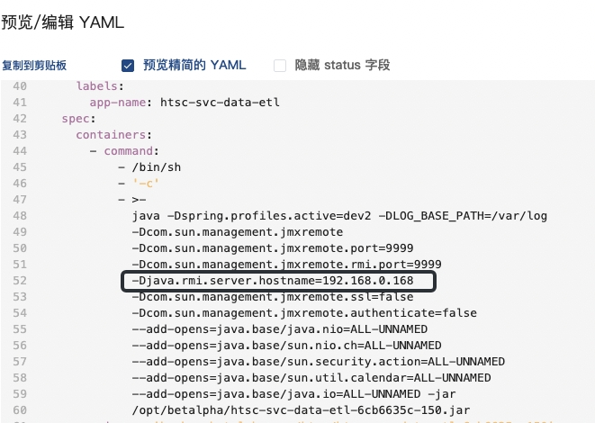
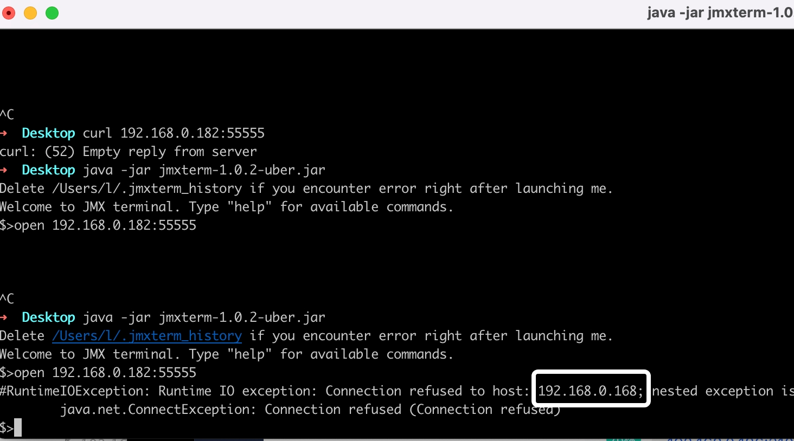

## gradle构建错误 
Could not resolve all dependencies for configuration ':detachedConfiguration13'.
Using insecure protocols with repositories, without explicit opt-in, is unsupported. Switch Maven repository 'maven(http://maven.aliyun.com/nexus/content/groups/public/)' to redirect to a secure protocol (like HTTPS) or allow insecure protocols. See https://docs.gradle.org/7.0.2/dsl/org.gradle.api.artifacts.repositories.UrlArtifactRepository.html#org.gradle.api.artifacts.repositories.UrlArtifactRepository:allowInsecureProtocol for more details. 


    解决办法
    maven{
        allowInsecureProtocol = true
        url 'http://maven.aliyun.com/nexus/content/groups/public/'
    }
    问题出处
    maven{
        url 'http://maven.aliyun.com/nexus/content/groups/public/'
    }
    
## git rebase -i xxx
交互式的rebase 
pick commit1   // 时间11.11
s commit2   // 时间11.12
s commit3   // 时间11.13
这里的提交全部都会汇聚到commit1里面

## 
    Build scan background action failed.
        org.gradle.process.internal.ExecException: Process 'command 'git'' finished with non-zero exit value 128
        at org.gradle.process.internal.DefaultExecHandle$ExecResultImpl.assertNormalExitValue(DefaultExecHandle.java:414)
        at org.gradle.process.internal.DefaultExecAction.execute(DefaultExecAction.java:38)
        at org.gradle.process.internal.DefaultExecActionFactory.exec(DefaultExecActionFactory.java:175)
        at io.spring.ge.conventions.gradle.WorkingDirectoryProcessOperations.exec(WorkingDirectoryProcessOperations.java:45)
        at io.spring.ge.conventions.gradle.ProcessOperationsProcessRunner.run(ProcessOperationsProcessRunner.java:41)
        at io.spring.ge.conventions.core.BuildScanConventions.run(BuildScanConventions.java:166)
        at io.spring.ge.conventions.core.BuildScanConventions.addGitMetadata(BuildScanConventions.java:113)
        at io.spring.ge.conventions.gradle.GradleConfigurableBuildScan.lambda$background$0(GradleConfigurableBuildScan.java:104)
        at com.gradle.enterprise.gradleplugin.internal.extension.DefaultBuildScanExtension$3.run(SourceFile:100)
        at java.util.concurrent.Executors$RunnableAdapter.call(Executors.java:511)
        at java.util.concurrent.FutureTask.run(FutureTask.java:266)
        at java.util.concurrent.ThreadPoolExecutor.runWorker(ThreadPoolExecutor.java:1149)
        at java.util.concurrent.ThreadPoolExecutor$Worker.run(ThreadPoolExecutor.java:624)
        at java.lang.Thread.run(Thread.java:748)


# 无法构建父类变量的解决方案

@SuperBuilder 可以解决      
但是build需要注意一下顺序：**先构建子类，再构建父类的变量。**     
如果先构建父类，会无法构建子类    
```java
@SuperBuilder
class Parent{
    String parentId;
}
@SuperBuilder
class Child extends Parent{
    String childId;
}
class Demo{
    public static void main(String[] args) {
        // 出问题的构建方法
        Child.builder()
                .parentId("parent")
                .childId("childId") // 这里会直接导致编译不过
                .build();
        // 正确的构建方式
        Child.builder()
                .childId("childId") // 应该先构建子类的变量
                .parentId("parent")
                .build();
    }
}
```

## json 序列化注意点
这里有一个小细节，在将jackson转化对象到数据库中的一个字段的时候，他会根据getXXX() 方法序列化成为对应的字段。
    
    public class AssetLeafCategoryFilter implements AssetFilterItemContent {
        private String value;
    
        public AssetLeafCategoryFilter(String value) {
            this.value = value;
        }
    
        public String getValue() {
            return value;
        }
        public String getFiled() {
            return value;
        }
    }
最终结果为：{value:"xxx",filed:"xxx"}     
他会将 filed 也看作一个字段    


## gradle 编译scala错误
下面的 java.scrDirs = ['src/main/java'] 或者 ['src/main/scala'] 就会导致scala的类无法在编译的时候被找到，为什么，          
我的出现这个情况的上下文是，我的其中一个java类引用了scala的文件，不知道是不是因为配置了java.srcDirs就导致无法识别倒入的scala类了
```groovy
sourceSets {
    main() {
        scala{
            srcDirs = ['src/main/scala', 'src/main/java']
        }
        java {
            srcDirs = []
        }
    }
    test {
        scala{
            srcDirs = ['src/test/java', 'src/test/scala']
        }
        java {
            srcDirs = []
        }
    }
}
```


## jmx 
jmx 配置需要的包, 下面每一个都需要，这样才能通过http访问jmx
<pre>
    implementation "org.jolokia:jolokia-core:1.3.6"
    implementation 'org.springframework.boot:spring-boot-starter-web'
    implementation "org.springframework.boot:spring-boot-starter-actuator"

===================================   yml  ===================================
spring:
  jmx:
    enabled: true
management:
  server:
    port: 9096
  endpoints:
    web:
      base-path: /man
      exposure:
        include: jolokia
  endpoint:
    jolokia:
      enabled: true
</pre>

#### jmx 4xx 报错
1. 检查 @ManagedResource("bean:name=xxxx")  是否写错
2. 检查 @ManagedOperation 方法的参数类型是否写对（尽量都使用String类型，非String 会报错）
3. 检查 @ManagedOperation 方法是否是使用public 关键字修饰的

### jmx rmi  连接在k8s连接失败问题
问题：在k8s环境中，jmx通过 jConsole 或者 visualvm 来进行jvm信息查看得到时候，工具连接不上。       
原因：在服务端我们配置了两个参数 java.rmi.server.hostname='ip' 和 com.sun.management.jmxremote.port=port；
    客户端在第一次连接jmx的时候回去获取这两个配置，获取到这两个配置后，利用这两个配置的进行jvm内存信息的访问。
    但是由于本次的k8s的端口进行了映射（从内部端口9999映射到物理端口55555，pod的ip地址也从192.168.0.182->192.168.0.168）
    这就导致了当客户端第一次请求拿到配置信息的时候，再次去获取配置信息的时候就会出现连接错误。
如下图服务端配置信息和客户端报错如下
真实的java服务时候部署在192.168.0.182 的k8s服务上面




### oom 排查
-XX:+HeapDumpBeforeFullGC -XX:+HeapDumpAfterFullGC -XX:+HeapDumpOnOutOfMemoryError  -XX:HeapDumpPath=/opt/saas/data/dump/dump.jprof

### thread dump
jstack -l 1 >> /opt/saas/data/dump/thread-2023-04-21.thread_dump

### memory dump
jmap -dump:format=b,file=/opt/saas/data/dump/memory-2023-04-21.memory_dump 1

# Java 9中--add-exports和--add-opens有什么区别？
使用--add-exports包被导出，意味着所有的公共类型和成员都可以在编译和运行时访问。    
随着--add-opens打开包，这意味着其中的所有类型和成员（不仅是公共的！）在运行时可以访问。    
所以在运行时的主要区别是--add-opens允许“深度反射”，意思是非公共成员的访问。    
您通常可以通过调用setAccessible(true)的反射代码来识别此类访问。       
opens 开放所有的权限，exports 只有被public修饰的可以被访问
