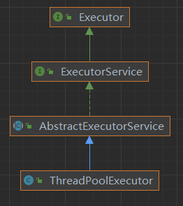

# 1. 线程池

线程池继承关系


线程池基本方法

1. Future<?> submit(Runnable task)
2. void execute(Runnable command

```java
public class ThreadPoolExecutor {
    public Future<?> submit(Runnable task) {
        if (task == null) throw new NullPointerException();
        RunnableFuture<Void> ftask = newTaskFor(task, null);
        execute(ftask);
        return ftask;
    }

    public void execute(Runnable command) {
        if (command == null) throw new NullPointerException();
        int c = ctl.get();
        if (workerCountOf(c) < corePoolSize) {
            if (addWorker(command, true)) return;
            c = ctl.get();
        }
        if (isRunning(c) && workQueue.offer(command)) {
            int recheck = ctl.get();
            if (!isRunning(recheck) && remove(command)) reject(command);
            else if (workerCountOf(recheck) == 0) addWorker(null, false);
        } else if (!addWorker(command, false))
            reject(command);
    }

    private boolean addWorker(Runnable firstTask, boolean core) {
        retry:
        for (int c = ctl.get(); ; ) {
            // Check if queue empty only if necessary.
            if (runStateAtLeast(c, SHUTDOWN)
                    && (runStateAtLeast(c, STOP)
                    || firstTask != null
                    || workQueue.isEmpty()))
                return false;

            for (; ; ) {
                if (workerCountOf(c)
                        >= ((core ? corePoolSize : maximumPoolSize) & COUNT_MASK))
                    return false;
                if (compareAndIncrementWorkerCount(c))
                    break retry;
                c = ctl.get();  // Re-read ctl
                if (runStateAtLeast(c, SHUTDOWN))
                    continue retry;
                // else CAS failed due to workerCount change; retry inner loop
            }
        }
        boolean workerStarted = false;
        boolean workerAdded = false;
        Worker w = null;
        try {
            w = new Worker(firstTask);
            final Thread t = w.thread;
            if (t != null) {
                final ReentrantLock mainLock = this.mainLock;
                mainLock.lock();
                try {
                    // Recheck while holding lock.
                    // Back out on ThreadFactory failure or if
                    // shut down before lock acquired.
                    int c = ctl.get();

                    if (isRunning(c) ||
                            (runStateLessThan(c, STOP) && firstTask == null)) {
                        if (t.isAlive()) // precheck that t is startable
                            throw new IllegalThreadStateException();
                        workers.add(w);
                        int s = workers.size();
                        if (s > largestPoolSize)
                            largestPoolSize = s;
                        workerAdded = true;
                    }
                } finally {
                    mainLock.unlock();
                }
                if (workerAdded) {
                    t.start();
                    workerStarted = true;
                }
            }
        } finally {
            if (!workerStarted)
                addWorkerFailed(w);
        }
        return workerStarted;
    }
}
```

```java
class Worker implements Runnable {
    final void runWorker(Worker w) {
        Thread wt = Thread.currentThread();
        Runnable task = w.firstTask;
        w.firstTask = null;
        w.unlock(); // allow interrupts
        boolean completedAbruptly = true;
        try {
            while (task != null || (task = getTask()) != null) {
                w.lock();
                if ((runStateAtLeast(ctl.get(), STOP) || (Thread.interrupted() && runStateAtLeast(ctl.get(), STOP))) && !wt.isInterrupted()) wt.interrupt();
                try {
                    beforeExecute(wt, task);
                    try {
                        task.run();
                        afterExecute(task, null);
                    } catch (Throwable ex) {
                        afterExecute(task, ex);
                        throw ex;
                    }
                } finally {
                    task = null;
                    w.completedTasks++;
                    w.unlock();
                }
            }
            completedAbruptly = false;
        } finally {
            processWorkerExit(w, completedAbruptly);
        }
    }
}
```


# java 命令参数

<pre>
java中的各种命令参数
java中有很多命令参数，这些命令参数有些是控制jvm行为的，有的则是供应用程序使用。我所了解的参数主要有三种，现在说一说这三种类型的参数。

（1）命令行参数。

命令行参数就是类似与c语言的命令行参数，这些参数会传给main函数，也就是java中 public static void main(String[] args) 的那个String数组。但是需要注意的是，c

语言的main行数中传入的参数，arv[0]是程序本身的名字，比如program1 option1 option2,那么arv[0]就是program1本身。但是java的命令函参数确实从0开始的，也就是说，java中的第一个命令行参数是的args[0]，举个例子 java program1 option1 option2 运行一个java程序的话，args[0]获取到的是option1。

（2）系统属性参数

系统属性参数也是供应用程序使用的，并且是以key=value这样的形式提供的，在程序的任何一个地方，都可以通过System.getProperty("key")获取到对应的value值。在官方文档中对系统属性参数的描述是这样的：

Set a system property value. If  value  is a string that contains spaces, you must enclose the string in double quotes:

java -Dfoo="some string" SomeClass
系统属性参数传入的时候需要带一个横杆和大写字母D，比如-Dfuck.abc="1234"这样的。在你业务代码中，你就可以使用它了：System.getProperty("fuck.abc")，获取"1234"。不过系统属性参数一般都是用来开启一些官方开关的，比如加入-Djdk.internal.lambda.dumpProxyClasses="/home/xxx"，你就可以把java8中lambda表达式的代理类自己码dump出来。

（3）jvm参数

jvm参数就是和jvm相关的参数了，比如配置gc、配置堆大小、配置classpath等等。

jvm参数分为标准参数、扩展参数和不稳定参数。

标准参数是一定有效，向后兼容的，且所有的jvm都必须要实现的，比如-classpath，这类参数是横杆直接跟参数名

扩展参数是不保证向后向后兼容，不强值要求所有jvm实现都要支持，不保证后续版本不会取消的，这类参数的形式是-Xname，横杠和一个大写的X开头

不稳定参数就是非常不稳定，可能只是特定版本的，特点是-XXname，横杆后带两个大写X开头。

 

如果想查看具体的参数的含义，最好的方法就是看官方文档，或者直接man java一下，也可以参考这篇文章《Java 命令行运行参数》
（4）spring boot 参数
-- 开头，这个是 spring boot 使用的

 

其实，只要java -h以下，就可以看到这些说明。java命令的语法为：

java [-options] class [args...]
           (to execute a class)
或者

java [-options] -jar jarfile [args...]
           (to execute a jar file)
所以，我前面说的严格意义上全都是不对的，java中的命令行参数只有option 和 args两类。我说的第一类对应args，后面两类都是属于option的，那才是jvm的参数。
</pre>

