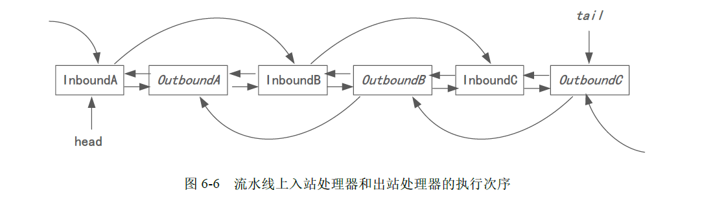

# error log
### 利用protobuf生成的对象直接进行toString     
 这样的操作会导致输出乱码出来，应该是protobuf生成对象的toString有问题
### netty直接发送String 的时候服务端无响应
 netty在进行网络传输的时候传输非直接输出String 会导致服务端接收不到消息的现象
##  java.lang.IllegalStateException: channel or channelFactory not set
没有配置 b.channel(NioServerSocketChannel.class);没有配置channel类型

 
 
 ## pipeline进出站规则
  
