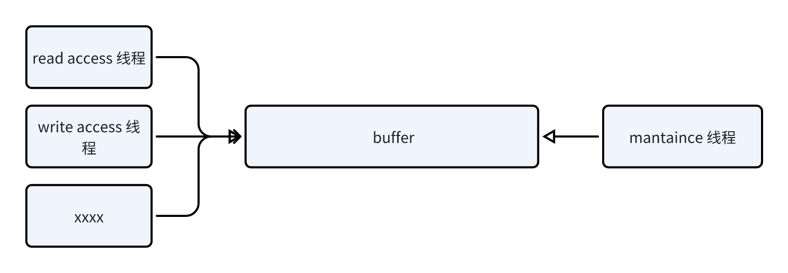
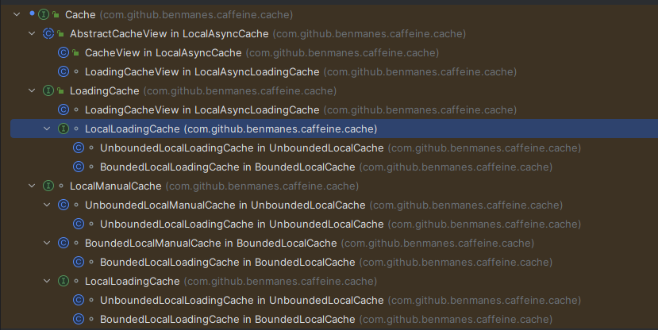
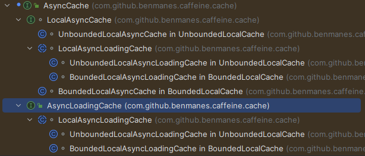

# 问题（解决的需求）

1. 访问频率的存储的空间的节约
2. 访问频率怎么统计
3. 访问频率怎么增加
4. 访问频率怎么获取
5. 访问频率怎么减少，以及减少的依据
6. 解决突然的稀疏频率访问
7. 解决长期下来的访问频率累计问题


# 整体类概览

<!-- TOC -->
1. Read Buffer
   [1.Read Buffer](##write buffer)
2. Write Buffer
3. drainReadBuffer
4. drainWriteBuffer
5. keyReferences/drain
6. valueReferences/drain
7. expireEntries/evictEntries
8. data
   1. window - LRU
      1. widow dequeue
   2. probation
      1. probation dequeue
   3. protected
      1. protected dequeue
9. TimerWheel
10. countMinSketch
## 淘汰算法


## FrequencySketch（频率草图）
整个caffeine的数据访问频率记录，不管是window、probation还是protection区域    
我们暂时不用关心hash值的冲突问题，因为caffeine一共进行了四次hash以此来减少hash的冲突问题
### 查看访问频率
获取hash结果后index的四个位置上数字的最小值
```java
final class FrequencySketch<E> {
   @NonNegative
   public int frequency(E e) {
      if (isNotInitialized()) {
         return 0;
      }

      int[] count = new int[4];
      int blockHash = spread(e.hashCode());
      int counterHash = rehash(blockHash);
      int block = (blockHash & blockMask) << 3;
      for (int i = 0; i < 4; i++) {
         int h = counterHash >>> (i << 3);
         int index = (h >>> 1) & 15;
         int offset = h & 1;
         count[i] = (int) ((table[block + offset + (i << 1)] >>> (index << 2)) & 0xfL);
      }
      return Math.min(Math.min(count[0], count[1]), Math.min(count[2], count[3]));
   }
   /** Applies a supplemental hash functions to defends against poor quality hash. */
   static int spread(int x) {
      x ^= x >>> 17;
      x *= 0xed5ad4bb;
      x ^= x >>> 11;
      x *= 0xac4c1b51;
      x ^= x >>> 15;
      return x;
   }

   /** Applies another round of hashing for additional randomization. */
   static int rehash(int x) {
      x *= 0x31848bab;
      x ^= x >>> 14;
      return x;
   }
}
```
### 降鲜机制以及频率增加

#### 解决LRU 在长期运行之后无法将频率过高，但是未来可能不会访问的元素问题
逻辑如下
1. 刚开始运行到一定次数（假定是n）后将所有元素的计数除以2
2. 第二次运行到  n + n/2 （因为第一步是对所有计数除2，所以在这个时候所有的计数加起来就是n了）
3. 第三次运行到  n + n/2 + n/2 
4. 以此类推
基于 caffeine 论文的证明来看当前次数越大那么真实的命中率期望（也就是缓存命中率）越接近不进行降鲜的命中率，当趋近于无穷的时候那么他们相等

#### 我们来看具体代码实现逻辑
caffeine 代码如下(我们重点看reset方法)：
```java
final class FrequencySketch<E> {
   @SuppressWarnings("ShortCircuitBoolean")
   static final long RESET_MASK = 0x7777777777777777L;
   static final long ONE_MASK = 0x1111111111111111L;

   /**
    * 
    * @param e
    */
   public void increment(E e) {
      if (isNotInitialized()) {
         return;
      }

      int[] index = new int[8]; // 前面4个表示long中的offset，后面四个表示buffer[]中的offset
      int blockHash = spread(e.hashCode());
      int counterHash = rehash(blockHash);
      int block = (blockHash & blockMask) << 3;
      for (int i = 0; i < 4; i++) { // 计算 long 中的offset和buffer[]中的offset 
         int h = counterHash >>> (i << 3);
         index[i] = (h >>> 1) & 15;
         int offset = h & 1;
         index[i + 4] = block + offset + (i << 1);
      }
      boolean added =
              incrementAt(index[4], index[0])
                      | incrementAt(index[5], index[1])
                      | incrementAt(index[6], index[2])
                      | incrementAt(index[7], index[3]);

      if (added && (++size == sampleSize)) {
         reset();
      }
   }

   /**
    * 
    * @param i 数组中的偏移量
    * @param j long 数组中的位偏移量
    * @return 如果对应位上的数字已经是15了，那么就增加失败 
    *  <p>这个有一个小问题如果一直都是 increment失败 怎么办呢？</p>
    *  <p>如果一直increment失败, 那么他访问数据的大概率是已经存在的数据</p>
    *  <p>这里由于是将 long 拆分成为四个数字（最大为15），但是并不是每个数字均匀的占用四个位，而是通过一个  counterHash >>> (i << 3) 来实现index的定位</p>
    *  <p>
    *      counterHash 算法：
    *        x *= 0x31848bab;
   *         x ^= x >>> 14;
    *  </p>
    */
   boolean incrementAt(int i, int j) {
      int offset = j << 2;
      long mask = (0xfL << offset);
      if ((table[i] & mask) != mask) { // table[i] & mask 表示在指定位上的计数（分为 [0,15], [16,31], [32,47],[48,63]）
         table[i] += (1L << offset);
         return true;
      }
      return false;
   }

   /** Reduces every counter by half of its original value.
    * 将原来计数数量减半
    *  */
   void reset() {
      int count = 0;
      for (int i = 0; i < table.length; i++) {
         count += Long.bitCount(table[i] & ONE_MASK);
         table[i] = (table[i] >>> 1) & RESET_MASK;
      }
      size = (size - (count >>> 2)) >>> 1;
   }
}
```
带来的问题
1. 对于访问次数超出15的数据怎么处理，为什么这么处理


# ReadBuffer 
实现类 BoundedBuffer, 也是在 mpsc buffer的基础上进行实现和扩张出来，同时允许写入的丢失事务
- A striped, non-blocking, bounded buffer.
- A multiple-producer / single-consumer buffer.




- 作用以及优化点
1. 这个其实也是一个典型削峰的行为，因为多个线程同时写入，势必会导致写入速度容易大于消费速度，所以使用这个来优化
2. 由于是属于读buffer 的优化，没有必要保证一定写入，如果没有写入buffer，那么就马上对当前的node执行onAccess方式（更新节点过期时间访问频率等）
3. 同时为了优化写入速度，实现类（BoundedBuffer），内部使用的stripedBuffer也就是将buffer 分成了好几个buffer 依次来增加并发性
<pre>
 A multiple-producer / single-consumer buffer that rejects new elements if it is full or
 fails spuriously due to contention. Unlike a queue and stack, a buffer does not guarantee an
 ordering of elements in either FIFO or LIFO order.
 <p>
 Beware that it is the responsibility of the caller to ensure that a consumer has exclusive read
 access to the buffer. This implementation does <em>not</em> include fail-fast behavior to guard
 against incorrect consumer usage.

A circular ring buffer stores the elements being transferred by the producers to the consumer.
The monotonically increasing count of reads and writes allow indexing sequentially to the next
element location based upon a power-of-two sizing.

The producers race to read the counts, check if there is available capacity, and if so then try
once to CAS to the next write count. If the increment is successful then the producer lazily
publishes the element. The producer does not retry or block when unsuccessful due to a failed
CAS or the buffer being full.

The consumer reads the counts and takes the available elements. The clearing of the elements
and the next read count are lazily set.

This implementation is striped to further increase concurrency by rehashing and dynamically
adding new buffers when contention is detected, up to an internal maximum. When rehashing in
order to discover an available buffer, the producer may retry adding its element to determine
whether it found a satisfactory buffer or if resizing is necessary.

一个用于在生产者和消费者之间传递元素的并发、无锁的循环环形缓冲区的实现.
一种数据结构，呈环形，用于将元素从生产者传递到消费者。
读取和写入的计数不断递增。这使得可以基于二的幂次方的大小进行顺序索引。?
多个生产者争用读取计数，检查是否有可用容量，如果有，就尝试一次 CAS 操作来增加下一个写入计数。如果成功，生产者就会惰性地发布元素。如果 CAS 失败或缓冲区已满，生产者不会重试或阻塞。
消费者读取计数并获取可用元素。元素的清除和下一个读取计数的更新是惰性进行的。
增加并发性的分片: **该实现进行了分片以增加并发性**。这涉及在检测到争用时重新散列并动态添加新的缓冲区，最多添加到内部最大值。
</pre>

<h2 id="write_buffer">write buffer</h2>
# WriteBuffer

回放操作，不允许写入丢失。
- 概述解释   
This is a shaded copy of MpscGrowableArrayQueue provided by JCTools  from version 2.0.   
这个是从jctool 复制过来代码
- 作用
用于回放操作，他的队列存储的都是一个runnable ，这个是时候，在afterWrite之后被加入到buffer
在 maintenance/clear 的时候（一个消费者执行）,将buffer里面task弹出来并run
- 性能优化
1. cache line buffer 填充
2. 多级队列，再扩容的时候直接直接分配新的数组，并将新的数据通过链表的形式放到老数组的末尾，

## 动态过期时间配置（时间轮）
- 触发的实际   
在对节点进行update、access的时候会触发，每次出发会将自己放入到对应的时间轮中的末尾
- 时间轮
用于记录动态时间配置的过期策略的主动过期策略，schedule调度
- 多级时间轮（用于优化不同过期时间范围，减少时间轮的出发次数）
- caffeine 时间轮原理论文 https://dl.acm.org/doi/pdf/10.1145/41457.37504
- 描述如下


## 使用
1. Caffeine
   主要的对话build类
2. Cache/AsyncCache

### Cache 顶级父类, 同步加载，这个会在同一个线程进行loading 数据




1. LoadingCache
   由缓存自动加载数据的缓存，也就是我们只需要传入一个key 不需要传入 loader，  
   这个loader 可以在最后build 的时候进行指定,  
   代码如下，省略其他配置
   ```java
   class Test {
      void demo_test() {
          Cache<Object, Object> build = Caffeine.newBuilder()
                  .build(new CacheLoader<Object, Object>() {
                      @Override
                      public @Nullable Object load(@NonNull Object key) throws Exception {
                          return key + "value";
                      }
                  });
      }
   }
   ```
2. LocalManualCache
   主动加载数据的，也就是在 Cache#get(KEY,Function)，这个方法在

### AsyncCache
能看出来这这个的loader 主要与前面的cache主要是一些执行的时候需要带一个executor以及返回值是一个CompletableFuture的异步结果

   ```java
   class Test {
       void demo_test_with_async()  {
           AsyncCache<Object, Object> build = Caffeine.newBuilder().buildAsync(new AsyncCacheLoader<>() {
               @Override
               public @NonNull CompletableFuture<Object> asyncLoad(@NonNull Object key, @NonNull Executor executor) {
                   return CompletableFuture.supplyAsync(() -> {
                       return key + "async loading";
                   });
               }
           });
       }
   }
   ```

# 参考
https://tig.red/caffeine.html
https://dl.acm.org/doi/pdf/10.1145/41457.37504