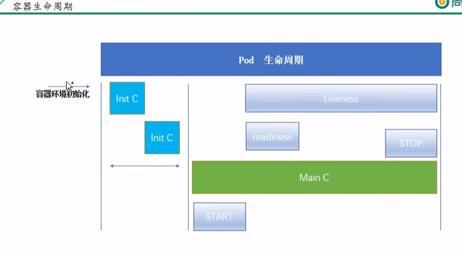

<div style="text-align: center; font-size: 33px; font-weight: bold; ">k8s</div>

# 1. 概览

## 1. 竞争情况

1. MESOS
2. DOCKER Swarm
3. k8s
    1. 轻量? 消耗资源小
    2. 开源
    3. 弹性伸缩
    4. 复杂均衡 IPVS

## 2. 知识图谱

### 2.1 介绍说明

1. 前世今生

2. k8s 框架

3. 关键字含

### 2.2 关键字含义

1. 什么是pod

2. 控制器类型

3. k8s 网络通讯模式

### 2.3 构建 k8s 集群 （安装）

### 2.4 资源清单

1. 什么是资源
2. 什么是资源清单
3. 掌握资源清单的语法，yaml语法
4. 通过资源清单编写pod
5. 掌握pod 的生命周期 ***

### 2.5 pod 控制器

1. 掌握各种控制器的特点以及定义方式

### 2.6 服务发现

1. svc 原理及其构建方式
2. 服务的分类
    1. 有状态服务 ：DBMS
    2. 无状态服务 ：LVS APACHE

### 2.7 存储

多种存储类型的特点
怎么选用

1. configmap
2. secret
3. volume
4. pv

### 2.8 调度器

1. 调度器原理
2. 能够要求把pod定义到想要的节点运行

### 2.9  鉴权

1. 集群的认证
2. 鉴权
3. 控制访问
4. 原理及其流程

### 2.10 HELM 包管理

1. Linux yum
2. HELM原理
3. HELM模板自定义
4. HELM

### 2.11 运维

1. kubeadm 源码修改，达到证书可用期限为10年
2. kubernetes 高可用集群

# 2. 组件说明

## 组件介绍

api server
kubectl

webui
replication controller（controller manager） ： 维持副本的期望数量   
scheduler: 负责介绍任务，选择合适的节点进行分配   
etcd： 存储k8s集群所有重要信息（持久化）   
kubelet： 直接跟容器引擎交互实现容器的生命周期管理   
kube-proxy： 负责写入规则至 IPTABLES，IPVS，实现服务映射访问  
CoreDNS ：可以为器群中svc穿件一个域名IP对应关系解析   
ingress controller：官方只能实现四层代理，ingress 可以实现七层代理   
Prometheus：提供k8s的监控能力    
dashboard ： 给 k8s 提供一个b/s结构访问体系   
federation：提供一个跨集群中心多k8s统一管理功能   
ELK：提供k8s集群日志统一分析介入

## pod

- 自主式pod   
  死亡之后不会被重新拉起来的pod，也就是自身自灭的pod  
  在同一个pod 里面共享同一个网络栈（也就是端口不能相同），同时也共享同一个存储卷（也就是存在文件名冲突的情况）

- 控制器管理的pod
  分为三类控制器（）
    - replication controller   
      用来确保容器应用的副本数始终保持在用户定义的副本数，即如果容器异常退出会创建新的pod来替代；如果异常多出来的容器也会自动回收。在新版的kubernetes中建议使用replica
      set来取代replication controller。当然如果资源不足的情况下就无法达到期望的副本数量
    - replica set   
      和 replication controller 没有本质不同，只是名字不一样，并且replica set只是集合式selector
    - deployment
      虽然replica set 可以单独使用，但是一般建议使用deployment来自动管理replica set ，这样就无需担心其他机制的不兼容问题（比如replica
      set 不支持rolling-update，但是deployment）
    - hpa （horizontal pod autoscaling）  
      仅适用与deployment 和replicaset， 在v1版本中仅支持根据pod的cpu利用率扩缩容，在v1
      alpha版本中，支持根据内存和用户自定义的metric扩缩容（可以自己定义规则进行扩容或者缩容）  
      如规则（cpu核数》80 停止扩容，pod数量在2-10之间），只要满足其中一个条件就会停止扩容，如果都溢出了就需要进行缩容

## stateFullSet

- 稳定的持久化存储，即pod重新调度后还是能访问到相同的持久化数据，基于pvc实现
- 稳定的网络标志，即pod重新调度后其pod name 和hostname 不变，基于headless service（即没有cluster ip 的service）实现
- 有序部署，有序扩展，pod是有序的，在部署或者扩展的时候要依据定义的顺序依次进行（即从0到N-1，在下一个pod运行之前所有的pod必须是running和ready状态），基于init
  container 来实现
- 有序收缩，有序删除（即从N-1到0）

## daemon set

确保全部（或者一些 ）node上运行一个pod的副本。当有node加入集群时，也会为他们新增一个pod。当node从集群移除时，这些pod也会被回收。删除daemonset
会将删除它创建的所有pod。
一些daemon set的典型用法：

- 云心集群存储daemon。列如在每一个node上运行glusterd，ceph。
- 在每一个node上运行日志收集daemon，列如fluentd，logstash
- 在每一个ndoe上运行监控daemon，列如Prometheus node exporter

## job， corn job

job 仅执行一次的任务，它抱枕批处理任务的一个或者多个pod成功结束
corn job 基于时间的job，给定时间点的周期执行

## 服务发现

不同的pod副本集之前范围需要使用一个中间件（service-具体的服务）来进行统一访问管理；通过这个统一的服务来进行访问可以实现负载均衡，节点挂了之后重新分配pod是地址变化后对于客户端的访问的影响。

# 3. 网络通讯模式

&emsp;&emsp; k8s的网络模型假定了一个所有pod都在一个可以"直接链接"的扁平的网络空间，这在gce（google compute engine）
里面是现成的网络模型，k8s假定网络已经存在。二在私有云里搭建k8s集群，就不能假定这个网络已经存在了。我们需要自己实现这个网络，将不同节点上的docker容器之间的相互访问先打通，然后运行k8s。   
&emsp;&emsp; flannel 是core os 团队 针对
k8s设计的一个网络规划服务，他是让集群中的不同节点主机创建的docker容器都具有全集群唯一的虚拟ip地址。而且他还能在这些ip地址之间建立一个覆盖网络（overlay
network），通过这个网络， 将数据包原封不同地传递到目标容器内。
协议栈帧如下：  
mac | outerIp | udp | innerIp | payload  
列如：  
xxx:xxx:xxx | source: 192.168.0.2; dest: 192.168.0.3 | udp | source:10.1.15.2; dest:10.1.20.3 | data

## pod 之pod

- 在同一台机器， 直接由docker0网桥直接转发请求之pod2，不需要经过flannel
- 不在同一台主机，需要将pod的ip 和node 的ip进行关联，通过关联然pod 可以相互访问

## pod 到service 的网络

目前基于性能考虑，全部为iptables(新版本是lvs)维护和转发

## pod 到外网

pod向外网发送请求：

1. 查找路由表
2. 转发数据包到宿主机的网卡
3. 宿主网卡完成路由选择之后
4. iptables 执行 **masquerade**，把源ip更改为宿主网卡的ip
5. 然后向外网服务器发送请求

## 外网访问 pod：service

node to pod 的方式来进行访问

# 4. k8s 资源清单

## 4.1 集群资源清单分类

- 名称空间级别： kubeadm （会在k8s的kube-system命名空间下运行） kubectl get pod (默认为 -n default 这个命名空间)
    - 工作负载型: pod、replicaset、deployment、statefulSet、deamonSet、job、cornjob（replication controller）
    - 服务发现及负载均衡型资源（ServiceDiscoveryLoadBalance）： service、ingress...
    - 配置与存储型资源：volume (存储卷)、csi（容器存储接口，可以扩展各类的第三方存储卷）
    - 特殊类型的存储卷：configMap（当配置中心来使用的资源类型，配置数据）、secret（保密数据）、DownwardAPI(
      把外部环境中的信息输出给容器)
- 集群级别：role 集群级别的资源标识？
    - namespace、node、role、clusterRole、RoleBinding、ClusterRoleBinding
- 元类型： HPA、podTemplate、LimitRange

## 4.2 资源清单含义

### yaml

基本语法：

- **缩进是不允许使用tab键**，只允许使用空格
- 缩进的空格树木不重要，只需要相同层级的元素左侧对齐即可
- **#** 标识注释, 注释一行

支持的数据结构

- 对象：k:v
- 数组: 数据要带**-**符号表示
- 纯量（scalars）:

```yaml
# 数组
arr:
  - a
  - b
  - c
arr1: [ a,b,c ]
# 纯量
scalars: b
# 对象
obj1:
  o1: c
obj2: { o1: v1, o2: v2 }
```

## 4.3 常用字段解释

### 4.3.1 创建pod的yaml必须存在的字段

| 参数名                     | 字段类型   | 说明                                                    |
|-------------------------|--------|-------------------------------------------------------|
| version(apiVersion)     | String | 这里指的是k8s API的版本，目前基本上是V1，可以用 kubectl api-versions命令查询 |
| kind                    | String | 这里指的是yaml文件定义的资源类型和角色，比如：Pod                          |
| metadata                | Object | 元数据对象，固定值就写metadata                                   |
| metadata.namespace      | String | 元数据对象的名字、这里有我们自定义，如比命令pod的名字(因为pod 是命名空间级别的资源)        |
| metadata.name           | String | 元数据对象的命令空间，由我们自身定义                                    |
| spec                    | Object | 详细定义对象，固定值就写 spec                                     |
| spec.containers[]       | list   | spec对象的容器列表定义                                         |
| spec.containers[].name  | String | 容器的名字                                                 |
| spec.containers[].image | String | 要用到的容器镜像名称                                            |

### 4.3.2 主要字段但是非必要

| 参数名                                        | 字段类型   | 说明                                                                                                                                    |
|--------------------------------------------|--------|---------------------------------------------------------------------------------------------------------------------------------------|
| spec.containers[].imagePullPolicy          | String | Always(每次都尝试重新拉取镜像)、Never（仅适用本地）、IfNotPresent（本地有用本地，没有就拉去），没有配置默认使用Always                                                            |
| spec.containers[].command[]                | list   | 容器启动命令，可以指定多个，不指定则使用镜像打包时使用的启动命令                                                                                                      |
| spec.containers[].args[]                   | list   | 指定容器启动命令参数                                                                                                                            |
| spec.containers[].workingDir               | String | 指定工作目录                                                                                                                                |
| spec.containers[].volumeMounts[]           | list   | 指定容器内部的存储卷配置                                                                                                                          |
| spec.containers[].volumeMounts[].name      | String | 指定可以被容器挂载的存储卷的名称                                                                                                                      |
| spec.containers[].volumeMounts[].mountPath | String | 指定可以被容器挂载的存储卷的路径                                                                                                                      |
| spec.containers[].volumeMounts[].readOnly  | String | 设置存储卷路径的读写模式，ture 或者false默认为读写模式                                                                                                      |
| spec.containers[].ports[]                  | list   | 指定容器需要用到的端口列表                                                                                                                         |
| spec.containers[].ports[].name             | String | 指定端口名称                                                                                                                                |
| spec.containers[].ports[].containerPort    | String | 指定容器需要监听的端口号                                                                                                                          |
| spec.containers[].ports[].hostPort         | String | 指定容器所在主机需要监听的端口号，默认跟上面containerPort相同，注意设置了hostPort同一台主机无法启动该容器的相同副本 (因为主机的端口号不能相同，这样会冲突)                                             |
| spec.containers[].ports[].protocol         | String | 指定端口协议，支持TCP和UDP，默认值为TCP                                                                                                              |
| spec.containers[].env[]                    | list   | 指定容器运行前需设置的环境变量列表                                                                                                                     |
| spec.restartPolicy                         | String | Always（pod一旦终止运行，无论容器是如何终止的，kubelet都会将它重启），OnFailure：只有当Pod以非9退出码退出才会重启该容器。如果容器正常结束（exit code is 0）则不会重启。Never（不会重启，但是会将退出码宝盖给master） |
| spec.nodeSelector                          | Object | 定义Node的Label过滤标签，以key：value格式指定                                                                                                       |
| spec.imagePullSecrets                      | Object | 定义pull镜像时使用secret名称，以name：secretkey格式指定                                                                                               |
| spec.hostNetwork                           | String | 是否为主机网络模式模式，默认为false。设置true表示使用宿主机网络，不在使用docker网桥；同时设置了true将无法在同一台宿主机启动第二个副本                                                          |


### 4.3.3 自己写一个pod.yaml

```yaml
apiVersion: v1
kind: Pod
metadata:
  name: myapp-pod
  labels: 
    app: myapp
spec:
  containers:
  - name: app
    image: nginx
    ports:
    - containerPort: 80
      hostPort: 10080
      protocol: tcp

#  - name: test
#    image: nginx
```

基于yaml启动pod   
kubectl apply -f pod.yaml   
查看pod情况，会发现只启动了一个pod  ,因为（由于网络模式默认使用的主机模式）此时端口冲突了
kubectl get pod   


## 4.4 k8s pod 生命周期

- init c 容器初始化 -》 main c   
    - start (执行我们指定的启动命令) -》 进入 Liveness  
      -  readiness -> (这中间存在一个检测机制，如果程序死了会有响应的重启策略，这个策略就是我们指定的restartPolicy)-> stop 
- init 容器
    