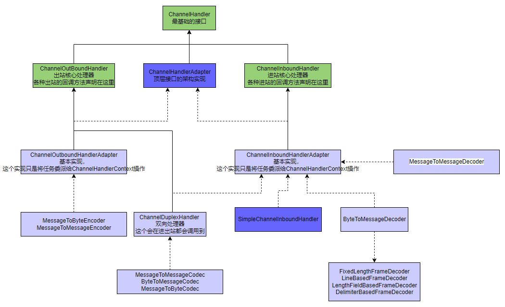

# nio 基础概念
1. selector  对应一个线程
2. channel  一个selector 会有多个channel 注册到selector/程序，他是双向的可以用于输入也可以用于输出
3. buffer  内存块，底层是一个数组，这个是程序操作的对象，
   <pre>
            |————buffer —— channel |      
   程序      |————buffer —— channel |    selector
            |————buffer —— channel |    
   </pre>
4. handler
5. 

# netty 基础组件
1. netty 抽象出两组线程池，master group 专门负责收客户端链接，worker 专门负责网络读写
2. BossGroup和WorkerGroup 类型都是NioEventLoopGroup
3. NioEventLoopGroup 相当于一个事件循环组，这个组中包含出个时间循环，每个时间循环是NioEventLoop
4. NioEventLoop表示一个不断循环的执行处理任务的线程, NioEventLoop都有一个selector，用于监听绑定在其上的Socket网络通讯
5. NioEventLoop可以有多个线程，既可以有多个 NioEventLoop
6. 每个master NioEventLoop 执行的步骤有3步
   1. 轮询处理accept事件
   2. 处理accept时间，与client建立链接，生成NioSocketChannel，并将其注册到某个worker 的NioEventLoop上的selector
   3. 处理任务队列的任务，及runAllTasks
7. 每个worker NioEventLoop 循环执行的步骤
   1. 轮询read， write事件，
   2. 处理i/o事件，即read，write事件，在对应NioSocketChannel处理
   3. 处理任务队列的任务，及runAllTasks
8. 每个Worker NioEventLoop处理业务时会使用到pipeline，pipeline就是handler的双向链表

Netty模型
方案再说明
1) Netty 抽象出两组线程池，MasterGroup专门负责接收客户端连接，WorkerGroup 专门负责网络读写操作。
2) NioEventLoop表示一个不断循环执行处理任务的线程，每 NioEventLoop 都有一个selector，用于监听绑定在其上的 socket 网络通道。
3) NioEventLoop内部采用串行化设计，从消息的读取->解码->处理->编码->发送，始终由I0 线程 NioEventLoop 负责
   NioEventLoopGroup 下包含多个 NioEventLoop
   每个 NioEventLoop 中包含有一个 Selector，一个 taskQueue
   每个 NioEventLoop的 Selector 上可以注册监听多个 NioChannel每个 
   NioChannel只会绑定在唯一的 NioEventLoop上每个 
   NioChannel都绑定有一个自己的 ChannelPipeline

# netty 线程池, EventLoopGroup/NioEventLoopGroup

# handler
handler 再请求过程中的情况，单个页面的请求多个资源，单个浏览器多个页面，单个浏览器多次刷新，多个浏览器
## handler 继承关系图

# pipeline

# channel

## channel option
ChannelOption.BACKLOG对应TCP/IP 协议 listen 函数中的 backlog 参数，用来初始化服务器可连接队列大小。服务端处理客户端连接请求是顺序处理的，所以同一时间只能处理一个客户端连接。多个客户端来的时候，服务端将不能外理的客户端连接请求放在队列中等待处理，backlog 参数指定了队列的大小。
ChannelOption.KEEPALIVE直保持连接活动状态

# protobuf 协议
