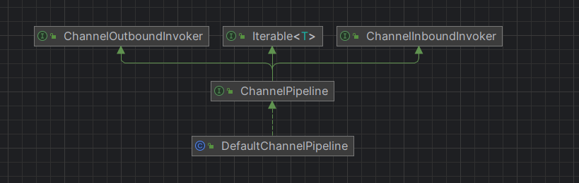
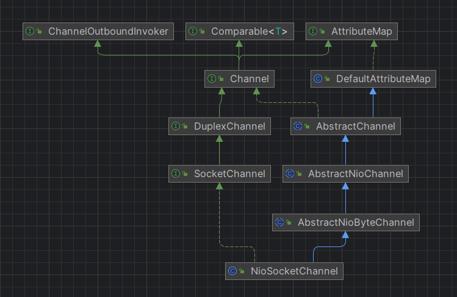

# nio 基础概念
1. selector  对应一个线程
2. channel  一个selector 会有多个channel 注册到selector/程序，他是双向的可以用于输入也可以用于输出
3. buffer  内存块，底层是一个数组，这个是程序操作的对象，
   <pre>
            |————buffer —— channel |      
   程序      |————buffer —— channel |    selector
            |————buffer —— channel |    
   </pre>
4. handler
5. 

# netty 基础组件
1. netty 抽象出两组线程池，master group 专门负责收客户端链接，worker 专门负责网络读写
2. BossGroup和WorkerGroup 类型都是NioEventLoopGroup
3. NioEventLoopGroup 相当于一个事件循环组，这个组中包含出个时间循环，每个时间循环是NioEventLoop
4. NioEventLoop表示一个不断循环的执行处理任务的线程, NioEventLoop都有一个selector，用于监听绑定在其上的Socket网络通讯
5. NioEventLoop可以有多个线程，既可以有多个 NioEventLoop
6. 每个master NioEventLoop 执行的步骤有3步
   1. 轮询处理accept事件
   2. 处理accept时间，与client建立链接，生成NioSocketChannel，并将其注册到某个worker 的NioEventLoop上的selector
   3. 处理任务队列的任务，及runAllTasks
7. 每个worker NioEventLoop 循环执行的步骤
   1. 轮询read， write事件，
   2. 处理i/o事件，即read，write事件，在对应NioSocketChannel处理
   3. 处理任务队列的任务，及runAllTasks
8. 每个Worker NioEventLoop处理业务时会使用到pipeline，pipeline就是handler的双向链表

Netty模型
方案再说明
1) Netty 抽象出两组线程池，MasterGroup专门负责接收客户端连接，WorkerGroup 专门负责网络读写操作。
2) NioEventLoop表示一个不断循环执行处理任务的线程，每 NioEventLoop 都有一个selector，用于监听绑定在其上的 socket 网络通道。
3) NioEventLoop内部采用串行化设计，从消息的读取->解码->处理->编码->发送，始终由I0 线程 NioEventLoop 负责
   NioEventLoopGroup 下包含多个 NioEventLoop
   每个 NioEventLoop 中包含有一个 Selector，一个 taskQueue
   每个 NioEventLoop的 Selector 上可以注册监听多个 NioChannel每个 
   NioChannel只会绑定在唯一的 NioEventLoop上每个 
   NioChannel都绑定有一个自己的 ChannelPipeline

# netty 线程池, EventLoopGroup/NioEventLoopGroup

# handler 源码
handler 再请求过程中的情况，单个页面的请求多个资源，单个浏览器多个页面，单个浏览器多次刷新，多个浏览器
## handler 继承关系图

handler 执行的hook方法执行顺序
handleAdded
registered
active
outBound#read
readComplete
# pipeline
## 概览
DefaultChannelPipeline#callHandlerAddedForAllHandlers 调用channelHandlerInitializer

- 它支持热插拔的方法使用handler
- AbstractChannelHandlerContext#skipContext pipeline 会根据 executionMask 这个的值进行pipeline 调用链进行优化
# channel
channel 继承关系图

## channel option
ChannelOption.BACKLOG 对应TCP/IP 协议 listen 函数中的 backlog 参数，用来初始化服务器可连接队列大小。服务端处理客户端连接请求是顺序处理的，所以同一时间只能处理一个客户端连接。多个客户端来的时候，服务端将不能外理的客户端连接请求放在队列中等待处理，backlog 参数指定了队列的大小。
ChannelOption.KEEPALIVE 直保持连接活动状态

# protobuf 协议

# netty 服务端启动流程
也就是服务端端口开启监听端口的流程     
核心入口方法：AbstractBootstrap#bind 
1. initAndRegister 初始化注册器
   1. 实例化一个netty的Channel对象, 
      1. 并且将readInterestOp成员变量赋值为ChannelSelectionKey.OP_ACCEPT，（这个时候还没有将感兴趣事件注册到selector上）
      2. 配置为非阻塞i/o 
      3. 实例化当前channel的pipeline，并且将默认的tail和head加入pipeline中
      4. 实例化内存分配器
   2. 初始化 netty的channel
      1. 添加匿名的ChannelInitializer：这里值添加一些处理器，ServerBootstrapAcceptor、日志处理器等
      2. 这里的处理器添加ServerBootstrapAcceptor这个处理器，是通过提交任务的方式加入任务的，目的可能是为了：为什么这么写呢？因为是单线程的，防止添加pipeline节点的操作导致反复添加节点问题
   3. 将channel 添加到  EventLoopGroup 中
      1. 注册将原生的channel注册到当前EventLoop的selector中，此时channel还没有被注册任何感兴趣事件
      2. 执行 DefaultChannelPipeline#invokeHandlerAddedIfNeeded，ChannelInitializer#handlerAdded，这里的initializer，就是（2.1中实例化的ChannelInitializer）
         1. 初始化channel ，这个时候回去调用我们自定义的ChannelInitializer#initChannel将我们的自定义handler添加到当前channel的pipeline上
         2. 将ChannelInitializer 的handler当前pipeline 移除出去！！！！！！！！！！（注意，这里就体现了链式pipeline的好处，热插拔功能）
      3. DefaultChannelPipeline#fireChannelRegistered
         1. 会去尝试执行 DefaultChannelPipeline#invokeHandlerAddedIfNeeded 由于之前以及执行过一次，所以这里基本就是一个 nop操作， 从head开始
      4. 尝试激活pipeline 但是由于此时还没有将进程绑定到端口上，所以无法激活    
=========================== 此时我们的netty的server 版本就启动代码以及完成，并且将监听接口的异步结果返回， ===========================
2. 将 ServerBootstrapAcceptor 加入到pipeline 中
3. 执行绑定端口, 从tail 从未到头执行 bind操作
4. 加入accept事件到当前channel的selectionKey ！！！！！！！！！！
   1. DefaultChannelPipeline#fireChannelActive 执行 pipeline 中handler 的 channelActive方法
   2. 执行完了 fireChannelActive 链 之后执行  ChannelOutboundHandler(HeadContext)#read

# netty 接请求流程流程
1. 死循环轮训selectionKey （再window上不存在空循环导致cpu %100问题，linux上存在空循环bug）
   1. 不存在事件
      1. 没有任务可以执行（也就是当前NioEventLoop线程池的taskQueues没有元素），再去select一把，如果再就阻塞
      2. 存在任务执行，去执行taskQueue中的task 
   2. 存在事件，处理selectionKey的对应事件
2. 处理新连接请求过来    
   通过 NioMessageUnsafe#doReadMessages 实现
   1. 通过acceptChannel 接受新的请求，产生一个新的java的nio channel
   2. 将java的channel封装到netty的channel中，并且将SelectionKey.OP_READ 作为 netty channel的readInterestOp成员变量
   3. 将新的 channel 放到 AbstractNioMessageChannel$NioMessageUnsafe.readBuf 列表中   
3. 调用ChannelPipeline#fireChannelRead，也就是调用 ChannelInboundHandler#channelRead方法，进站操作，同事此时的message是 accept产生的新的netty的channel
   1. 这里最核心的逻辑就是去执行在 netty 启动阶段的ServerBootstrapAcceptor 这里处理器，
   2. 组装我们的pipeline ，将我们的initializer 加入到新channel的pipeline中
   3. 将新的channel注册到childGroup中，也就是就像新的连接注册到我们的workerGroup中，这个时候就与前文（1.3 的前三个步骤一样了），
      1. 注册 channel到selector
      2. 执行initializer中init方法
   4. 其中第四个步骤不一样，因为此时channel已经是出于被激活状态，所以回去调用新channel的pipeline的fireChannelActive也就是ChannelInboundHandler#channelActive 链
   5. 由于设置了autoRead，这里会触发channel的read，也就是pipeline的Read， ChannelOutboundHandler(HeadContext)#read
   6. 回去调用 netty 的 Unsafe#beginRead 也就是将我们的感兴趣的事件注册到新channel上
   

# channelHandlerContext 分析
