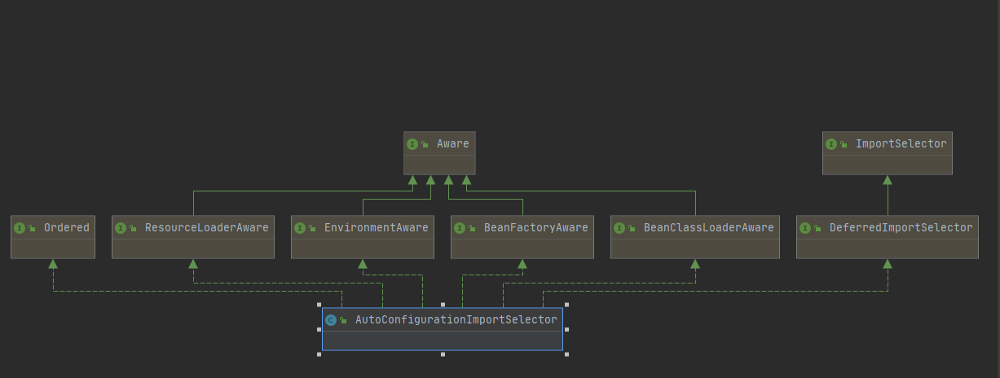
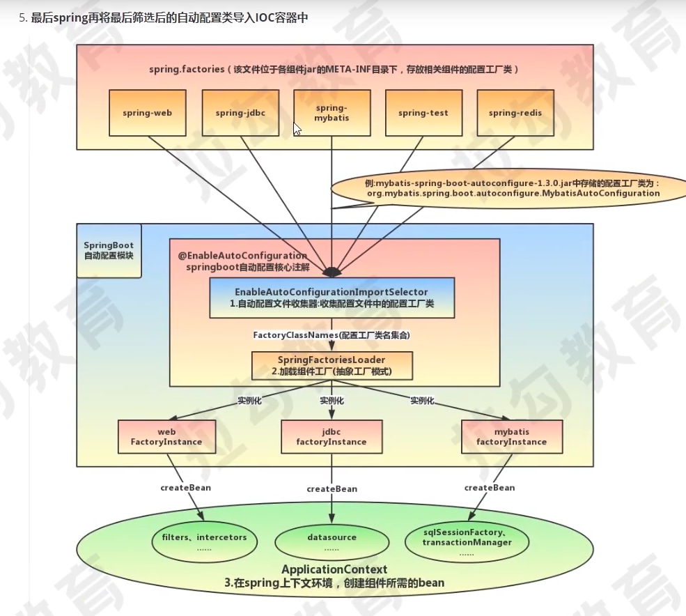

# 问题1：
为什么 导入starter不需要指定版本
<pre>
    在 /spring-boot-project/spring-boot-dependencies/中的pom文件中里面
    的properties标签和<dependencyManagement> <dependencies> </dependencies></dependencyManagement> 
    对starter进行了版本锁定
</pre>

# 问题2： @SpringBootApplication 注解
## 1. 本质是一个组合注解 注解内容如下     
```java
@Target(ElementType.TYPE)        // 只用范围可以作用类在类，接口，注解，或者枚举
@Retention(RetentionPolicy.RUNTIME)  // 注解的生命周期，Runtime运行时
@Documented  // 可以记录在javadoc中
@Inherited     // 可以被继承
@SpringBootConfiguration    //  表示该类为配置类，因为他 使用了 @Configuration注解，就是对该注解的一个重新包装
@EnableAutoConfiguration    //	启动自动配置功能
@ComponentScan(
        excludeFilters = {
                @Filter(type = FilterType.CUSTOM, classes = TypeExcludeFilter.class),
                @Filter(type = FilterType.CUSTOM, classes = AutoConfigurationExcludeFilter.class)
        }
)  // 扫包范围
```
## 2. 对各个注解的细则解释       
2.1 @SpringBootConfiguration    //  表示该类为配置类，因为他 使用了 @Configuration注解，就是对该注解的一个重新包装     
2.2 @EnableAutoConfiguration    //  也是一个组合注解，他是组合了(除开基本注解外) @AutoConfigurationPackage 和
        @Import(AutoConfigurationImportSelector.class) 注解，Spring中有很多以Enable开头的注解，
        其作用就是借助**@Import**来收集并注册特定场景相关的Bean，并加载到Ioc容器。
        @EnableAutoConfiguration就是借助@Import来收集所有符合自动配置条件的bean定义，并加载到loC容器。          
        AutoConfigurationImportSelector的继承关系：
        
        其中上图的ImportSelector,而继承他的DeferredImportSelector  **（需要看的内容）**       
        确定自动配置的实现逻辑的入口方法：       
            自动配置实现逻辑的相关入口方法在而继承他的 DeferredImportSelectorGrouping 类的getImports方法处，
```java
private static class DeferredImportSelectorGrouping {
    private final DeferredImportSelector.Group group;

    private final List<DeferredImportSelectorHolder> deferredImports = new ArrayList<>();

    DeferredImportSelectorGrouping(Group group) {
        this.group = group;
    }

    public void add(DeferredImportSelectorHolder deferredImport) {
        this.deferredImports.add(deferredImport);
    }

    /**
     * Return the imports defined by the group.
     * @return each import with its associated configuration class
     */
    public Iterable<Group.Entry> getImports() {
        for (DeferredImportSelectorHolder deferredImport : this.deferredImports) {
            this.group.process(deferredImport.getConfigurationClass().getMetadata(),
                    deferredImport.getImportSelector());
        }
        return this.group.selectImports();
    }

    public Predicate<String> getCandidateFilter() {
        Predicate<String> mergedFilter = DEFAULT_EXCLUSION_FILTER;
        for (DeferredImportSelectorHolder deferredImport : this.deferredImports) {
            Predicate<String> selectorFilter = deferredImport.getImportSelector().getExclusionFilter();
            if (selectorFilter != null) {
                mergedFilter = mergedFilter.or(selectorFilter);
            }
        }
        return mergedFilter;
    }
}
```
    
### 关于条件注解的讲解       
* @Conditional是Spring4新提供的注解，它的作用是按照一定的条件进行判断，满足条件给容器注册bean。      
* @ConditionalOnBean:仅仅在当前上下文中存在某个对象时，才会实例化一个Bean。        
* @ConditionalOnClass:某个class位于类路径上，才会实例化一个Bean。      
* @ConditionalOnExpression:当表达式为true的时候，才会实例化一个Bean。基于SpEL表达式的条件判断。       
* @ConditionalOnMissingBean:仅仅在当前上下文中不存在某个对象时，才会实例化一个Bean。        
* @ConditionalOnMissingClass:某个class类路径上不存在的时候，才会实例化一个Bean,       
        


2.1.1 AutoConfigurationPackage 注解又是Import::AutoConfigurationPackages.Registrar
```java 
@Import(AutoConfigurationPackages.Registrar.class)
public @interface AutoConfigurationPackage {}
```
    2.1.2 @Import 注解 spring的底层注解，可以用来给容器中导入一个组件
    


## 自己需要搞定的前置问题
1. 注解信息怎么拿到的
2. 源码中出现的类型推导 deduce
3. spring的后置处理器，这个似乎是很多东西的拓展入口

## 问题：springBoot自动配置原理
从main方法开始，
1. springboot怎么去找到的我们自己写的主类，以及实例化我们的主类
2. 对我们的主类上面的注解 **@SpringBootApplication** 的解析      
2.1 对下面三个类注解的解析
    <pre>
     @SpringBootConfiguration    //  表示该类为配置类，因为他 使用了 @Configuration注解，就是对该注解的一个重新包装
     @EnableAutoConfiguration    //	启动自动配置功能
     @ComponentScan(
            excludeFilters = {
                    @Filter(type = FilterType.CUSTOM, classes = TypeExcludeFilter.class),
                    @Filter(type = FilterType.CUSTOM, classes = AutoConfigurationExcludeFilter.class)
            }
     )
     </pre>
2.2 在 @EnableAutoConfiguration 注解中怎么执行自动配置的。        
2.2.1  怎么加载spring.factories，以及他的key是啥       
    
    AbstractApplicationContext#invokeBeanFactoryPostProcessors(beanFactory); 
    1. 资源定位
            SpringBoot实现定位有三种，1、主类所在的包，2、SPI就是我们导入的 spring-boot-starter-xxx 的定位方式 3、 @Import 注解指定的类
    2. BeanDefinition的载入 （我们加上了@Component注解，并且可以被扫描到的类）
    3. 注册BeanDefinition
3. 在通过ComponentScan注解把需要扫描的包中对应被@Component 注解所注解的所有类，进行解析，并放入到IOC容器中        
3.1 这里有一句代码 ClassUtils.getPackageName(declaringClass); 获取到我们的主类的全路径的包路径
3.3 这个是处理@Import导入的类，ConfigurationClassParser#processImports(configClass, sourceClass, getImports(sourceClass), filter, true);


# springboot 应用的启动过程
## 主流程

## 准备: 这下面的方法很重要，里面有很多全类名，用来直接初始化使用的
* 主要是用来加载 **spring.factories** 文件里面的内容里面有类的全类名 
```java
public final class SpringFactoriesLoader {
    public static List<String> loadFactoryNames(Class<?> factoryType, @Nullable ClassLoader classLoader) {
        String factoryTypeName = factoryType.getName();
        return loadSpringFactories(classLoader).getOrDefault(factoryTypeName, Collections.emptyList());
    }

	private static Map<String, List<String>> loadSpringFactories(@Nullable ClassLoader classLoader) {
		MultiValueMap<String, String> result = cache.get(classLoader);
		if (result != null) {
			return result;
		}

		try {
			Enumeration<URL> urls = (classLoader != null ?
					classLoader.getResources(FACTORIES_RESOURCE_LOCATION) :
					ClassLoader.getSystemResources(FACTORIES_RESOURCE_LOCATION));
			result = new LinkedMultiValueMap<>();
			while (urls.hasMoreElements()) {
				URL url = urls.nextElement();
				UrlResource resource = new UrlResource(url);
				Properties properties = PropertiesLoaderUtils.loadProperties(resource);
				for (Map.Entry<?, ?> entry : properties.entrySet()) {
					String factoryTypeName = ((String) entry.getKey()).trim();
					for (String factoryImplementationName : StringUtils.commaDelimitedListToStringArray((String) entry.getValue())) {
						result.add(factoryTypeName, factoryImplementationName.trim());
					}
				}
			}
			cache.put(classLoader, result);
			return result;
		}
		catch (IOException ex) {
			throw new IllegalArgumentException("Unable to load factories from location [" +
					FACTORIES_RESOURCE_LOCATION + "]", ex);
		}
	}
}
```
### 1 new SpringApplication(primarySources) 解析
1. 主要就是将我们的主类放入SpringApplication实例化对象的成员变量，推到web应用的类型 （servlet还是reactiveWeb）
2. 从 spring.factories 加载应用上下文初始化器和应用监听器
3. 推到主类的类型
```java
class SpringApplication{
	public static ConfigurableApplicationContext run(Class<?>[] primarySources, String[] args) {
		return new SpringApplication(primarySources).run(args);
	}
    //  这个构造方法会去执行
	public SpringApplication(ResourceLoader resourceLoader, Class<?>... primarySources) {
		// resourceLoader 设置为null(资源加载器)
		this.resourceLoader = resourceLoader;
		Assert.notNull(primarySources, "PrimarySources must not be null");
		// 将我们的主类放到这个成员成员变量
		this.primarySources = new LinkedHashSet<>(Arrays.asList(primarySources));
		// 推到web应用的类型，是servlet还是reactive
		this.webApplicationType = WebApplicationType.deduceFromClasspath();
		// 从 jar包和自己项目中的 META-INF/spring.factories 中的值拿出来,
		// 这个是拿去ApplicationListener全类名为key的属性值, 并赋值给 initializers
		setInitializers((Collection) getSpringFactoriesInstances(ApplicationContextInitializer.class));
		// 从 jar包和自己项目中的 META-INF/spring.factories 中的值拿出来，
		// 这个是拿去ApplicationListener全类名为key的属性值, 并赋值给 listeners
		setListeners((Collection) getSpringFactoriesInstances(ApplicationListener.class));
		this.mainApplicationClass = deduceMainApplicationClass();
	}

}
```
#### 2 run(args) 方法解析
1. 获取并启动监听器
2. 构造上下文环境
3. 初始化应用上下文，在创建这个应用上下文的收这里会去创建IOC容器,IOC会以context的属性存在容器中，这个容器的名称就是beanFactory
4. 刷新上下文的准备阶段, 主要是对应用上下文的一些属性给加上去，以及将我们的核心启动类（就是我们的springboot启动类）给加载到我们IOC容器
5. 刷新应用上下文 // 这里的工作主要都是交由spring来完成了，springboot 主要是在之前主要是准备 spring 的 context 了        
    &nbsp;&nbsp;&nbsp;    5.1. 准备环境  prepareRefresh();\
    &nbsp;&nbsp;&nbsp;    5.2. 准备Bean工厂  prepareBeanFactory(beanFactory);       \
    &nbsp;&nbsp;&nbsp;    5.3. 这个是主线 invokeBeanFactoryPostProcessors(beanFactory);      \
    &nbsp;&nbsp;&nbsp;  &nbsp;&nbsp;&nbsp;  5.3.1. 检查我们的启动主类是不是     \
    &nbsp;&nbsp;&nbsp;  &nbsp;&nbsp;&nbsp;  5.3.2. 执行ComponentScan包下面    \
    &nbsp;&nbsp;&nbsp;  &nbsp;&nbsp;&nbsp;     这个有一个很重要的方法 ConfigurationClassParser#doProcessConfigurationClass  \
    &nbsp;&nbsp;&nbsp;  &nbsp;&nbsp;&nbsp;     // 这个不是全部内容需要补充一下，不过是主要内容   \
    &nbsp;&nbsp;&nbsp;  &nbsp;&nbsp;&nbsp;  &nbsp;&nbsp;&nbsp;    5.3.2.1 扫描类对里面的每一个类扫面里面的注解里面有没有在Component注解（如果没有会使用递归去解析）       \
    &nbsp;&nbsp;&nbsp;  &nbsp;&nbsp;&nbsp;  &nbsp;&nbsp;&nbsp;    5.3.2.2 解析 @PropertySources注解        \
    &nbsp;&nbsp;&nbsp;  &nbsp;&nbsp;&nbsp;  &nbsp;&nbsp;&nbsp;    5.3.2.3 解析 @Import     \
    &nbsp;&nbsp;&nbsp;  &nbsp;&nbsp;&nbsp;  &nbsp;&nbsp;&nbsp;    5.3.2.4 解析 @ImportResource     
    &nbsp;&nbsp;&nbsp;  &nbsp;&nbsp;&nbsp;  &nbsp;&nbsp;&nbsp;    5.3.2.5 解析 @Bean       
    &nbsp;&nbsp;&nbsp;  &nbsp;&nbsp;&nbsp;  &nbsp;&nbsp;&nbsp;    5.3.2.6 对接口的默认方法的初始化，主要是为是实佩java      \
    &nbsp;&nbsp;&nbsp;  &nbsp;&nbsp;&nbsp;  &nbsp;&nbsp;&nbsp;    5.3.2.7 看是否有父类，如果有父类那么返回父类，将父类执行3.2.x的操作 \
    &nbsp;&nbsp;&nbsp;   5.4.注册后置bean工厂，这里会有关于web的一些bean初始化等  registerBeanPostProcessors(beanFactory); \
    &nbsp;&nbsp;&nbsp;   5.5. 后面是一些监听结果的完成和模板方法的调用  \
6. 刷新应用上下文后的拓展接口, 默认是空实现，什么都没有做, 这个可以实现一些自定义功能
```java
class SpringApplication{
    public ConfigurableApplicationContext run(String... args) {
        StopWatch stopWatch = new StopWatch();
        stopWatch.start();
        ConfigurableApplicationContext context = null;
        Collection<SpringBootExceptionReporter> exceptionReporters = new ArrayList<>();
        configureHeadlessProperty();
        // 1. 获取并启动监听器
        SpringApplicationRunListeners listeners = getRunListeners(args);
        listeners.starting();
        try {
            ApplicationArguments applicationArguments = new DefaultApplicationArguments(args);
            // 2. 构造上下文环境
            ConfigurableEnvironment environment = prepareEnvironment(listeners, applicationArguments);
            // 处理需要忽略的Bean
            configureIgnoreBeanInfo(environment);
            // 打印Banner 答应spring 的那个文字图片
            Banner printedBanner = printBanner(environment);
            // 3. 初始化应用上下文，在创建这个应用上下文的收这里会去创建IOC容器,IOC会以context的属性存在容器中，这个容器的名称就是beanFactory
            context = createApplicationContext();
            // 实例化SpringBootExceptionReporter.class, 用来支持报告关于启动的错误
            exceptionReporters = getSpringFactoriesInstances(SpringBootExceptionReporter.class,
                    new Class[] { ConfigurableApplicationContext.class }, context);
            // 4. 刷新上下文的装备阶段, 主要是对应用上下文的一些属性给加上去，以及将我们的核心启动类（就是我们的springboot启动类）给加载到我们IOC容器
            prepareContext(context, environment, listeners, applicationArguments, printedBanner);
            // 5. 刷新应用上下文 // 这里的工作主要都是交由spring来完成了，springboot 主要是在之前主要是准备 spring 的 context 了
            refreshContext(context);
            // 6. 刷新应用上下文后的拓展接口, 默认是空实现，什么都没有做, 这个可以实现一些自定义功能
            afterRefresh(context, applicationArguments);
            // end
            stopWatch.stop();
            if (this.logStartupInfo) {
                new StartupInfoLogger(this.mainApplicationClass).logStarted(getApplicationLog(), stopWatch);
            }
            listeners.started(context);
            callRunners(context, applicationArguments);
        }
        catch (Throwable ex) {
            handleRunFailure(context, ex, exceptionReporters, listeners);
            throw new IllegalStateException(ex);
        }
    
        try {
            listeners.running(context);
        }
        catch (Throwable ex) {
            handleRunFailure(context, ex, exceptionReporters, null);
            throw new IllegalStateException(ex);
        }
        return context;
    }
}
```
##### 2.1  getRunListeners(args)
// 就是从spring.factories中去加在以org.springframework.boot.SpringApplicationRunListener 获取src\main\resources\META-INF\spring.factories文件下面的        
org.springframework.boot.SpringApplicationRunListener=\     
org.springframework.boot.context.event.EventPublishingRunListener       
这两行的监听器，通过全类名利用反射去创建它，并去启动他
```java
class SpringApplication{
	private SpringApplicationRunListeners getRunListeners(String[] args) {
		Class<?>[] types = new Class<?>[] { SpringApplication.class, String[].class };
		return new SpringApplicationRunListeners(logger,
				getSpringFactoriesInstances(SpringApplicationRunListener.class, types, this, args));
	}
	
	private <T> Collection<T> getSpringFactoriesInstances(Class<T> type, Class<?>[] parameterTypes, Object... args) {
		ClassLoader classLoader = getClassLoader();
		// Use names and ensure unique to protect against duplicates
		Set<String> names = new LinkedHashSet<>(SpringFactoriesLoader.loadFactoryNames(type, classLoader));
        // 利用反射去初始化这些自动配置类
		List<T> instances = createSpringFactoriesInstances(type, parameterTypes, classLoader, args, names);
		AnnotationAwareOrderComparator.sort(instances);
		return instances;
	}
}
```
##### 2.2 构造上下文环境
// 2. 构造上下文环境
ConfigurableEnvironment environment = prepareEnvironment(listeners, applicationArguments);
// 处理需要忽略的Bean
configureIgnoreBeanInfo(environment);
// 打印Banner 答应spring 的那个文字图片
Banner printedBanner = printBanner(environment);
```java 
private ConfigurableEnvironment prepareEnvironment(SpringApplicationRunListeners listeners,
        ApplicationArguments applicationArguments) {
    // Create and configure the environment
    // 创建一个环境，是SERVLET还是REACTIVE的web还
    ConfigurableEnvironment environment = getOrCreateEnvironment();   
    // 设置环境以及我们传入的一些参数，这里的args主要是main函数中的参数(String args[])
    configureEnvironment(environment, applicationArguments.getSourceArgs());
    ConfigurationPropertySources.attach(environment);
    listeners.environmentPrepared(environment);
    // 执行的方法 Binder.get(environment).bind("spring.main", Bindable.ofInstance(this));
    bindToSpringApplication(environment);  
    if (!this.isCustomEnvironment) {
        environment = new EnvironmentConverter(getClassLoader()).convertEnvironmentIfNecessary(environment,
                deduceEnvironmentClass());
    }
    ConfigurationPropertySources.attach(environment);
    return environment;
}
```
##### 2.3 初始化应用上下文，在创建这个应用上下文的收这里会去创建IOC容器,IOC会以context的属性存在容器中，这个容器的名称就是beanFactory
* context = createApplicationContext();
* 获取到对应类型的上下文，并且使用反射初始化
* 实例化SpringBootExceptionReporter.class, 用来支持报告关于启动的错误
* exceptionReporters = getSpringFactoriesInstances(SpringBootExceptionReporter.class, new Class[] { ConfigurableApplicationContext.class }, context);
```java
class SpringApplication{
	public static final String DEFAULT_CONTEXT_CLASS = "org.springframework.context."
			+ "annotation.AnnotationConfigApplicationContext";

	public static final String DEFAULT_SERVLET_WEB_CONTEXT_CLASS = "org.springframework.boot."
			+ "web.servlet.context.AnnotationConfigServletWebServerApplicationContext";

	public static final String DEFAULT_REACTIVE_WEB_CONTEXT_CLASS = "org.springframework."
			+ "boot.web.reactive.context.AnnotationConfigReactiveWebServerApplicationContext";
	protected ConfigurableApplicationContext createApplicationContext() {
		Class<?> contextClass = this.applicationContextClass;
		if (contextClass == null) {
			try {
				switch (this.webApplicationType) {
				case SERVLET:
					contextClass = Class.forName(DEFAULT_SERVLET_WEB_CONTEXT_CLASS);
					break;
				case REACTIVE:
					contextClass = Class.forName(DEFAULT_REACTIVE_WEB_CONTEXT_CLASS);
					break;
				default:
					contextClass = Class.forName(DEFAULT_CONTEXT_CLASS);
				}
			}
			catch (ClassNotFoundException ex) {
				throw new IllegalStateException(
						"Unable create a default ApplicationContext, please specify an ApplicationContextClass", ex);
			}
		}
		return (ConfigurableApplicationContext) BeanUtils.instantiateClass(contextClass);
	}
}
```
##### 2.4 刷新上下文的

// 4. 刷新上下文的准备阶段, 主要是对应用上下文的一些属性给加上去，以及将我们的核心启动类（就是我们的springboot启动类）给加载到我们IOC容器     
prepareContext(context, environment, listeners, applicationArguments, printedBanner);       
1. 把main函数中的args封装成单例bean,并注册到IOC容器中
2. 判断一下是不是BeanFactory的后置处理器是否用的懒加载的形式，并将其用使用懒加载的形式来来初始化处理器
3. 将我们的Springboot主类给注册到IOC容器中，就是放到 DefaultListableBeanFactory.beanDefinitionMap 里面去

```java
class SpringApplication{
	private void prepareContext(ConfigurableApplicationContext context, ConfigurableEnvironment environment,
			SpringApplicationRunListeners listeners, ApplicationArguments applicationArguments, Banner printedBanner) {
		context.setEnvironment(environment);  // 设置environment
		postProcessApplicationContext(context);   // 设置 :: context.getBeanFactory().setConversionService(ApplicationConversionService.getSharedInstance());
		applyInitializers(context);   				// 执行初始化，这里有一个后置处理器的初始化
		listeners.contextPrepared(context);			// 向各个监听器发送容易已经装备好的事件
		if (this.logStartupInfo) {
			logStartupInfo(context.getParent() == null);
			logStartupProfileInfo(context);
		}
		// Add boot specific singleton beans
		ConfigurableListableBeanFactory beanFactory = context.getBeanFactory();
        // 把main函数中的args封装成单例bean,并注册到IOC容器中
		beanFactory.registerSingleton("springApplicationArguments", applicationArguments);	
		if (printedBanner != null) {
			beanFactory.registerSingleton("springBootBanner", printedBanner);
		}
		if (beanFactory instanceof DefaultListableBeanFactory) {
			((DefaultListableBeanFactory) beanFactory)
					.setAllowBeanDefinitionOverriding(this.allowBeanDefinitionOverriding);
		}
		if (this.lazyInitialization) {
			context.addBeanFactoryPostProcessor(new LazyInitializationBeanFactoryPostProcessor());
		}
		// Load the sources
		Set<Object> sources = getAllSources();				// 这里获取到的就是我们获取到的核心启动类
		Assert.notEmpty(sources, "Sources must not be empty");
        // 将我们的核心启动类注册到IOC的bean容器中
		load(context, sources.toArray(new Object[0]));		
		listeners.contextLoaded(context);
	}
}
```
##### 2.5  刷新应用上下文 

这里的工作主要都是交由spring来完成了，springboot 主要是在之前主要是准备 spring 的 context 了

###### 2.5.1 刷新上下文的主流程
    
    1. 准备环境  prepareRefresh();
    2. 准备Bean工厂  prepareBeanFactory(beanFactory);
    3. 这个是主线 invokeBeanFactoryPostProcessors(beanFactory);
        3.1. 检查我们的启动主类是不是
        3.2. 执行ComponentScan包下面       
        这个有一个很重要的方法 ConfigurationClassParser#doProcessConfigurationClass
        // 这个不是全部内容需要补充一下，不过是主要内容   
            3.2.1 扫描类对里面的每一个类扫面里面的注解里面有没有在Component注解（如果没有会使用递归去解析）       
            3.2.2 解析@PropertySources注解        
            3.2.3 @Import     
            3.2.4 @ImportResource     
            3.2.5 @Bean       
            3.2.6 对接口的默认方法的初始化      
            3.2.7 看是否有父类，如果有父类那么返回父类，将父类执行3.2.x的操作
    4.注册后置bean工厂，这里会有关于web的一些bean初始化等  registerBeanPostProcessors(beanFactory);
    5. 后面是一些监听结果的完成和模板方法的调用
            
        
```java
package org.springframework.context.support;
public abstract class AbstractApplicationContext extends DefaultResourceLoader
		implements ConfigurableApplicationContext {
	@Override
	public void refresh() throws BeansException, IllegalStateException {
		synchronized (this.startupShutdownMonitor) {
			// Prepare this context for refreshing.
			prepareRefresh();

			// Tell the subclass to refresh the internal bean factory.
			ConfigurableListableBeanFactory beanFactory = obtainFreshBeanFactory();

			// Prepare the bean factory for use in this context.
            // 准备 bean 工厂
			prepareBeanFactory(beanFactory);

			try {
				// Allows post-processing of the bean factory in context subclasses.
                // 注册  RequestScope、SessionScope到IOC容中的scopes中
                // 注册 RequestObjectFactory、ResponseObjectFactory、SessionObjectFactory、WebRequestObjectFactory
                //      到IOC容中的 resolvableDependencies 
				postProcessBeanFactory(beanFactory);

				// Invoke factory processors registered as beans in the context.
				invokeBeanFactoryPostProcessors(beanFactory);

				// Register bean processors that intercept bean creation.
				registerBeanPostProcessors(beanFactory);

				// Initialize message source for this context.
				initMessageSource();

				// Initialize event multicaster for this context.
				initApplicationEventMulticaster();

				// Initialize other special beans in specific context subclasses.
				onRefresh();

				// Check for listener beans and register them.
				registerListeners();

				// Instantiate all remaining (non-lazy-init) singletons.
				finishBeanFactoryInitialization(beanFactory);

				// Last step: publish corresponding event.
				finishRefresh();
			}catch(BeansException ex) { /* ... */ }
        }
    }
}
```
##### 2.5.2 invokeBeanFactoryPostProcessors(beanFactory);
1. 检查我们的启动主类是不是
2. 执行ComponentScan包下面       
这个有一个很重要的方法 ConfigurationClassParser#doProcessConfigurationClass   
    2.1 扫描类对里面的每一个类扫面里面的注解里面有没有在Component注解（如果没有会使用递归去解析）       
    2.2 解析@PropertySources注解        
    2.3 @Import     
    2.4 @ImportResource     
    2.5 @Bean       
    2.6 对接口的默认方法的初始化      
    2.7 看是否有父类，如果有父类那么返回父类，将父类执行2.x的操作
```java
public abstract class AbstractApplicationContext extends DefaultResourceLoader
		implements ConfigurableApplicationContext {
	protected void invokeBeanFactoryPostProcessors(ConfigurableListableBeanFactory beanFactory) {
		PostProcessorRegistrationDelegate.invokeBeanFactoryPostProcessors(beanFactory, getBeanFactoryPostProcessors());

		// Detect a LoadTimeWeaver and prepare for weaving, if found in the meantime
		// (e.g. through an @Bean method registered by ConfigurationClassPostProcessor)
		if (beanFactory.getTempClassLoader() == null && beanFactory.containsBean(LOAD_TIME_WEAVER_BEAN_NAME)) {
			beanFactory.addBeanPostProcessor(new LoadTimeWeaverAwareProcessor(beanFactory));
			beanFactory.setTempClassLoader(new ContextTypeMatchClassLoader(beanFactory.getBeanClassLoader()));
		}
	}

}

final class PostProcessorRegistrationDelegate {

	private PostProcessorRegistrationDelegate() {
	}
	public static void invokeBeanFactoryPostProcessors(
			ConfigurableListableBeanFactory beanFactory, List<BeanFactoryPostProcessor> beanFactoryPostProcessors) {

		// Invoke BeanDefinitionRegistryPostProcessors first, if any.
		Set<String> processedBeans = new HashSet<>();
        // 注册需要被后置处理的Bean容器，
		if (beanFactory instanceof BeanDefinitionRegistry) {
			BeanDefinitionRegistry registry = (BeanDefinitionRegistry) beanFactory;
			List<BeanFactoryPostProcessor> regularPostProcessors = new ArrayList<>();
			List<BeanDefinitionRegistryPostProcessor> registryProcessors = new ArrayList<>();

			for (BeanFactoryPostProcessor postProcessor : beanFactoryPostProcessors) {
				if (postProcessor instanceof BeanDefinitionRegistryPostProcessor) {
					BeanDefinitionRegistryPostProcessor registryProcessor =
							(BeanDefinitionRegistryPostProcessor) postProcessor;
					registryProcessor.postProcessBeanDefinitionRegistry(registry);
					registryProcessors.add(registryProcessor);
				}
				else {
					regularPostProcessors.add(postProcessor);
				}
			}

			// Do not initialize FactoryBeans here: We need to leave all regular beans
			// uninitialized to let the bean factory post-processors apply to them!
			// Separate between BeanDefinitionRegistryPostProcessors that implement
			// PriorityOrdered, Ordered, and the rest.
			List<BeanDefinitionRegistryPostProcessor> currentRegistryProcessors = new ArrayList<>();

			// First, invoke the BeanDefinitionRegistryPostProcessors that implement PriorityOrdered.
			String[] postProcessorNames =
					beanFactory.getBeanNamesForType(BeanDefinitionRegistryPostProcessor.class, true, false);
			for (String ppName : postProcessorNames) {
				if (beanFactory.isTypeMatch(ppName, PriorityOrdered.class)) {
					currentRegistryProcessors.add(beanFactory.getBean(ppName, BeanDefinitionRegistryPostProcessor.class));
					processedBeans.add(ppName);
				}
			}
			sortPostProcessors(currentRegistryProcessors, beanFactory);
			registryProcessors.addAll(currentRegistryProcessors);
			invokeBeanDefinitionRegistryPostProcessors(currentRegistryProcessors, registry);
			currentRegistryProcessors.clear();

			// Next, invoke the BeanDefinitionRegistryPostProcessors that implement Ordered.
			postProcessorNames = beanFactory.getBeanNamesForType(BeanDefinitionRegistryPostProcessor.class, true, false);
			for (String ppName : postProcessorNames) {
				if (!processedBeans.contains(ppName) && beanFactory.isTypeMatch(ppName, Ordered.class)) {
					currentRegistryProcessors.add(beanFactory.getBean(ppName, BeanDefinitionRegistryPostProcessor.class));
					processedBeans.add(ppName);
				}
			}
			sortPostProcessors(currentRegistryProcessors, beanFactory);
			registryProcessors.addAll(currentRegistryProcessors);
			invokeBeanDefinitionRegistryPostProcessors(currentRegistryProcessors, registry);
			currentRegistryProcessors.clear();

			// Finally, invoke all other BeanDefinitionRegistryPostProcessors until no further ones appear.
			boolean reiterate = true;
			while (reiterate) {
				reiterate = false;
				postProcessorNames = beanFactory.getBeanNamesForType(BeanDefinitionRegistryPostProcessor.class, true, false);
				for (String ppName : postProcessorNames) {
					if (!processedBeans.contains(ppName)) {
						currentRegistryProcessors.add(beanFactory.getBean(ppName, BeanDefinitionRegistryPostProcessor.class));
						processedBeans.add(ppName);
						reiterate = true;
					}
				}
				sortPostProcessors(currentRegistryProcessors, beanFactory);
				registryProcessors.addAll(currentRegistryProcessors);
				invokeBeanDefinitionRegistryPostProcessors(currentRegistryProcessors, registry);
				currentRegistryProcessors.clear();
			}

			// Now, invoke the postProcessBeanFactory callback of all processors handled so far.
			invokeBeanFactoryPostProcessors(registryProcessors, beanFactory);
			invokeBeanFactoryPostProcessors(regularPostProcessors, beanFactory);
		}

		else {
			// Invoke factory processors registered with the context instance.
			invokeBeanFactoryPostProcessors(beanFactoryPostProcessors, beanFactory);
		}

		// Do not initialize FactoryBeans here: We need to leave all regular beans
		// uninitialized to let the bean factory post-processors apply to them!
		String[] postProcessorNames =
				beanFactory.getBeanNamesForType(BeanFactoryPostProcessor.class, true, false);

		// Separate between BeanFactoryPostProcessors that implement PriorityOrdered,
		// Ordered, and the rest.
		List<BeanFactoryPostProcessor> priorityOrderedPostProcessors = new ArrayList<>();
		List<String> orderedPostProcessorNames = new ArrayList<>();
		List<String> nonOrderedPostProcessorNames = new ArrayList<>();
		for (String ppName : postProcessorNames) {
			if (processedBeans.contains(ppName)) {
				// skip - already processed in first phase above
			}
			else if (beanFactory.isTypeMatch(ppName, PriorityOrdered.class)) {
				priorityOrderedPostProcessors.add(beanFactory.getBean(ppName, BeanFactoryPostProcessor.class));
			}
			else if (beanFactory.isTypeMatch(ppName, Ordered.class)) {
				orderedPostProcessorNames.add(ppName);
			}
			else {
				nonOrderedPostProcessorNames.add(ppName);
			}
		}

		// First, invoke the BeanFactoryPostProcessors that implement PriorityOrdered.
		sortPostProcessors(priorityOrderedPostProcessors, beanFactory);
		invokeBeanFactoryPostProcessors(priorityOrderedPostProcessors, beanFactory);

		// Next, invoke the BeanFactoryPostProcessors that implement Ordered.
		List<BeanFactoryPostProcessor> orderedPostProcessors = new ArrayList<>(orderedPostProcessorNames.size());
		for (String postProcessorName : orderedPostProcessorNames) {
			orderedPostProcessors.add(beanFactory.getBean(postProcessorName, BeanFactoryPostProcessor.class));
		}
		sortPostProcessors(orderedPostProcessors, beanFactory);
		invokeBeanFactoryPostProcessors(orderedPostProcessors, beanFactory);

		// Finally, invoke all other BeanFactoryPostProcessors.
		List<BeanFactoryPostProcessor> nonOrderedPostProcessors = new ArrayList<>(nonOrderedPostProcessorNames.size());
		for (String postProcessorName : nonOrderedPostProcessorNames) {
			nonOrderedPostProcessors.add(beanFactory.getBean(postProcessorName, BeanFactoryPostProcessor.class));
		}
		invokeBeanFactoryPostProcessors(nonOrderedPostProcessors, beanFactory);

		// Clear cached merged bean definitions since the post-processors might have
		// modified the original metadata, e.g. replacing placeholders in values...
		beanFactory.clearMetadataCache();
	}
}


//  
class ConfigurationClassParser {
    // 把 holder 中的BeanDefinition取出来
	public void parse(Set<BeanDefinitionHolder> configCandidates) {
		for (BeanDefinitionHolder holder : configCandidates) {
			BeanDefinition bd = holder.getBeanDefinition();
			try {
				if (bd instanceof AnnotatedBeanDefinition) {
					parse(((AnnotatedBeanDefinition) bd).getMetadata(), holder.getBeanName());
				}
				else if (bd instanceof AbstractBeanDefinition && ((AbstractBeanDefinition) bd).hasBeanClass()) {
					parse(((AbstractBeanDefinition) bd).getBeanClass(), holder.getBeanName());
				}
				else {
					parse(bd.getBeanClassName(), holder.getBeanName());
				}
			}
			catch (BeanDefinitionStoreException ex) {
				throw ex;
			}
			catch (Throwable ex) {
				throw new BeanDefinitionStoreException(
						"Failed to parse configuration class [" + bd.getBeanClassName() + "]", ex);
			}
		}

		this.deferredImportSelectorHandler.process();
	}
    // parse(((AnnotatedBeanDefinition) bd).getMetadata(), holder.getBeanName());
    // 顺序执行内容
	protected final void parse(AnnotationMetadata metadata, String beanName) throws IOException {
		processConfigurationClass(new ConfigurationClass(metadata, beanName), DEFAULT_EXCLUSION_FILTER);
	}

	protected void processConfigurationClass(ConfigurationClass configClass, Predicate<String> filter) throws IOException {
		if (this.conditionEvaluator.shouldSkip(configClass.getMetadata(), ConfigurationPhase.PARSE_CONFIGURATION)) {
			return;
		}

		ConfigurationClass existingClass = this.configurationClasses.get(configClass);
		if (existingClass != null) {
			if (configClass.isImported()) {
				if (existingClass.isImported()) {
					existingClass.mergeImportedBy(configClass);
				}
				// Otherwise ignore new imported config class; existing non-imported class overrides it.
				return;
			}
			else {
				// Explicit bean definition found, probably replacing an import.
				// Let's remove the old one and go with the new one.
				this.configurationClasses.remove(configClass);
				this.knownSuperclasses.values().removeIf(configClass::equals);
			}
		}
		// Recursively process the configuration class and its superclass hierarchy.
		SourceClass sourceClass = asSourceClass(configClass, filter);
		do {
			sourceClass = doProcessConfigurationClass(configClass, sourceClass, filter);
		}
		while (sourceClass != null);

		this.configurationClasses.put(configClass, configClass);
    }

	protected void processConfigurationClass(ConfigurationClass configClass, Predicate<String> filter) throws IOException {
		if (this.conditionEvaluator.shouldSkip(configClass.getMetadata(), ConfigurationPhase.PARSE_CONFIGURATION)) {
			return;
		}

		ConfigurationClass existingClass = this.configurationClasses.get(configClass);
		if (existingClass != null) {
			if (configClass.isImported()) {
				if (existingClass.isImported()) {
					existingClass.mergeImportedBy(configClass);
				}
				// Otherwise ignore new imported config class; existing non-imported class overrides it.
				return;
			}
			else {
				// Explicit bean definition found, probably replacing an import.
				// Let's remove the old one and go with the new one.
				this.configurationClasses.remove(configClass);
				this.knownSuperclasses.values().removeIf(configClass::equals);
			}
		}

		// Recursively process the configuration class and its superclass hierarchy.
		SourceClass sourceClass = asSourceClass(configClass, filter);
		do {
			sourceClass = doProcessConfigurationClass(configClass, sourceClass, filter);
		}
		while (sourceClass != null);

		this.configurationClasses.put(configClass, configClass);
	}

	/**
	 * Apply processing and build a complete {@link ConfigurationClass} by reading the
	 * annotations, members and methods from the source class. This method can be called
	 * multiple times as relevant sources are discovered.
	 * @param configClass the configuration class being build
	 * @param sourceClass a source class
	 * @return the superclass, or {@code null} if none found or previously processed
	 */
	@Nullable
	protected final SourceClass doProcessConfigurationClass(
			ConfigurationClass configClass, SourceClass sourceClass, Predicate<String> filter)
			throws IOException {
        //  没有干啥事情
		if (configClass.getMetadata().isAnnotated(Component.class.getName())) {
			// Recursively process any member (nested) classes first
			processMemberClasses(configClass, sourceClass, filter);
		}

        //  执行对 PropertySource 的扫描，并把它放入IOC容器中
		// Process any @PropertySource annotations
		for (AnnotationAttributes propertySource : AnnotationConfigUtils.attributesForRepeatable(
				sourceClass.getMetadata(), PropertySources.class,
				org.springframework.context.annotation.PropertySource.class)) {
			if (this.environment instanceof ConfigurableEnvironment) {
				processPropertySource(propertySource);
			}
			else {
				logger.info("Ignoring @PropertySource annotation on [" + sourceClass.getMetadata().getClassName() +
						"]. Reason: Environment must implement ConfigurableEnvironment");
			}
		}

		// Process any @ComponentScan annotations
		Set<AnnotationAttributes> componentScans = AnnotationConfigUtils.attributesForRepeatable(
				sourceClass.getMetadata(), ComponentScans.class, ComponentScan.class);
		if (!componentScans.isEmpty() &&
				!this.conditionEvaluator.shouldSkip(sourceClass.getMetadata(), ConfigurationPhase.REGISTER_BEAN)) {
			for (AnnotationAttributes componentScan : componentScans) {
				// The config class is annotated with @ComponentScan -> perform the scan immediately
				Set<BeanDefinitionHolder> scannedBeanDefinitions =
						this.componentScanParser.parse(componentScan, sourceClass.getMetadata().getClassName());
				// Check the set of scanned definitions for any further config classes and parse recursively if needed
				for (BeanDefinitionHolder holder : scannedBeanDefinitions) {
					BeanDefinition bdCand = holder.getBeanDefinition().getOriginatingBeanDefinition();
					if (bdCand == null) {
						bdCand = holder.getBeanDefinition();
					}
					if (ConfigurationClassUtils.checkConfigurationClassCandidate(bdCand, this.metadataReaderFactory)) {
						parse(bdCand.getBeanClassName(), holder.getBeanName());
					}
				}
			}
		}
		// 导入@Import 导入的类，并把它放入IOC容器中
		processImports(configClass, sourceClass, getImports(sourceClass), filter, true);

		// Process any @ImportResource annotations
		AnnotationAttributes importResource =
				AnnotationConfigUtils.attributesFor(sourceClass.getMetadata(), ImportResource.class);
		if (importResource != null) {
			String[] resources = importResource.getStringArray("locations");
			Class<? extends BeanDefinitionReader> readerClass = importResource.getClass("reader");
			for (String resource : resources) {
				String resolvedResource = this.environment.resolveRequiredPlaceholders(resource);
				configClass.addImportedResource(resolvedResource, readerClass);
			}
		}

		// Process individual @Bean methods
		Set<MethodMetadata> beanMethods = retrieveBeanMethodMetadata(sourceClass);
		for (MethodMetadata methodMetadata : beanMethods) {
			configClass.addBeanMethod(new BeanMethod(methodMetadata, configClass));
		}

		// Process default methods on interfaces
		processInterfaces(configClass, sourceClass);

		// Process superclass, if any
		if (sourceClass.getMetadata().hasSuperClass()) {
			String superclass = sourceClass.getMetadata().getSuperClassName();
			if (superclass != null && !superclass.startsWith("java") &&
					!this.knownSuperclasses.containsKey(superclass)) {
				this.knownSuperclasses.put(superclass, configClass);
				// Superclass found, return its annotation metadata and recurse
				return sourceClass.getSuperClass();
			}
		}

		// No superclass -> processing is complete
		return null;
	}


	private void processMemberClasses(ConfigurationClass configClass, SourceClass sourceClass,
			Predicate<String> filter) throws IOException {

		Collection<SourceClass> memberClasses = sourceClass.getMemberClasses();
		if (!memberClasses.isEmpty()) {
			List<SourceClass> candidates = new ArrayList<>(memberClasses.size());
			for (SourceClass memberClass : memberClasses) {
				if (ConfigurationClassUtils.isConfigurationCandidate(memberClass.getMetadata()) &&
						!memberClass.getMetadata().getClassName().equals(configClass.getMetadata().getClassName())) {
					candidates.add(memberClass);
				}
			}
			OrderComparator.sort(candidates);
			for (SourceClass candidate : candidates) {
				if (this.importStack.contains(configClass)) {
					this.problemReporter.error(new CircularImportProblem(configClass, this.importStack));
				}
				else {
					this.importStack.push(configClass);
					try {
						processConfigurationClass(candidate.asConfigClass(configClass), filter);
					}
					finally {
						this.importStack.pop();
					}
				}
			}
		}
	}

	private class DeferredImportSelectorHandler {
		@Nullable
		private List<DeferredImportSelectorHolder> deferredImportSelectors = new ArrayList<>();
		/**
		 * Handle the specified {@link DeferredImportSelector}. If deferred import
		 * selectors are being collected, this registers this instance to the list. If
		 * they are being processed, the {@link DeferredImportSelector} is also processed
		 * immediately according to its {@link DeferredImportSelector.Group}.
		 * @param configClass the source configuration class
		 * @param importSelector the selector to handle
		 */
		public void handle(ConfigurationClass configClass, DeferredImportSelector importSelector) {
			DeferredImportSelectorHolder holder = new DeferredImportSelectorHolder(configClass, importSelector);
			if (this.deferredImportSelectors == null) {
				DeferredImportSelectorGroupingHandler handler = new DeferredImportSelectorGroupingHandler();
				handler.register(holder);
				handler.processGroupImports();
			}
			else {
				this.deferredImportSelectors.add(holder);
			}
		}

		public void process() {
			List<DeferredImportSelectorHolder> deferredImports = this.deferredImportSelectors;
			this.deferredImportSelectors = null;
			try {
				if (deferredImports != null) {
					DeferredImportSelectorGroupingHandler handler = new DeferredImportSelectorGroupingHandler();
					deferredImports.sort(DEFERRED_IMPORT_COMPARATOR);
					deferredImports.forEach(handler::register);
					handler.processGroupImports();
				}
			}
			finally {
				this.deferredImportSelectors = new ArrayList<>();
			}
		}
	}
}

// 这个就是在扫描包下面的一个一个类去扫描 进行扫描
class ComponentScanAnnotationParser {
	public Set<BeanDefinitionHolder> parse(AnnotationAttributes componentScan, final String declaringClass) {
		ClassPathBeanDefinitionScanner scanner = new ClassPathBeanDefinitionScanner(this.registry,
				componentScan.getBoolean("useDefaultFilters"), this.environment, this.resourceLoader);

		Class<? extends BeanNameGenerator> generatorClass = componentScan.getClass("nameGenerator");
		boolean useInheritedGenerator = (BeanNameGenerator.class == generatorClass);
		scanner.setBeanNameGenerator(useInheritedGenerator ? this.beanNameGenerator :
				BeanUtils.instantiateClass(generatorClass));

		ScopedProxyMode scopedProxyMode = componentScan.getEnum("scopedProxy");
		if (scopedProxyMode != ScopedProxyMode.DEFAULT) {
			scanner.setScopedProxyMode(scopedProxyMode);
		}
		else {
			Class<? extends ScopeMetadataResolver> resolverClass = componentScan.getClass("scopeResolver");
			scanner.setScopeMetadataResolver(BeanUtils.instantiateClass(resolverClass));
		}

		scanner.setResourcePattern(componentScan.getString("resourcePattern"));

		for (AnnotationAttributes filter : componentScan.getAnnotationArray("includeFilters")) {
			for (TypeFilter typeFilter : typeFiltersFor(filter)) {
				scanner.addIncludeFilter(typeFilter);
			}
		}
		for (AnnotationAttributes filter : componentScan.getAnnotationArray("excludeFilters")) {
			for (TypeFilter typeFilter : typeFiltersFor(filter)) {
				scanner.addExcludeFilter(typeFilter);
			}
		}

		boolean lazyInit = componentScan.getBoolean("lazyInit");
		if (lazyInit) {
			scanner.getBeanDefinitionDefaults().setLazyInit(true);
		}

		Set<String> basePackages = new LinkedHashSet<>();
		String[] basePackagesArray = componentScan.getStringArray("basePackages");
		for (String pkg : basePackagesArray) {
			String[] tokenized = StringUtils.tokenizeToStringArray(this.environment.resolvePlaceholders(pkg),
					ConfigurableApplicationContext.CONFIG_LOCATION_DELIMITERS);
			Collections.addAll(basePackages, tokenized);
		}
		for (Class<?> clazz : componentScan.getClassArray("basePackageClasses")) {
			basePackages.add(ClassUtils.getPackageName(clazz));
		}
		if (basePackages.isEmpty()) {
			basePackages.add(ClassUtils.getPackageName(declaringClass));
		}

		scanner.addExcludeFilter(new AbstractTypeHierarchyTraversingFilter(false, false) {
			@Override
			protected boolean matchClassName(String className) {
				return declaringClass.equals(className);
			}
		});
		return scanner.doScan(StringUtils.toStringArray(basePackages));
	}
}

public class ClassPathScanningCandidateComponentProvider implements EnvironmentCapable, ResourceLoaderAware {
    private Set<BeanDefinition> scanCandidateComponents(String basePackage) {

		Set<BeanDefinition> candidates = new LinkedHashSet<>();
		try {
			String packageSearchPath = ResourcePatternResolver.CLASSPATH_ALL_URL_PREFIX +
					resolveBasePackage(basePackage) + '/' + this.resourcePattern;
			Resource[] resources = getResourcePatternResolver().getResources(packageSearchPath);
			boolean traceEnabled = logger.isTraceEnabled();
			boolean debugEnabled = logger.isDebugEnabled();
			for (Resource resource : resources) {
				if (traceEnabled) {
					logger.trace("Scanning " + resource);
				}
				if (resource.isReadable()) {
					try {
						MetadataReader metadataReader = getMetadataReaderFactory().getMetadataReader(resource);
						if (isCandidateComponent(metadataReader)) {
							ScannedGenericBeanDefinition sbd = new ScannedGenericBeanDefinition(metadataReader);
							sbd.setSource(resource);
							if (isCandidateComponent(sbd)) {
								if (debugEnabled) {
									logger.debug("Identified candidate component class: " + resource);
								}
								candidates.add(sbd);
							}
							else {
								if (debugEnabled) {
									logger.debug("Ignored because not a concrete top-level class: " + resource);
								}
							}
						}
						else {
							if (traceEnabled) {
								logger.trace("Ignored because not matching any filter: " + resource);
							}
						}
					}
					catch (Throwable ex) {
						throw new BeanDefinitionStoreException(
								"Failed to read candidate component class: " + resource, ex);
					}
				}
				else {
					if (traceEnabled) {
						logger.trace("Ignored because not readable: " + resource);
					}
				}
			}
		}
		catch (IOException ex) {
			throw new BeanDefinitionStoreException("I/O failure during classpath scanning", ex);
		}
		return candidates;
	}
}
```


   
   
   
   
   