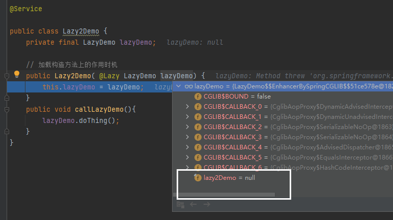
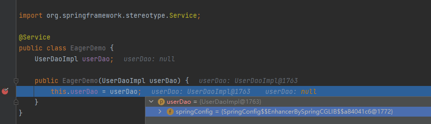
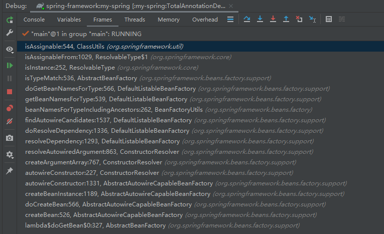
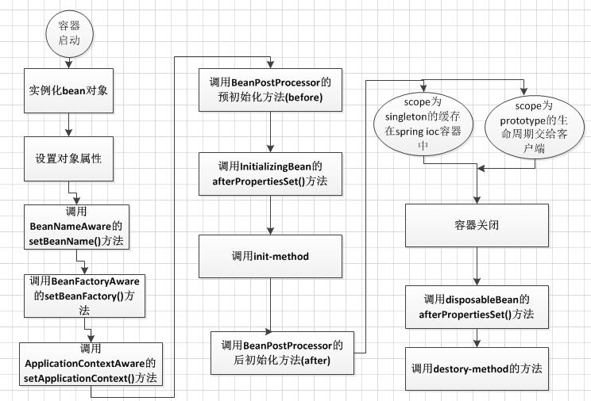

## spring 代码解析
代码如下：

    ApplicationContext context = new AnnotationConfigApplicationContext(SpringConfig.class);
    UserService userService = context.getBean("userService", UserService.class);
    System.out.println(userService);
    userService.add();


# spring 启动
 new AnnotationConfigApplicationContext(SpringConfig.class); 的行为
## 1. this(); 
初始化了 AnnotatedBeanDefinitionReader 和 ClassPathBeanDefinitionScanner     
为后面的扫类和读取有效的被Component和Configuration注解过的类
## 2. register(componentClasses);
```java
// 跳过了一些与分析无关的 if 代码块
public class AnnotatedBeanDefinitionReader {
   private <T> void doRegisterBean(Class<T> beanClass, @Nullable String name,
                                   @Nullable Class<? extends Annotation>[] qualifiers, @Nullable Supplier<T> supplier,
                                   @Nullable BeanDefinitionCustomizer[] customizers) {
       // 1.
      AnnotatedGenericBeanDefinition abd = new AnnotatedGenericBeanDefinition(beanClass);
      abd.setInstanceSupplier(supplier);
      // 2. 
      ScopeMetadata scopeMetadata = this.scopeMetadataResolver.resolveScopeMetadata(abd);
      abd.setScope(scopeMetadata.getScopeName());
      String beanName = (name != null ? name : this.beanNameGenerator.generateBeanName(abd, this.registry));
      // 3. 
      AnnotationConfigUtils.processCommonDefinitionAnnotations(abd);
      // 4.
      BeanDefinitionHolder definitionHolder = new BeanDefinitionHolder(abd, beanName);
      definitionHolder = AnnotationConfigUtils.applyScopedProxyMode(scopeMetadata, definitionHolder, this.registry);
      // 5.
      BeanDefinitionReaderUtils.registerBeanDefinition(definitionHolder, this.registry);
   }
}
```
注册构造器参数的那个类，这个注册是使用的第一步初始化的reader（AnnotatedBeanDefinitionReader）来注册的，因为里面有一个成员变量为（ BeanDefinitionRegistry registry）     
1. 初始化一个AnnotatedGenericBeanDefinition，这个里面主要是从Calss对象中获取 AnnotationMetadata对象，里面包含的类的基本信息（如：有多少注解，所在的包名吗，类名等）      
   AnnotatedGenericBeanDefinition abd = new AnnotatedGenericBeanDefinition(beanClass);
2. 解析Scope,由于我们的类么有添加scope参数，默认为Singleton         
   ScopeMetadata scopeMetadata = this.scopeMetadataResolver.resolveScopeMetadata(abd);
3. 处理 Lazy, Primary, DependsOn.class, Role, Description 几个注解的处理， 也就是给BeanDefinition的属性赋值
   AnnotationConfigUtils.processCommonDefinitionAnnotations(abd);
4. 是否为代理的beanDefinition 
   如果需要创建代理的BeanDefinition的话
   1. 如果为代理的就创建一个：ScopedProxyFactoryBean为class 的RootBeanDefinition
   2. 并将原来的BeanDefinition的 autowireCandidate，primary 属性设置为false（因为被代理的所以不能直接著如此属性），
   3. 注册原来的BeanDefinition，
   4. 返回代理的BeanDefinition(这里是一个RootBeanDefinition类的对象)
definitionHolder = AnnotationConfigUtils.applyScopedProxyMode(scopeMetadata, definitionHolder, this.registry);
5. 注册我们传入类的BeanDefinition，同时注册它的Alias（别名）, 
   BeanDefinitionReaderUtils.registerBeanDefinition(definitionHolder, this.registry);
## 3. refresh();
// 标记 refresh 动作开始
StartupStep contextRefresh = this.applicationStartup.start("spring.context.refresh");

// 初始化了一些基本属性，
// 初始化资源， 验证必要的 property
prepareRefresh();

// 获取IOC容器
// 获取序列化ID， 获取 DefaultListableBeanFactory的实例化对象，这个会在实例化 ApplicationContext 的时候实例化
ConfigurableListableBeanFactory beanFactory = obtainFreshBeanFactory();

// 准备工厂，配置一些忽视的接口依赖，主要就是写一些类类型到到ioc容器中的属性中
prepareBeanFactory(beanFactory);

// 给子类用的IOC容器的的拓展
postProcessBeanFactory(beanFactory);

// 标记 IOC容器的后置处理开始了
StartupStep beanPostProcess = this.applicationStartup.start("spring.context.beans.post-process");
// Invoke factory processors registered as beans in the context.
// 这个执行IOC容器的后置处理 过程比较复杂，也是拓展的关键点
invokeBeanFactoryPostProcessors(beanFactory);

// 注册拦截bean创建的BeanProcessors
registerBeanPostProcessors(beanFactory);
beanPostProcess.end();

// Initialize message source for this context. 
// 为这个上下文初始化消息源
initMessageSource();

// Initialize event multicaster for this context.
// 初始化事件广播器，
// 1. 如果用户定义了自定义事件广播器
// 2. 没有定义子使用默认的 SimpleApplicationEventMulticaster
initApplicationEventMulticaster();

// Initialize other special beans in specific context subclasses.
onRefresh();

// Check for listener beans and register them.
// 注册监听器
registerListeners();


// 完成IOC容器的初始化， 这里会对bean单例的bean进行初始化
// 这里会调用 bean的后置处理器
finishBeanFactoryInitialization(beanFactory);

// Last step: publish corresponding event.
finishRefresh();

```java
public abstract class AbstractApplicationContext extends DefaultResourceLoader
        implements ConfigurableApplicationContext {
	@Override
	public void refresh() throws BeansException, IllegalStateException {
		synchronized (this.startupShutdownMonitor) {
			StartupStep contextRefresh = this.applicationStartup.start("spring.context.refresh");

			// Prepare this context for refreshing.
			prepareRefresh();

			// Tell the subclass to refresh the internal bean factory.
			ConfigurableListableBeanFactory beanFactory = obtainFreshBeanFactory();

			// Prepare the bean factory for use in this context.
			prepareBeanFactory(beanFactory);

			try {
				// Allows post-processing of the bean factory in context subclasses.
				postProcessBeanFactory(beanFactory);

				StartupStep beanPostProcess = this.applicationStartup.start("spring.context.beans.post-process");
				// Invoke factory processors registered as beans in the context.
                // 1.将class文件加载进来，并处理封装成为BeanDefinition
                // 2.再此调用注册后置处理器
                // 3.最后循坏调用注册后置处理器
                // 4. 调用优先级后置处理器
                // 5. Order注解的后置处理器
                // 6. incoke BeanFactoryProcessors
				invokeBeanFactoryPostProcessors(beanFactory);

				// Register bean processors that intercept bean creation.
				registerBeanPostProcessors(beanFactory);
				beanPostProcess.end();

				// Initialize message source for this context.
				initMessageSource();

				// Initialize event multicaster for this context.
				initApplicationEventMulticaster();

				// Initialize other special beans in specific context subclasses.
				onRefresh();

				// Check for listener beans and register them.
				registerListeners();

				// Instantiate all remaining (non-lazy-init) singletons.
				finishBeanFactoryInitialization(beanFactory);

				// Last step: publish corresponding event.
				finishRefresh();
			}

			catch (BeansException ex) {
				if (logger.isWarnEnabled()) {
					logger.warn("Exception encountered during context initialization - " +
							"cancelling refresh attempt: " + ex);
				}

				// Destroy already created singletons to avoid dangling resources.
				destroyBeans();

				// Reset 'active' flag.
				cancelRefresh(ex);

				// Propagate exception to caller.
				throw ex;
			}

			finally {
				// Reset common introspection caches in Spring's core, since we
				// might not ever need metadata for singleton beans anymore...
				resetCommonCaches();
				contextRefresh.end();
			}
		}
	}
}
```

### 3.1.invokeBeanFactoryPostProcessors(beanFactory);
tip: 下文中的：后置工厂、工厂后置、后置工厂处理器、工厂后置处理器 是一个意思，这里的工厂都是代表IOC容器
 这个方法做的事情：
1. 执行 BeanDefinitionRegistryPostProcessor 后置处理器，同时将普通的后置工厂处理器配置存储起来后面调用
   1. 执行 获取BeanDefinitionRegistryPostProcessor的处理器，排序后置处理器，      
      invoke 后置处理器 invokeBeanDefinitionRegistryPostProcessors() 这个就是我们的第二步获取的工厂的后置处理器，
      执行的行为是：       
      1. 根据我们传入被Configuration注解的类，同从中获取我们的@ComponentScan注解的信息,这里到的主要信息就是扫包的基本包名，
      2. 这里会组成 basePackage.\*\*/\*.class 的匹配符取加载资源文件（java类）   
      3. 遍历所有的类文件,从中获取被Component注解了的类文件，并注册到IOC工厂中    
      4. 也会去解析被@Bean注解的方法，并生成的BeanDefinition

2. 再去工厂里面取获取一下注册了的后置工厂     
    这个大概应该是为了*我们自己实现的后置工厂处理器的后置工厂*处理器的调用    
    在排序刚刚扫描出来的工厂后置处理器           
    执行他们       
3. 最后还要invoke 一下所有的后置处理器    
    这里就是我们自定义的后置处理器加载进来的注册工厂的后置处理器的执行，
4. 执行常规的后置工厂，就是第一步准备的常规的后置工厂
5. 准备优先权后置处理器、order（顺序）后置处理器、无顺序处理器
6. 排序、并执行(invoke)优先权后置处理器
7. 排序、Order后置处理器
8. 最后执行BeanFactoryPostProcessors BeanFactory后置工厂处理器        
具体的代码如下：
```java

final class PostProcessorRegistrationDelegate {
   public static void invokeBeanFactoryPostProcessors(
           ConfigurableListableBeanFactory beanFactory, List<BeanFactoryPostProcessor> beanFactoryPostProcessors) {
       
      Set<String> processedBeans = new HashSet<>();

      if (beanFactory instanceof BeanDefinitionRegistry registry) {
         List<BeanFactoryPostProcessor> regularPostProcessors = new ArrayList<>();
         List<BeanDefinitionRegistryPostProcessor> registryProcessors = new ArrayList<>();

         for (BeanFactoryPostProcessor postProcessor : beanFactoryPostProcessors) {
            if (postProcessor instanceof BeanDefinitionRegistryPostProcessor registryProcessor) {
               registryProcessor.postProcessBeanDefinitionRegistry(registry);
               registryProcessors.add(registryProcessor);
            } else {
               regularPostProcessors.add(postProcessor);
            }
         }

         // Do not initialize FactoryBeans here: We need to leave all regular beans
         // uninitialized to let the bean factory post-processors apply to them!
         // Separate between BeanDefinitionRegistryPostProcessors that implement
         // PriorityOrdered, Ordered, and the rest.
         List<BeanDefinitionRegistryPostProcessor> currentRegistryProcessors = new ArrayList<>();

         // First, invoke the BeanDefinitionRegistryPostProcessors that implement PriorityOrdered.
         String[] postProcessorNames =
                 beanFactory.getBeanNamesForType(BeanDefinitionRegistryPostProcessor.class, true, false);
         for (String ppName : postProcessorNames) {
            if (beanFactory.isTypeMatch(ppName, PriorityOrdered.class)) {
               currentRegistryProcessors.add(beanFactory.getBean(ppName, BeanDefinitionRegistryPostProcessor.class));
               processedBeans.add(ppName);
            }
         }
         sortPostProcessors(currentRegistryProcessors, beanFactory);
         registryProcessors.addAll(currentRegistryProcessors);
         invokeBeanDefinitionRegistryPostProcessors(currentRegistryProcessors, registry, beanFactory.getApplicationStartup());
         currentRegistryProcessors.clear();

         // Next, invoke the BeanDefinitionRegistryPostProcessors that implement Ordered.
         postProcessorNames = beanFactory.getBeanNamesForType(BeanDefinitionRegistryPostProcessor.class, true, false);
         for (String ppName : postProcessorNames) {
            if (!processedBeans.contains(ppName) && beanFactory.isTypeMatch(ppName, Ordered.class)) {
               currentRegistryProcessors.add(beanFactory.getBean(ppName, BeanDefinitionRegistryPostProcessor.class));
               processedBeans.add(ppName);
            }
         }
         sortPostProcessors(currentRegistryProcessors, beanFactory);
         registryProcessors.addAll(currentRegistryProcessors);
         invokeBeanDefinitionRegistryPostProcessors(currentRegistryProcessors, registry, beanFactory.getApplicationStartup());
         currentRegistryProcessors.clear();

         // Finally, invoke all other BeanDefinitionRegistryPostProcessors until no further ones appear.
         boolean reiterate = true;
         while (reiterate) {
            reiterate = false;
            postProcessorNames = beanFactory.getBeanNamesForType(BeanDefinitionRegistryPostProcessor.class, true, false);
            for (String ppName : postProcessorNames) {
               if (!processedBeans.contains(ppName)) {
                  currentRegistryProcessors.add(beanFactory.getBean(ppName, BeanDefinitionRegistryPostProcessor.class));
                  processedBeans.add(ppName);
                  reiterate = true;
               }
            }
            sortPostProcessors(currentRegistryProcessors, beanFactory);
            registryProcessors.addAll(currentRegistryProcessors);
            invokeBeanDefinitionRegistryPostProcessors(currentRegistryProcessors, registry, beanFactory.getApplicationStartup());
            currentRegistryProcessors.clear();
         }

         // Now, invoke the postProcessBeanFactory callback of all processors handled so far.
         invokeBeanFactoryPostProcessors(registryProcessors, beanFactory);
         invokeBeanFactoryPostProcessors(regularPostProcessors, beanFactory);
      } else {
         // Invoke factory processors registered with the context instance.
         invokeBeanFactoryPostProcessors(beanFactoryPostProcessors, beanFactory);
      }

      // Do not initialize FactoryBeans here: We need to leave all regular beans
      // uninitialized to let the bean factory post-processors apply to them!
      String[] postProcessorNames =
              beanFactory.getBeanNamesForType(BeanFactoryPostProcessor.class, true, false);

      // Separate between BeanFactoryPostProcessors that implement PriorityOrdered,
      // Ordered, and the rest.
      List<BeanFactoryPostProcessor> priorityOrderedPostProcessors = new ArrayList<>();
      List<String> orderedPostProcessorNames = new ArrayList<>();
      List<String> nonOrderedPostProcessorNames = new ArrayList<>();
      for (String ppName : postProcessorNames) {
         if (processedBeans.contains(ppName)) {
            // skip - already processed in first phase above
         } else if (beanFactory.isTypeMatch(ppName, PriorityOrdered.class)) {
            priorityOrderedPostProcessors.add(beanFactory.getBean(ppName, BeanFactoryPostProcessor.class));
         } else if (beanFactory.isTypeMatch(ppName, Ordered.class)) {
            orderedPostProcessorNames.add(ppName);
         } else {
            nonOrderedPostProcessorNames.add(ppName);
         }
      }

      // First, invoke the BeanFactoryPostProcessors that implement PriorityOrdered.
      // 权限工厂，优先级工厂
      sortPostProcessors(priorityOrderedPostProcessors, beanFactory);
      invokeBeanFactoryPostProcessors(priorityOrderedPostProcessors, beanFactory);

      // Next, invoke the BeanFactoryPostProcessors that implement Ordered.
      // 顺序工厂
      List<BeanFactoryPostProcessor> orderedPostProcessors = new ArrayList<>(orderedPostProcessorNames.size());
      for (String postProcessorName : orderedPostProcessorNames) {
         orderedPostProcessors.add(beanFactory.getBean(postProcessorName, BeanFactoryPostProcessor.class));
      }
      sortPostProcessors(orderedPostProcessors, beanFactory);
      invokeBeanFactoryPostProcessors(orderedPostProcessors, beanFactory);

      // Finally, invoke all other BeanFactoryPostProcessors.
      List<BeanFactoryPostProcessor> nonOrderedPostProcessors = new ArrayList<>(nonOrderedPostProcessorNames.size());
      for (String postProcessorName : nonOrderedPostProcessorNames) {
         nonOrderedPostProcessors.add(beanFactory.getBean(postProcessorName, BeanFactoryPostProcessor.class));
      }
      invokeBeanFactoryPostProcessors(nonOrderedPostProcessors, beanFactory);

      // Clear cached merged bean definitions since the post-processors might have
      // modified the original metadata, e.g. replacing placeholders in values...
      beanFactory.clearMetadataCache();
   }
   /**
    * Invoke the given BeanDefinitionRegistryPostProcessor beans.
    */
   private static void invokeBeanDefinitionRegistryPostProcessors(
           Collection<? extends BeanDefinitionRegistryPostProcessor> postProcessors, BeanDefinitionRegistry registry, ApplicationStartup applicationStartup) {

      for (BeanDefinitionRegistryPostProcessor postProcessor : postProcessors) {
         StartupStep postProcessBeanDefRegistry = applicationStartup.start("spring.context.beandef-registry.post-process")
                 .tag("postProcessor", postProcessor::toString);
         postProcessor.postProcessBeanDefinitionRegistry(registry);
         postProcessBeanDefRegistry.end();
      }
   }
   private static void invokeBeanFactoryPostProcessors(
           Collection<? extends BeanFactoryPostProcessor> postProcessors, ConfigurableListableBeanFactory beanFactory) {

      for (BeanFactoryPostProcessor postProcessor : postProcessors) {
         StartupStep postProcessBeanFactory = beanFactory.getApplicationStartup().start("spring.context.bean-factory.post-process")
                 .tag("postProcessor", postProcessor::toString);
         postProcessor.postProcessBeanFactory(beanFactory);
         postProcessBeanFactory.end();
      }
   }
}
```
### 3.2. 


## 4. 问题
### 问题1 ： 在 AbstractApplicationContext#refresh的时候，类文件是那个时候被解析成为BeanDefinition？
AnnotationConfigApplicationContext#refresh 方法中的一句话invokeBeanFactoryPostProcessors(beanFactory);    
而在 invokeBeanFactoryPostProcessors(beanFactory); 更为重要的一句话就是 PostProcessorRegistrationDelegate.invokeBeanFactoryPostProcessors(beanFactory, getBeanFactoryPostProcessors());
1. ConfigurationClassParser 类是一个很关键的类，在这个问题里面，其中最主要的方法就是 doProcessConfigurationClass
2. AnnotationConfigUtils 这个类是用来解析ComponentScan注解里面的内容的
3. ComponentScanAnnotationParser# parse(AnnotationAttributes componentScan, String declaringClass)。 主要是配置扫描需要的准备，
   1. 初始化ClassPathBeanDefinitionScanner scanner 这里会指定资源加载其（就是我们的resource文件夹下面的内容的加载器）、把BeanDefinitionRegistry放到scanner里面去、Environment也放进去、还有一些过滤条件
   2. 声明需要扫描的包、
   3. 懒加载配置、
   4. 扫描文件的指定（默认""**/*.class"）
   5. 配置移除的filter
   6. 调用scanner的doScan
4. ClassPathBeanDefinitionScanner#doScan 扫描每一个包，主要是调用同类的findCandidateComponents方法扫描出来对应的BeanDefinition
   1. ClassPathBeanDefinitionScanner#findCandidateComponents 简单判断一下 调用了 scanCandidateComponents 方法
   2. ClassPathBeanDefinitionScanner#scanCandidateComponents
       1.    Resource[] resources = getResourcePatternResolver().getResources(packageSearchPath);
       2. PathMatchingResourcePatternResolver#findPathMatchingResources
       3. PathMatchingResourcePatternResolver#doFindPathMatchingFileResources
       4. PathMatchingResourcePatternResolver#retrieveMatchingFiles 这个逻辑比较简单，把匹配出来的结果全部遍历，如果为文件夹就递归遍历，如果为文件就加入我们的Set<Resource>集合
```java
// 移除了debug和异常输出的相关代码
public class ClassPathBeanDefinitionScanner extends ClassPathScanningCandidateComponentProvider {
    protected Set<BeanDefinitionHolder> doScan(String... basePackages) {
        Assert.notEmpty(basePackages, "At least one base package must be specified");
        Set<BeanDefinitionHolder> beanDefinitions = new LinkedHashSet<>();
        for (String basePackage : basePackages) {
            Set<BeanDefinition> candidates = findCandidateComponents(basePackage);
            for (BeanDefinition candidate : candidates) {
                ScopeMetadata scopeMetadata = this.scopeMetadataResolver.resolveScopeMetadata(candidate);
                candidate.setScope(scopeMetadata.getScopeName());
                String beanName = this.beanNameGenerator.generateBeanName(candidate, this.registry);
                if (candidate instanceof AbstractBeanDefinition) {
                    postProcessBeanDefinition((AbstractBeanDefinition) candidate, beanName);
                }
                if (candidate instanceof AnnotatedBeanDefinition) {
                    AnnotationConfigUtils.processCommonDefinitionAnnotations((AnnotatedBeanDefinition) candidate);
                }
                if (checkCandidate(beanName, candidate)) {
                    BeanDefinitionHolder definitionHolder = new BeanDefinitionHolder(candidate, beanName);
                    definitionHolder =
                            AnnotationConfigUtils.applyScopedProxyMode(scopeMetadata, definitionHolder, this.registry);
                    beanDefinitions.add(definitionHolder);
                    registerBeanDefinition(definitionHolder, this.registry);
                }
            }
        }
        return beanDefinitions;
    }
}
public class ClassPathScanningCandidateComponentProvider implements EnvironmentCapable, ResourceLoaderAware {

    public Set<BeanDefinition> findCandidateComponents(String basePackage) {
        if (this.componentsIndex != null && indexSupportsIncludeFilters()) {
            return addCandidateComponentsFromIndex(this.componentsIndex, basePackage);
        }
        else {
            return scanCandidateComponents(basePackage);
        }
    }
    private Set<BeanDefinition> scanCandidateComponents(String basePackage) {
        Set<BeanDefinition> candidates = new LinkedHashSet<>();
        String packageSearchPath = ResourcePatternResolver.CLASSPATH_ALL_URL_PREFIX +
                resolveBasePackage(basePackage) + '/' + this.resourcePattern;
        // 这里实在是太重要了，这里就是在basePackage包下面的所有的class文件取出来（但是暂时无法判断是不是初次加载的问题）
        Resource[] resources = getResourcePatternResolver().getResources(packageSearchPath);
        for (Resource resource : resources) {
            // 获取对应的属性，这里主要是要用到对应的注释，如后面判断所需要的Component注解
            MetadataReader metadataReader = getMetadataReaderFactory().getMetadataReader(resource);
            if (isCandidateComponent(metadataReader)) {
                // 这里将我们的资源文件解析成了对应的BeanDefinition
                ScannedGenericBeanDefinition sbd = new ScannedGenericBeanDefinition(metadataReader);
                sbd.setSource(resource);
                if (isCandidateComponent(sbd)) {
                    candidates.add(sbd);
                }
            }
        }
        //...
        return candidates;
    }
    // 这个方法里面会的调用链里面会出现@Conditional注解， 这个在ConditionEvaluator#shouldSkip(AnnotatedTypeMetadata,ConfigurationPhase)  这个方法里面
    // 以及excludeFilters的的出现
    protected boolean isCandidateComponent(MetadataReader metadataReader) throws IOException {
        for (TypeFilter tf : this.excludeFilters) {
            if (tf.match(metadataReader, getMetadataReaderFactory())) {
                return false;
            }
        }
        for (TypeFilter tf : this.includeFilters) {
            if (tf.match(metadataReader, getMetadataReaderFactory())) {
                return isConditionMatch(metadataReader);
            }
        }
        return false;
    }
}
	
```
### 2. 那个时候怎么判断是否需要初始化成为singleTon的Bean，那如果是prototype的Scope呢
@Component注解 默认为Singleton，在BeanDefinition里面会有一个Scope字段用来存储范围。
### 3. bean的后置处理器，和工厂的后置处理器
1. BeanPostProcessor 是用于拓展实例化bean的，如：AOP就是拓展了 postProcessAfterInitialization，方法来返回一个代理对象给最终的返回结果
2. BeanFactoryPostProcessor IOC 容器，的后置处理器，这个的拓展暂时只知道了几个简单的操纵如
### 4. 几个Aware的时候的地方
概述：将spring中内部使用的对象暴露出来

1. ApplicationEventPublisherAware (org.springframework.context)
暴露ApplicationEventPublisher
在普通 bean属性的复制，先于 初始化回调（如InitializingBean#afterPropertiesSet,或者自定义的initMethod） , 也在ApplicationContextAware 之前被调用
   Invoked after population of normal bean properties but before an init callback like InitializingBean's afterPropertiesSet or a custom init-method. Invoked before ApplicationContextAware's setApplicationContext.
2. ServletContextAware (org.springframework.web.context)
servletContext 暴露
3. MessageSourceAware (org.springframework.context)      
不懂？
4. ResourceLoaderAware (org.springframework.context)
资源加载器的爆率
5. ApplicationStartupAware (org.springframework.context)
   ApplicationStartup 这个是标记某个步骤已经开始了的接口，如 创建bean的开始和bean/工厂开始的标记
   在普通bean属性填充之后调用，但在init回调之前调用，如InitializingBean的AfterPropertieSet或自定义init方法。在ApplicationContextAware的setApplicationContext之前调用。
6. SchedulerContextAware (org.springframework.scheduling.quartz)
定时器上下文暴露 
这里的就是一个定时调度
Set the SchedulerContext of the current Quartz Scheduler.
7. NotificationPublisherAware (org.springframework.jmx.export.notification)
暴露通知发布发布者的bean 似乎用在jmx?
8. BeanFactoryAware (org.springframework.beans.factory)
暴露ioc容器
9. EnvironmentAware (org.springframework.context)
暴露 Environment 对象
存储了如下
spring环境外的对象，properties文件、JVM properties、system环境变量、JNDI、servlet context parameters上下文参数、专门的properties对象，Maps等等
还有就是yml配置文件中的各种配置信息
10. EmbeddedValueResolverAware (org.springframework.context)
？？ 没懂
11. ImportAware (org.springframework.context.annotation)
可以获取：被@Configuration 注解的类的注解信息
    Set the annotation metadata of the importing @Configuration class
12. ServletConfigAware (org.springframework.web.context)
初始化 servlet的servlet容器的信息
   A servlet configuration object used by a servlet container to pass information to a servlet during initialization.
13. LoadTimeWeaverAware (org.springframework.context.weaving)
classloader的 类文件转换器？？
Defines the contract for adding one or more ClassFileTransformers to a ClassLoader.
14. BeanClassLoaderAware (org.springframework.beans.factory)
  暴露bean的类加载器
15. BeanNameAware (org.springframework.beans.factory)
  暴露bean在ioc容器（beanFactory）中的key名称,就是beanFactory#getName("name") 中的name
16. ApplicationContextAware (org.springframework.context)
  比较常使用的 spring 上下文 这个可以将我们使用的springContext暴露出来，暴露出来直接获取定义了的bean


### 5. 循环依赖的解
使用@Lazy注解

### 6. @Lazy 注解的详细解释
加载类上：这个类会在被获取的时候创建      
加载构造方法上的Lazy处理：    
2. AbstractAutowireCapableBeanFactory # doCreateBean 创建Bean
3. AbstractAutowireCapableBeanFactory # autowireConstructor    返回一个BeanWrapper对象
4. ConstructorResolver # autowireConstructor   
   代码如下 return new ConstructorResolver(this).autowireConstructor(beanName, mbd, ctors, explicitArgs);    
   通过根据构造器解析器创建一个对象，
6. ConstructorResolver # createArgumentArray    这个回去创建参数
7. ConstructorResolver # resolveAutowiredArgument  解析单个参数
8. DefaultListableBeanFactory # resolveDependency  真正的执行参数实例化
    <pre>
   这一句话的意思就是，如果是Lazy注解过了的参数，就是产生一个代理的对象返回,但是为什么不会产生循环依赖了，这是一个问题：（代理对象是怎么实例化的，需要调用父类的构造器嘛）
   如果是被@Lazy注释了的构造方法参数，这里返回的result就是我们要类的一个代理子类（由spring代理生成，他并不会直接取调用我们的目标类的任何构造方法）
   Object result = getAutowireCandidateResolver().getLazyResolutionProxyIfNecessary(
           descriptor, requestingBeanName);
   if (result == null) {
       // 通用处理逻辑
       result = doResolveDependency(descriptor, requestingBeanName, autowiredBeanNames, typeConverter);
   }
   return result;
    </pre>
9. ContextAnnotationAutowireCandidateResolver#buildLazyResolutionProxy
Object result = getAutowireCandidateResolver().getLazyResolutionProxyIfNecessary(descriptor, requestingBeanName);
上一句话返回的代理类（他是构造体上的参数，被我们加上了@Lazy注解的结果）：   LazyDemo$$EnhancerBySpringCGLIB 
10. 展示图片如下，这个就是由于lazyDemo参数有@Lazy所以它里面的lazy2Demo 压根没有初始化，这个也是证明LazyDemo构造方法没有调用的证明

11. DefaultAopProxyFactory#createAopProxy 几经调用，最终来到了这个方法 
     而这个方法最重要的就是返回一些代理对象  return new ObjenesisCglibAopProxy(config);       
     我们的案例总调用的说就是这个类，他是会回去调用目标类（被代理的类）构造器
12. 如果没有注释@Lazy的话 正常的参数会调用这个方法，DependencyDescriptor#resolveCandidate
    而这个方法的代码如下，他又是去调用的IOC容器的getBean，这个时候就会创建我们为创建的Bean， 
    走正常的流程，如果构造器有参数，再去解析参数就会产生循环依赖
    <pre>
    public Object resolveCandidate(String beanName, Class<?> requiredType, BeanFactory beanFactory)
            throws BeansException {
        return beanFactory.getBean(beanName);
    }
    </pre>
13. 如下图，没有@Lazy的构造方法参数里面的成员变量被初始化了


### 7. 如果是接口怎么注入
从beanDefinitionNames里面去找一下是否又自己的实现了的子类，是就注入
具体的调用如如下


    /**
     * Determines if the class or interface represented by this
     * {@code Class} object is either the same as, or is a superclass or
     * superinterface of, the class or interface represented by the specified
     * {@code Class} parameter. It returns {@code true} if so;
     * otherwise it returns {@code false}. If this {@code Class}
     * object represents a primitive type, this method returns
     * {@code true} if the specified {@code Class} parameter is
     * exactly this {@code Class} object; otherwise it returns
     * {@code false}.
     *
     * <p> Specifically, this method tests whether the type represented by the
     * specified {@code Class} parameter can be converted to the type
     * represented by this {@code Class} object via an identity conversion
     * or via a widening reference conversion. See <cite>The Java Language
     * Specification</cite>, sections {@jls 5.1.1} and {@jls 5.1.4},
     * for details.
     *
     * @param     cls the {@code Class} object to be checked
     * @return    the {@code boolean} value indicating whether objects of the
     *            type {@code cls} can be assigned to objects of this class
     * @throws    NullPointerException if the specified Class parameter is
     *            null.
     * @since     1.1
     */
    @IntrinsicCandidate
    public native boolean isAssignableFrom(Class<?> cls);

# bean的生命周期

生命周期流程如上图所示，流程大致如下：

1.首先容器启动后，会对scope为singleton且非懒加载的bean进行实例化，

2.按照Bean定义信息配置信息，注入所有的属性，

3.如果Bean实现了BeanNameAware接口，会回调该接口的setBeanName()方法，传入该Bean的id，此时该Bean就获得了自己在配置文件中的id，

4.如果Bean实现了BeanFactoryAware接口,会回调该接口的setBeanFactory()方法，传入该Bean的BeanFactory，这样该Bean就获得了自己所在的BeanFactory，

5.如果Bean实现了ApplicationContextAware接口,会回调该接口的setApplicationContext()方法，传入该Bean的ApplicationContext，这样该Bean就获得了自己所在的ApplicationContext，

6.如果有Bean实现了BeanPostProcessor接口，则会回调该接口的postProcessBeforeInitialzation()方法，

7.如果Bean实现了InitializingBean接口，则会回调该接口的afterPropertiesSet()方法，

8.如果Bean配置了init-method方法，则会执行init-method配置的方法，

9.如果有Bean实现了BeanPostProcessor接口，则会回调该接口的postProcessAfterInitialization()方法，

10.经过流程9之后，就可以正式使用该Bean了,对于scope为singleton的Bean,Spring的ioc容器中会缓存一份该bean的实例，而对于scope为prototype的Bean,每次被调用都会new一个新的对象，期生命周期就交给调用方管理了，不再是Spring容器进行管理了

11.容器关闭后，如果Bean实现了DisposableBean接口，则会回调该接口的destroy()方法，

12.如果Bean配置了destroy-method方法，则会执行destroy-method配置的方法，至此，整个Bean的生命周期结束
# AOP


## AOP的执行流程
```java
public class AopMain {
    public static void main(String[] args) {
        var context = new AnnotationConfigApplicationContext(AopMain.class);
        Target target = context.getBean("target", Target.class);
        target.print();
	}
}
```
执行过程被CglibAopProxy#intercept所拦截这个方法会将我们的原方法和切点都进行执行(如果需要)
intercept的主流程
1. List<Object> chain = this.advised.getInterceptorsAndDynamicInterceptionAdvice(method, targetClass);
    获取我们之前扫描加入的拦截链，也就是获取我们的各个切面（或者说我们使用@Before，@After等注释的生成的Advice）
2. retVal = new CglibMethodInvocation(proxy, target, method, args, targetClass, chain, methodProxy).proceed();
    在这里我们假定一定会AOP的代理，因为没有aop代理的话，会直接调用原来的方法          
    这里也比较简单，就是创建一个方法的invocation，让后执行他。    
    真正复杂的在proceed();方法里面，里面有aop的状态流转

```java
// 调用 我们的 before 注解的方法
public class MethodBeforeAdviceInterceptor implements MethodInterceptor, BeforeAdvice, Serializable {
	private final MethodBeforeAdvice advice;
	@Override
	@Nullable
	public Object invoke(MethodInvocation mi) throws Throwable {
		this.advice.before(mi.getMethod(), mi.getArguments(), mi.getThis());
        // 再此执行proceed
		return mi.proceed();
	}
}
// 调用 我们的 After 注解的方法
public class AspectJAfterAdvice extends AbstractAspectJAdvice implements MethodInterceptor, AfterAdvice, Serializable {
    public AspectJAfterAdvice(Method aspectJBeforeAdviceMethod, AspectJExpressionPointcut pointcut, AspectInstanceFactory aif) {
        super(aspectJBeforeAdviceMethod, pointcut, aif);
    }
    @Override
    public Object invoke(MethodInvocation mi){
        try {
            return mi.proceed();
        }
        finally {
            invokeAdviceMethod(getJoinPointMatch(), null, null);
        }
    }
}


public class AspectJAfterReturningAdvice extends AbstractAspectJAdvice implements AfterReturningAdvice, AfterAdvice, Serializable {

    @Override
    public void afterReturning(@Nullable Object returnValue, Method method, Object[] args, @Nullable Object target) throws Throwable {
        if (shouldInvokeOnReturnValueOf(method, returnValue)) {
            invokeAdviceMethod(getJoinPointMatch(), returnValue, null);
        }
    }
    // 父类方法
    protected Object invokeAdviceMethod(
            @Nullable JoinPointMatch jpMatch, @Nullable Object returnValue, @Nullable Throwable ex)
            throws Throwable {

        return invokeAdviceMethodWithGivenArgs(argBinding(getJoinPoint(), jpMatch, returnValue, ex));
    }
    // 父类方法
    protected Object invokeAdviceMethodWithGivenArgs(Object[] args) throws Throwable {
        Object[] actualArgs = args;
        if (this.aspectJAdviceMethod.getParameterCount() == 0) {
            actualArgs = null;
        }
        try {
            ReflectionUtils.makeAccessible(this.aspectJAdviceMethod);
            return this.aspectJAdviceMethod.invoke(this.aspectInstanceFactory.getAspectInstance(), actualArgs);
        }
        catch (IllegalArgumentException ex) {
            throw new AopInvocationException("Mismatch on arguments to advice method [" +
                    this.aspectJAdviceMethod + "]; pointcut expression [" +
                    this.pointcut.getPointcutExpression() + "]", ex);
        }
        catch (InvocationTargetException ex) {
            throw ex.getTargetException();
        }
    }
}

public class AspectJAroundAdvice extends AbstractAspectJAdvice implements MethodInterceptor, Serializable {
    public AspectJAroundAdvice(Method aspectJAroundAdviceMethod, AspectJExpressionPointcut pointcut, AspectInstanceFactory aif) {
        super(aspectJAroundAdviceMethod, pointcut, aif);
    }
    @Override  @Nullable
    public Object invoke(MethodInvocation mi) {
        ProceedingJoinPoint pjp = lazyGetProceedingJoinPoint(pmi);
        JoinPointMatch jpm = getJoinPointMatch(pmi);
        return invokeAdviceMethod(pjp, jpm, null, null);
    }
    protected ProceedingJoinPoint lazyGetProceedingJoinPoint(ProxyMethodInvocation rmi) {
        return new MethodInvocationProceedingJoinPoint(rmi);
    }
    // 父类的方法  AbstractAspectJAdvice
    protected Object invokeAdviceMethod(JoinPoint jp, @Nullable JoinPointMatch jpMatch, @Nullable Object returnValue, @Nullable Throwable t) throws Throwable {
        return invokeAdviceMethodWithGivenArgs(argBinding(jp, jpMatch, returnValue, t));
    }
    // 父类的方法  AbstractAspectJAdvice
    protected Object invokeAdviceMethodWithGivenArgs(Object[] args) {
        Object[] actualArgs = args;
        if (this.aspectJAdviceMethod.getParameterCount() == 0) {
            actualArgs = null;
        }
        try {
            ReflectionUtils.makeAccessible(this.aspectJAdviceMethod);
            return this.aspectJAdviceMethod.invoke(this.aspectInstanceFactory.getAspectInstance(), actualArgs);
        }
        catch (Exception ex) {throw ex.getTargetException();}
    }
}
```

一个Bean的过程
### doGetBean方法
1. 解析BeanName
2. 从SingletonMap中获取一下单例Bean      
    如果存在就直接返回，就通过获取到的Bean再去我们的真实Bean      
    主要是去判断一下，返回的Bean是什么类型        
不存在，继续
3. 循环依赖检测
4. 获取父类BeanFactory 
    我们这次没有所以为空
5. 标记Bean为创建的
6. 实例化一个 DefaultApplicationStartup$DefaultStartupStep
7. 获取需要实例化Bean的BeanDefinition
8. 检查一个这个BeanDefinition 检查是不是抽象类型，如果是抽象类型就跑错
9. 获取dependsOn
   如果为非空， 将依赖dependentBeanMap写入到这个Map里面，并创建依赖的Bean，但是我们这次实例没有这个
10. 获取或者创建Bean,
    如果是创建Bean，或调用createBean(beanName, beanDefinition, args);
    如果是单例Bean还会将创建好了的Bean放到SingletonBeans里面去
### createBean
1. 解析需要创建Bean的类型
2. 准备方法的重写
3. 用 Bean的后置处理器去创建一个Bean，如创建一个代理Bean返回回来
   但是我们此次里面没有可以创建Bean的PostProcessor
4. 调用真正创建的Bean的方法，doCreateBean(beanName, beanDefinition, args)

### doCreateBean
1. 声明BeanWrapper， 我们后面统称为：wrapper
2. 如果是单例，移除factoryBeanInstanceCache中的BeanWrapper
3. 如果wrapper为空，创建Bean，这里会利用反射去执行构造方法
   执行：createBeanInstance(beanName, mbd, args); 这个我们后面讨论
4. 执行BeanDefinition的后置处理器
   1. findAutowiringMetadata
   2. ApplicationListenerDetector 将
5. 获取earlySingletonExposure
6. 如果为true 添加单例工厂
   this.singletonFactories.put(beanName, singletonFactory);
   this.earlySingletonObjects.remove(beanName);
   this.registeredSingletons.add(beanName);
7. 又是一个比较重要的方法 ：populateBean(beanName, mbd, instanceWrapper);
   注入成员属性    
   注入的主要是：AutowiredAnnotationBeanPostProcessor#postProcessProperties 来完成注入
   这个后置处理器主要是对所有的需要注入的属性进行注入，
   而单个属性的解析和实例化（或者从ioc中获取），是交给AutowiredFieldElement#inject这个方法实现的

### AbstractAutowireCapableBeanFactory # createBeanInstance
1. 解析bean的类型，就是找出是那个类的bean
2. 一些准备工作和判断
3. AutowiredAnnotationBeanPostProcessor#determineCandidateConstructors 判断使用那个构造器，就是我们会在构造方法上面加上@Autowired来指定某个构造方法
4. 调用：autowireConstructor
### AbstractAutowireCapableBeanFactory # autowireConstructor
return new ConstructorResolver(this).autowireConstructor(beanName, mbd, ctors, explicitArgs);
### ConstructorResolver # autowireConstructor 
1. 实例化一个BeanWrapperImpl对象 bw
2. ioc容器初始化bw
3. 构造方法，参数的持有者，参数的声明
4. 给参数赋值
5. 确定构造方法 
   这个有一个小细节，这里的构造器如果有多个但是有没有指定用哪个构造器，会**默认调用无参构造器**
   1. 餐、如果传入了构造方法对象（Constructord的对象，则无需重新去获取全部的构造方法）
   2. 判断是否只有无参构造方法，如果是直接执行无参构造方法
   3. 定义一个boolean autowiring变量并赋值
   4. 定义并赋值 int minNrOfArgs; 
   5. 排序构造方法
   6. 声明 模糊构造器和一个延时的异常队列
   7. 遍历构造方法
      1. 获取构造方法的参数数量
      2. 如果已经有了完整的构造方法了，直接结束遍历
      3. 如果为参数数量小于最小的参数数量直接此次循环
      4. 获取参数类型数组
      5. createArgumentArray  实例化所有的参数
      6. resolveAutowiredArgument  实例化单个构造方法的参数， 他是调用的this.beanFactory.resolveDependency,也就是IOC容易的方法来解决依赖
         并赋值给ArgumentsHolder的对象
      7. 判断权重，该用哪一个构造方法（这里有歧义）
   8. 调用instantiate(beanName, mbd, constructorToUse, argsToUse)，这个就是最终使用反射去执行我们的构造方法，返回一个实例对象

### ConstructorResolver # createArgumentArray
总的来说就是一个一个的去实例化构造方法的参数
他会调用这个方法  resolveAutowiredArgument()
而这个方法会调用this.beanFactory.resolveDependency(new DependencyDescriptor(param, true), beanName, autowiredBeanNames, typeConverter);
这么一句话，这一句话里面有一个重要的操作：new DependencyDescriptor(param, true)
最终他会执行这么一个语句：descriptor.resolveCandidate(autowiredBeanName, type, beanFactory); 来实例化我们autowiredBeanName对应的Bean
而上面的一句话调用的是  return beanFactory.getBean(beanName); 这个就又回到获取Bean的原点了。
