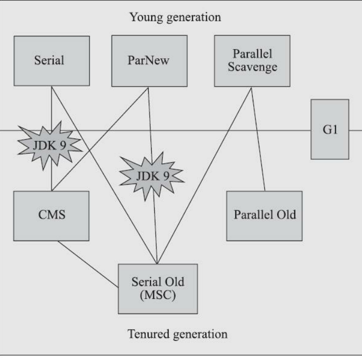
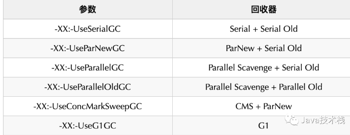
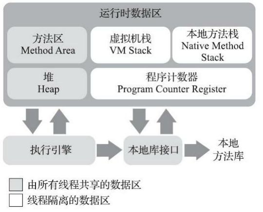
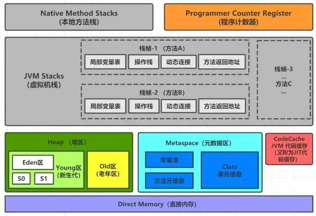
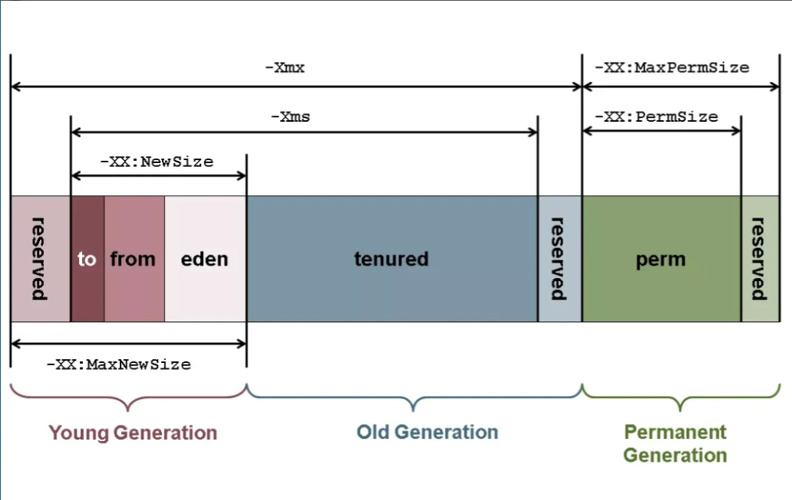
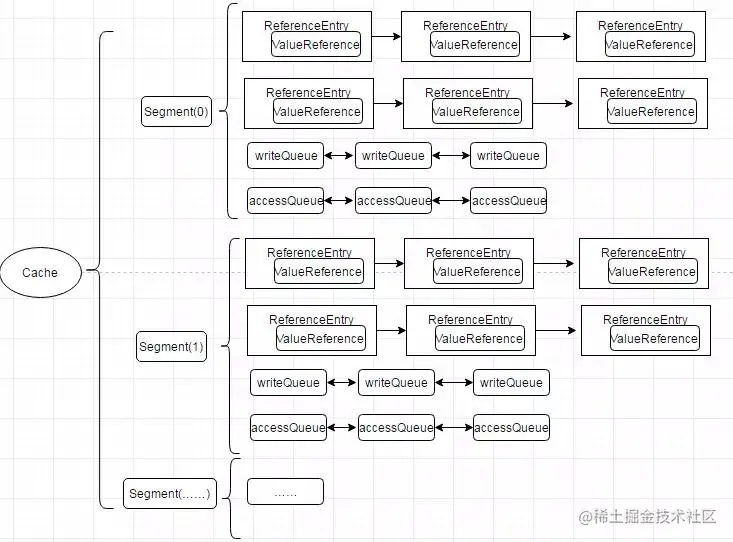

# JVM

1. 有哪些jvm
    1. Oracle的HotSpot虚拟机； 最常用
    2. BEA System的JRockit虚拟机；也被oracle收购了，主要用于高性能的场景
    3. IBM公司的J9虚拟机； 一站式jvm

2. gc
    1. gc 算法有哪些
        1. 引用计数法 给每一个对象一个引用计算，为0的就清理，但是无法处理对象间循环引用的情况。
        2. 标记-清除算法

        - 标记 从GC Root 开始 标记对象，如果从GC root 可达的对象就不能被回收，不可达的就可被回收
        - 清除 将可以回收的内存标记为可用状态（回收内存）但是不整理，会产生大量内存碎片

            3. 标记-复制算法
                - 标记 同上
                - 复制 半区复制 将不能被回收的内存，连续的存放到另一半内存中。这样可以保证每次GC完之后都有一个连续内存空间可以使用。
                - G1、CMS、ParNew、Parallel Scavenge 这样的新生代GC算法基本思想都是这个
            4. 标记-整理算法
                - 标记 同上
                - 整理 就是将不连续并且不能被回收的内存整理成为连续的内存
                - 主要用于老年代 也就是 major GC

    2. 有哪些gc收集器
       
        - Serial
            - 用于回收新生代
            - 使用复制算法
            - （存在stop the world 的情况，因为他在gc的时候是使用单个线程区执行，同时此时只有一个线程在执行回收其他的线程都在等待这个线程gc完成）
        - ParNew （parallel new）
            - 用于回收新生代
            - 使用复制算法
            - 存在stop the world 的情况
            - 并行新生代gc收集器，也就是并行版的serial，serial有的问题他都要
        - Parallel Scavenge
            - 用于回收新生代
            - 标记复制算法
            - 存在stop the world 的情况
            - 还是会导致stop the world 的情况，但是可以通过参数调整gc的时间和频率
            - jdk 1.8 的默认gc 收集器
        - CMS （concurrent mark sweep）
            - 作用于老年代， 可以并发gc，
            - 基于 标记-清理算法 （1. 初始标记（只是堆Gcroot 关联的对象进行标记） 、 并发标记、重新标记（增量标记）、并发清除）；在初始和重新标记也会stop
              the world
            - 也就是用户线程执行的时候进行gc，
            - 这样可以减少 stop the world，但是需要看配置的gc时机（内存使用百分比）需要合适的配置，jdk6以后是92%，
            - 存在一个缺点：可能出现 “Con-current Mode Failure“ :也就是在执行CMS gc 阶段的时候内存就不够用了，这个时候会产生FULL
              GC 这个时候会使用 Serial Old 来执行 GC，这个时候也会产生较长时间的Stop the world
            - 但是在jdk9中被 标记为了Deprecate 体检使用G1
        - Serial Old(MSC)
            - （作用于老年代）
            - 使用 标记-整理算法
            - 存在stop the world 的情况，在整理阶段
        - Parallel Old（作用于老年代） 是 Parallel Scavenge 的老年代
            - 作用于老年代
            - 使用标记整理算法
            - 存在stop the world 的情况
        - G1 （Garbage First1）
            - （不区分？）（全功能收集器 —— Fully-Featured Garbage Collector）      
              这哥们取代了 （Parallel Scavenge + Parallel Old）， 只需要这一个就可以了（Java 7 Update 9 or later）
              G1 算法 将堆内存分为多个块， 然后以块为单位分为（eden，s0，s1，old）；如 1-10 块，有可能分为 （s0:1-2,s1:
              3-4,old5-6,eden7-8,还有两个保留区域）
            - 存在一个 humongous 区域， 用于存储大对象
            - 作用与全部区域
            - 标记-复制算法
            - 除了并发标记其他几个阶段都会产生 stop the world 的情况
            - 算法过程：
                - 初始标记 只是标记GC root 直接关联的对象
                - 并发标记 全局扫描，这个是并发的
                - 最终标记 增量标记
                - 筛选回收 采用 region 见的复制算法实现，从非空闲region复制到空闲region

        - ZGC 对标 Shenandoah
            - 也是基于region 的gc 算法
            - 不遵循分代原理
            - 标记 - 整理算法
            - 算法过程
                - 初始标记 （stop the world）
                - 并发标记/对象重定位
                - 再标记 （stop the world）
                - 并发转移准备
                - 初始转移 （stop the world）
                - 并发转移
        - Shenandoah redhat 开发的gc
        - PGC （Pauseless GC）
        - C4 （concurrent continuously compacting collector） PGC的演进版    
          gc 参数  
    3. gc 一共有哪几种
        - minor gc
            - young gc 只会 eden 区域进行gc
            - 使用的是标记复制算法
        - major GC （Old GC）
            - 只针对老年代进行GC
            - 目前只有cms 收集器会有单独手机老年代的情况
        - full gc 这个会对 堆内存和**方法区**都会进行内存回收，会造成stop the world 的问题
            - System.gc();
        - mixed gc
            - 这个只针对G1 收集器的
            - 在老年代出于45%（默认可以调整）会进行mixed gc
            - 部分老年代 + 整个新生代
    4. GC Root 是什么，有哪些      
       是什么：GC Roots 是一组必须活跃的**引用**。他是一堆**引用**。      
       有哪些：
        - 虚拟机内部的引用，比如类加载器等；
        - native，本地方法栈引用的对象(在本地方法栈)
        - final，常量引用的对象（比如字符串常量池的引用；在方法区）， 这个应该不一定是对的
        - static，静态变量引用的对象（比如Java类的引用类型静态变量；在方法区）
        - synchronzied引用的对象(所有被同步锁持有的对象；在堆里)
        - jvm虚拟机栈引用的对象(比如：各个线程被调用的方法堆栈中用到的参数、局部变量和临时变量；在jvm虚拟机栈中)
        - Thread，活动的线程
        - Class对象，由BootstrapClassLoader加载的对象是不能被回收的
        - 跨代引用的对象也会被GCRoot 引用

3. jvm 内存模型    
   
   

    - 方法区： 线程共享。存储已经被加载的类的信息：常量、静态变量；即时编译器编译后的代码。   
      在jdk1.8（hotspot） 之后 方法区变成了： native memory + meta space
        - native memory： 主要存储 字符串常量池（如我们的String::intern）、静态变量等
        - meta space： 类的一些基本信息
    - 虚拟机栈：线程私有。存储局部变量、**操作数栈**、动态链接、方法出口（return 之后的方法的下一个指令的地址）等信息
        - 操作数栈： 表示 保存计算的中间结果，同时作为计算过程中变量临时的存储空间；
    - 本地方法栈：线程私有。native的方法栈，就是java代码中用native关键休息的栈信息，在 sun hotspot中他们两个被合并了
    - 程序计数器：线程私有。 当前线程下一步执行的位置
    - 堆 ：线程共享。所有的对象实例以及数组都要在堆上分配
    - 代码缓存 jit
      

      分代gc收集器才会存在的情况
        - eden 新生代
            - 新的对象会优先分配在这个区域
        - s0 (survivor 0) (from)
        - s1 (survivor 1) (to)
            - 在gc依次后会使用标记复制算法将对象存放在这里
        - 老年代
            - 大对象（通过参数配置大小），直接存放在老年代
    ---------------
            gc 流程 （此时是全新的环境，Eden 和 s0 和 s1 都没有任何数据）
    
            1. 新的对象放入到eden区域，到达gc零界点，进行minor gc
               gc 结果，eden 中存活的对象放入到s0中。 此时 eden为空，s0 存在对象，s1为空
            2. 新的对象放入到eden区域，到达gc零界点，进行minor gc
               gc 结果，eden 和 s0 中存活的对象放入到s1中。此时 eden为空，s0 为空，s1存在对象
            3. 新的对象放入到eden区域，到达gc零界点，进行minor gc
               gc 结果，eden 和 s1 中存活的对象放入到s0中。此时 eden为空，s0 存在对象，s1为空
               ... 以此往复
               这个gc 过程表明s0 和 s1 的作用是一样的
            4. 如果s0/s1 中的对象过次gc后都没有被gc掉，那么就把他放入老年代中。如果老年代，最终也放满了，就会发生 major GC（即
               Full GC）如果老年代，最终也放满了，就会发生 major GC（即 Full GC）；
    ---------------
4. 即时编译 jit

5. Java 为什么能一次编写，处处运行？
   因为java 代码编译后的程序为java字节码文件，这个字节码文件是给jvm虚拟机进行解释执行的，之所以能多次运行都是因为jvm虚拟在多平台实现了

6. JVM 是什么？

7. HotSpot 是什么？
   是jvm虚拟机的一个实现
8. 堆和栈区别是什么？
   堆： 存在实力对象，静态常量（jdk 1.8 之后），数组
   栈： 存放局部变量，返回值地址，操作数栈，动态连接
9. JVM 哪块内存区域不会发生内存溢出？
    1. 堆、栈、元空间、直接内存、**程序计数器**
10. 什么情况下会发生栈内存溢出？

11. 对象都是在堆上分配的吗？
    不一定主要是jvm存在逃逸分析，如果发现对象未能逃逸到当前方法，那么可以直接在栈上进行分配
12. 常用的 JVM 参数有哪些？   
    -Xmx -Xms --add-opens/exports...
13. Java 8 中的内存结构有什么变化？
    方法区 变成了 元空间+常量池(在堆中)
14. Java 8 中的永久代为什么被移除了？
    1、字符串存在永久代中，容易出现性能问题和内存溢出。
    2、类及方法的信息等比较难确定其大小，因此对于永久代的大小指定比较困难，太小容易出现永久代溢出，太大则容易导致老年代溢出。
    3、永久代会为GC 带来不必要的复杂度，并且回收效率偏低。
15. JVM 是怎么加载字节码文件的？
    1. 加载
       将java字节码的字节流从外部（文件class文件或者自定义的字节流）加载到方法区（jdk1.8之后改成了元空间）
    2. 验证
       验证字节码是否正确
        - 文件格式验证，是否以coffebaby开始，版本号等
        - 元数据验证： 父类（继承关系验证）、接口/抽象类实现验证、字段等验证
        - 字节码验证 语法和词法验证
        - 符号引用验证： 是否能通过全类名找到引用，访问权限修饰符、
    3. 准备
       初始化静态变量，为其分配初始值（这个初始值不是我们初始值，而是jvm定义的初始值，如int的初始值为0）
    4. 解析
       符号引用的验证，
        - 类和接口
        - 字段
        - 方法
    5. 初始化     
       重要前提这个执行是存在一定顺序性的。。。，这里有一个应用顺序需要注意！！！！！！！
        - 执行java代码中的静态变量赋值语句
        - 执行java代码中的static代码块
    6. 使用
    7. 卸载
16. 什么是类加载器？
    加载class文件到内存中的程序
17. 类加载器（ClassLoader）有哪些方法？
    。。
18. 类加载器的分类及作用？
    启动类加载 c++实现
    扩展类加载 sun.misc.Launcher$ExtClassLoader
    应用程序类加载 sun.misc.Launcher$AppClassLoader
    自定义
19. 编程实现一个自定义的类加载器
    重写的findClass()或loadClass()
20. 什么是双亲委派模型？
    就是加载累的时候，会先给父类进行加载，如果父类没有才会使用自己的类加载
21. 为什么要打破双亲委派模型？
    1. 因为jdk1.2之前那个时候还没有双清委派，
    2. spi 破壞 他直接使用了 应用程序类加载這個去加載
22. Class.forName 和 ClassLoader 的区别？
    1. forName 會去 執行static 代碼，也就是會去多執行一步類加載的**初始化**，但是ClassLoader不會
23. 什么是 JVM 内存模型？
    Java内存模型(Java Memory Model)
    是和多线程相关的一个抽象模型，描述了一组规则或规范，这个规范定义了一个线程对共享变量的写入时对另一个线程是可见的。简而言之，JMM是为了解决多线程环境下可见性问题的一组规范。
24. JAVA 内存模型和 JVM 内存结构的区别？
    1. jvm 內存结构就是，程序运行时的内存布局，也就是我们之前讨论的 堆（常量池）、栈、元空间、代码区、程序计数器
    2. JAVA 内存模型是指多线程环境堆内存的
       是和多线程相关的一个抽象模型，描述了一组规则或规范，这个规范定义了一个线程对共享变量的写入时对另一个线程是可见的
25. 什么是指令重排序？

26. 内存屏障是什么？
    fence 暂时的理解：就是在内存屏障的指令不会进行排序，换句话说内存屏障的指令不会与附件的指令重排序
27. 什么是 Happens-Before 原则？
    - 程序次序规则：一个线程内，按照代码顺序，书写在前面的操作先行发生于书写在后面的操作；
    - 锁定规则：一个unLock操作先行发生于后面对同一个锁的lock操作；
    - volatile变量规则：对一个变量的写操作先行发生于后面对这个变量的读操作；
    - 传递规则：如果操作A先行发生于操作B，而操作B又先行发生于操作C，则可以得出操作A先行发生于操作C；
    - 线程启动规则：Thread对象的start()方法先行发生于此线程的每个一个动作；
    - 线程中断规则：对线程interrupt()方法的调用先行发生于被中断线程的代码检测到中断事件的发生；
    - 线程终结规则：线程中所有的操作都先行发生于线程的终止检测，我们可以通过Thread.join()方法结束、Thread.isAlive()
      的返回值手段检测到线程已经终止执行；
    - 对象终结规则：一个对象的初始化完成先行发生于他的finalize()方法的开始。
28. JVM 从 GC 角度看，堆的分区情况？
    从分代原理来看：新生代（eden、survivor1、survivor0），老年代，永久代

29. 为什么堆要分新生代和老年代？而不是一个老年代就行？
    因为大部分对象都会
30. 为什么新生代要分成 Eden 和 Survivor 两个区？

31. 为什么新生代 Survivor 区又分为两个区？一个不行吗？
    可以，这样会导致young gc 时间复杂增加
32. 新生代各分区的默认比例是怎样的？
    eden ： survivor ： suvivor 8:1
33. 哪些情况下存活对象会进入老年代？
    minor gc 超过一定次数 默认是15次，可以通过参数配置
34. GC 是什么？为什么需要 GC？
    gc 垃圾收集，有的内存使用后后续不会在使用了，所以需要回收
35. 什么是 Young GC？
    针对 eden区域和survivor 区域的垃圾回收，这个时候会将部分对象（经过一定的gc次数）从survivor区 移动到old区域
36. 什么是 Minor GC？
    只针对老年老年代
37. 什么是 Full GC？
    整个堆内存的gc 还有元空间，常量池、永久代
38. 什么时候会触发 Minor GC？
    eden 区域不够的时候，会触发stop the world的情况
39. 什么时候出发 major GC
    当老年代满时会触发MajorGC，通常至少经历过一次Minor GC，再紧接着进行Major GC

40. 什么时候会触发 Full GC？
    - 老年代空间不足
    - 持久代空间不足
    - YGC出现promotion failure 也是因为老年代不足，
    - 统计YGC发生时晋升到老年代的平均总大小大于老年代的空闲空间， 根本原因还是老年代不足
    - System.gc();
41. 一次完整的 GC 流程是怎样的？
    1. 分代原理
        1. 内存先分配在eden区域
        2. 先执行young gc 通过标记复制算法，将eden 和 survivor 复制到另外一个survivor 区域
        3. 在执行major gc 只gc老年带
        4. 在堆全局full gc这个时候常量池也会进行gc

42. 什么是 GC 停顿？为什么要停顿？
    用户会停止工作，之后gc 线程在执行，因为存在对象的一定才会导致gc停顿
43. 如何减少长时间的 GC 停顿？
    ？
44. JVM 如何判断一个对象可被回收？
    更具Gc root 进行可达性分析，不可达就可以被回收
45. 常用的垃圾收集器有哪些？
    cms, g1, serial/serial old, par new/ par old, zgc
46. JVM 中的默认垃圾收集器是？
    1.8 cms 1.9+ g1
47. 什么是 G1 垃圾收集器？
    g1 收集器，是全功能收集器，他可以对老年代和
48. 有了 CMS 收集器，为什么又搞出了 G1？
    因为g1 与cms的实现逻辑不同，他是基于region进行内存分配的，不想cms 是几块连续的内存。
    而且cms 会存在 标记-清除后存在内存碎片的问题，但是g1不会存在这样的情况
49. G1 垃圾收集器的适用场景？
    需要低延时，
50. G1 垃圾收集器有什么优缺点？
    缺点：
    - 管理 region 存在内存开销
    - 分代管理相对复杂，实现上的复杂
    - 在最后整理阶段还存在 stop the world 的情况，这是一个比较耗时的操作
      优点
    - 进行gc 后不会产生 内存碎片
    - 创新的mixed gc
    - 可以配置gc 时间，可以更具某种算法计算出先gc那些region

51. G1 收集器对于堆是怎么划分的？
    - 以 region 为单位进行分配
    - 增加了大对象专门的 humongous 区域
52. G1 收集器为什么重新划分了堆？
    - 以region 为单位进行管理可以避免像 cms 那样的 内存碎片，
    - 为了降低 gc 停顿的时间

53. G1 收集器是怎么处理大对象的？
    - 存放到专门的 humongous region
54. G1 收集器为什么新增 Humongous 区域？有什么用？
    存放大对象
55. G1 垃圾回收的过程是怎样的？
    1. 初始标记 stop the world ，只会对gc root 上的对象进行标记
    2. 并发标记 对所有的对象进行标记
    3. 重新标记 stop the world ，增量标记
    4. 整理
56. G1 回收停顿了几次，为什么？
    第一次 初始标记 因为会修改TAMS指针的值，因为会使用部分新的区域作为此次gc的新空间
    第二次 重新标记 处理SATB记录
    第三次 整理 因为存在对象移动的情况所以不能并发执行
57. 怎么启用 G1 收集器？有哪些设置参数？
    -XX:+UseG1GC
58. 什么是 CMS 垃圾收集器？
    concurrent mark sweep
59. CMS 垃圾收集器的适用场景？

60. CMS 垃圾收集器有什么优缺点？
    缺点：
    - 存在内存碎片
    - 可能 concurrent fail 导致FULL gc 从而导致停顿

    优点：
    - 在清理阶段可以并发，可
61. CMS 收集器触发 GC 的条件？
    1. 是否是并行 Full GC 如果已经被请求了 gull fc 需要执行cms
    2. 根据统计数据动态计算（仅未配置 UseCMSInitiatingOccupancyOnly 时） 未配置 UseCMSInitiatingOccupancyOnly
       时，会根据统计数据动态判断是否需要进行一次 CMS GC。
    3. 根据 Old Gen 情况判断 默认是92%的时触
    4. 根据增量 GC 是否可能会失败（悲观策略） 两代的 GC 体系中，主要指的是 Young GC 是否会失败。如果 Young GC
       已经失败或者可能会失败，JVM 就认为需要进行一次 CMS GC。
    5. 根据 meta space 情况判断： meta space 进行扩容前如果配置了 CMSClassUnloadingEnabled 参数时，会进行设置。这种情况下就会进行一次
       CMS GC。

62. CMS 垃圾回收的过程是怎样的？
    1. 初始标记
    2. 并发标记
    3. 最终标记
    4. 并发清理
63. CMS 垃圾收集器能处理浮动垃圾吗？为什么？
    1. 不能，因为他可以并发清理内存，
64. CMS 回收停顿了几次，为什么？
    两次 初始标记和最终标记
65. CMS 垃圾收集器为什么会被废弃？

66. CMS 垃圾收集器废弃后有什么替代方案？
    G1
67. 怎么启用 CMS 收集器？有哪些设置参数？
    -XXX
68. CMS 和 G1 收集器的区别？
    堆内存组织凡是不同，cms是eden区域和其他区域是连续，但是g1部通region进行管理的，并不一定是连续的
69. CMS 和 G1 收集器怎么选？
    cms适合内存较小、g1 适合内存较大
70. 常用的垃圾回收算法有哪些？
    标记-清除、标记-复制、标记-整理
71. 你怎么理解 GC 引用计数算法？
    。。。
72. 你怎么理解 GC 复制算法？
    在gc的时候将还存活的对象，复制到另一块空闲的区域
73. 你怎么理解 GC 标记清除算法？
    在gc的时候只是将死亡的对象的存储空间释放出来，
74. 你怎么理解 GC 标记整理算法？
    在gc的时候只是将死亡的对象的存储空间释放出来，同时整理到一块连续的内存空间
75. 你怎么理解 GC 分代算法？
    将堆内存分队多个代，eden survivor
76. System.gc() 和 Runtime.gc() 的作用？有什么区别？
    出发full gc, system 调用runtime
77. 什么是三色标记法？
    是一种跟踪垃圾回收的内存管理算法，启动白色表示没有被扫描、灰色表示被扫描了但是他引用的对象还未被扫描完、黑色表示自身和关联对象都被扫描了
78. 什么是浮动垃圾？
    并发收集过程中产生了不可达的对象
79. 什么是内存泄漏？
    内存无法被释放同时也无法被找到
80. Java 中会存在内存泄漏吗？
    除了 程序技术器； 堆、栈、元空间、直接内存。都存在
81. 为什么会发生内存泄漏？
    内存没有被释放，但是引用丢失了
82. 如何防止内存泄漏？
    规范代码
83. 一个线程 OOM 后，其他线程还能运行吗？ // 需要验证
    看情况直接内存可以，heap不知道
84. 什么是直接内存？
    系统的内存
85. 直接内存有什么用？
    unsafe api，用于零拷贝减少内存拷贝
86. 怎样访问直接内存？
    unsafe api
87. 常用的 JVM 调优命令有哪些？

88. 常用的 JVM 问题定位工具有哪些？
    1. jconsole
    2. VMVisual
    3. arthas
    4. java mission control
    5. flam graphs
    6. tProfiler
    7. Btrace
    8. yourkit
    9. jProbe
    10. spring insight
89. 常用的主流 JVM 虚拟机都有哪些？
    hotspot
90. JVM 对频繁调用的方法做了哪些优化？
    jit 将java字节码编译成二进制代码
91. 什么是热点代码？
    经常执行的
92. GraalVM 是什么技术？

# JDK

## 1. 多线程

1. 多线程初始化 参数
    - int corePoolSize, 核心线程数量, 这个也可以通过 ThreadPoolExecutor#allowCoreThreadTimeOut(boolean) 来设置与非核心线程同样的效果
    - int maximumPoolSize, 线程池最大线程数量， maximumPoolSize 必须大于等于 corePoolSize， 因为核心线程数 +
      非核心线程数 = 线程池最大线程数量。
    - long keepAliveTime, 空闲线程的存活时间， 这个存活时间是指当非核心线程处于空闲状态后还可以存活多久
    - TimeUnit unit, 存储时间的时间单位
    - BlockingQueue<Runnable> workQueue, 提交任务的任务队列，用于存放我们使用的 submit 或者execute 方法提交的runnable实例对象
    - ThreadFactory threadFactory, 线程工厂
    - RejectedExecutionHandler handler 拒绝策略
2. 线程池线程执行情况
    1. 尝试执行第一个初始任务，也就是我们new 线程的时候传入的第一个任务，同时允许在在获取新任务的期间允许打断单签线程
    2. 

## 2. 序列化和反序列化

## 3. guava Cache

LocalCache 数据结构

重要的成员变量

```java
   class LocalCache {
    // 这个就是一个缓存的分区，不同的key可能存在于不同的分区
    final Segment<K, V>[] segments;

    /**
     * The recency queue is used to record which entries were accessed for updating the access list's ordering. It is drained as a batch operation when either the DRAIN_THRESHOLD is crossed or a write occurs on the segment.
     * 批量加入到
     */
    static class Segment<K, V> extends ReentrantLock {
        final Queue<ReferenceEntry<K, V>> recencyQueue; // 新写入的过期信息会放入到这里
        final Queue<ReferenceEntry<K, V>> writeQueue; // 按照过期时间升序排序
        final Queue<ReferenceEntry<K, V>> accessQueue; // 按照过期时间升序排序
    }
}

```

## 4.锁

基本使用就不介绍了。。。

1. synchronized 关键字
    1. mark word
       <pre>
       无锁状态 mark word 最后两位为 01  
       偏向锁 mark word 最后两位为 01
       轻量级锁 mark word 最后两位为 00， 基于cas 自旋来尝试获取锁，使用-XX:+UseSpining 
       重量级锁 mark word 最后两位为 10  需要看一下jvm 的源码 todo
        </pre>
    2. 关键字与object的wait、notify的配合使用，如下例，这些方法都必须保证当前线程的代码在synchronized关键字语句块中，同时需要保证对象是同一个对象
        1. wait 方法：这个方法会将当前线程的 synchronized 锁给释放掉，然后将当前线程暂停 ，这个时候线程会加入到WaitSet中
           这里的线程状态会从 running 到waiting
        2. notify 尝试唤醒被当前对象阻塞的对象,notify 并不是唤醒被线程锁的线程，而是把他加入到抢占 synchronized
           锁对象相关的队列，也就是加入到 c++语言中的EntryList中
           这里的线程状态会从 waiting 到blocked，
    ```java
    // 如test_object_wait_1 这个方法的t1和t2 不会产生死锁
    class Demo {
        void test_object_wait_1() {
    
            Object lock = new Object();
            new Thread(() -> {
                synchronized (lock) {
                    try {
                        lock.wait();
                    } catch (Exception e) {
                        throw new RuntimeException(e);
                    }
                }
            }, "t-1").start();
            new Thread(() -> {
                synchronized (lock) {
                    lock.notify();
                }
            }, "t-2").start();
    
        }
    }
    ```
2. Lock
   lock 作为jdk 实现的锁, 以 AbstractQueuedSynchronizer 队列 和 Condition 条件队列实现的一个锁
    1. ReentrantLock 为例,可以实现重入基于aqs 的 state 字段实现，
    2. AbstractQueueSynchronizer 队列
       这是一个双向队列，队列中的元素二点
    3. Condition 队列
       这是一个单向链表

```java
class ReentrantLock {
    // 和兴成员变量
    private final Sync sync;// （这是一个 aqs的一个实现）

}

class AbstractQueuedSynchronizer {
    /**
     * Head of the wait queue, lazily initialized.
     */
    private transient volatile Node head;

    /**
     * Tail of the wait queue. After initialization, modified only via casTail.
     */
    private transient volatile Node tail;

    /**
     * The synchronization state.
     */
    private volatile int state;

    abstract static class Node {
        volatile Node prev;       // initially attached via casTail
        volatile Node next;       // visibly nonnull when signallable
        Thread waiter;            // visibly nonnull when enqueued
        volatile int status;      // written by owner, atomic bit ops by others
    }

    static final class ConditionNode extends Node
            implements ForkJoinPool.ManagedBlocker {
        ConditionNode nextWaiter;            // link to next waiting node

        /**
         * Allows Conditions to be used in ForkJoinPools without
         * risking fixed pool exhaustion. This is usable only for
         * untimed Condition waits, not timed versions.
         */
        public final boolean isReleasable() {
            return status <= 1 || Thread.currentThread().isInterrupted();
        }

        public final boolean block() {
            while (!isReleasable()) LockSupport.park();
            return true;
        }
    }


}
```

## jdk 动态代理和 cglib 动态代理原理

两个都是动态生成class作为类

- jdk 生成一个实现了指定接口、继承了 jdk.proxy.Proxy 的类    
  如： final class $Proxy11 extends Proxy implements JdkTestInterface
  每一个方法的调用，都是使用的 super.h.invoke(this, m1, ...);
- cglib 一个继承 目标类，实现 Factory 的类
  每次执行方法的时候会去使用 MethodInterceptor#intercpt 方法进行拦截方法的执行从而实现aop

# Redis

0. 底层数据类型
    - intset 一个数字的有序集合
    - SDS简单字符串 封装加功能
    - ziplist 压缩列表
    - linked list 链表
    - quick list 快表 ziplist linkedlist
    - dict 散列表
    - skip list 跳表
    -
1. 基本数据类型
    - 字符串对象
      SDS
    - 列表对象
      quick list （块内用zip list， 快外用linked list）(zip list 存储连锁更新的问题)
    - 集合对象   
      分别用dict和intset存储
    - 有序集合对象  
      ziplist     
      dict     
      skiplist
    - 散列表对象（hash）     
      ziplist 到达一定的临界值转成 散列表，这个可以用过配置配置
      散列表（hashtable）
    - 模块对象和流对象
      list pack

# MySQL

# netty

# spring 面试题

## 1. Spring是什么？有什么特点？

## 2. Spring由哪些模块组成？

data 相关

1. spring jdbc       
   提供了一个JDBC的抽象层，消除了烦琐的JDBC编码和数据库厂商特有的错误代码解析， 用于简化JDBC
2. orm

3. oxm

4. jmx

5. transactions

   web
6. web socket

7. servlet

8. web

9. portlet

       mid，中间层
10. aop

    提供了面向切面的编程实现，让你可以自定义拦截器、切点等。
11. aspects

12. instrumentation

13. messaging

        core container       
14. beans           
    提供了BeanFactory，是工厂模式的一个经典实现，Spring将管理对象称为Bean。
15. core    
    提供了框架的基本组成部分，包括控制反转（Inversion of Control，IOC）和依赖注入（Dependency Injection，DI）功能。
16. context   
    构建于 core 封装包基础上的 context 封装包，提供了一种框架式的对象访问方法。
17. SpEL

18. test

## 3. Spring 框架中都用到了哪些设计模式？

1. 工厂模式，如bean factory
2. 单例模式，bean 默认为单例
3. 代理模式： spring 的aop 功能用到了jdk代理和cglib字节生成技术
4. 模板方法：jdbc template
5. 观察者模式，ApplicationListener

## 4. 详细讲解一下核心容器（spring context应用上下文) 模块

这是基本的Spring模块，提供spring 框架的基础功能，BeanFactory 是 任何以spring为基础的应用的核心。Spring
框架建立在此模块之上，它使Spring成为一个容器。
他是以 beanFactory 作为di，以注解或者xml的形式，将对象注入beanFactory中，

## 5. Spring框架中有哪些不同类型的事件

Spring 提供了以下5种标准的事件：

1. 上下文更新事件（ContextRefreshedEvent）：在调用ConfigurableApplicationContext 接口中的refresh()方法时被触发。
2. 上下文开始事件（ContextStartedEvent）：当容器调用ConfigurableApplicationContext的Start()方法开始/重新开始容器时触发该事件。
3. 上下文停止事件（ContextStoppedEvent）：当容器调用ConfigurableApplicationContext的Stop()方法停止容器时触发该事件。
4. 上下文关闭事件（ContextClosedEvent）：当ApplicationContext被关闭时触发该事件。容器被关闭时，其管理的所有单例Bean都被销毁。
5. 请求处理事件（RequestHandledEvent）：在Web应用中，当一个http请求（request）结束触发该事件。如果一个bean实现了ApplicationListener接口，当一个ApplicationEvent
   被发布以后，bean会自动被通知。

## 6. Spring 应用程序有哪些不同组件？

?
Spring 应用一般有以下组件：

（1）接口 - 定义功能。

（2）Bean 类 - 它包含属性，setter 和 getter 方法，函数等。

（3）Bean 配置文件 - 包含类的信息以及如何配置它们。

（4）Spring 面向切面编程（AOP） - 提供面向切面编程的功能。

（5）用户程序 - 它使用接口。

## 7. 使用 Spring 有哪些方式？

ssm / ssh

## 8. 什么是Spring IOC 容器？

控制反转即IoC (Inversion of Control)
，它把传统上由程序代码直接操控的对象的调用权交给容器，通过容器来实现对象组件的装配和管理。所谓的“控制反转”概念就是对组件对象控制权的转移，从程序代码本身转移到了外部容器。

Spring IOC 负责创建对象，管理对象（通过依赖注入（DI），装配对象，配置对象，并且管理这些对象的整个生命周期。

## 9. 控制反转(IoC)有什么作用？

1. 管理对象的创建和依赖关系的维护。对象的创建并不是一件简单的事，在对象关系比较复杂时，如果依赖关系需要程序猿来维护的话，那是相当头疼的
2. 解耦，由容器去维护具体的对象
3. 托管了类的产生过程，比如我们需要在类的产生过程中做一些处理，最直接的例子就是代理，如果有容器程序可以把这部分处理交给容器，应用程序则无需去关心类是如何完成代理的

## 10. IOC的优点是什么？

1. IOC 或 依赖注入把应用的代码量降到最低。
2. 它使应用容易测试，单元测试不再需要单例和JNDI查找机制。
3. 最小的代价和最小的侵入性使松散耦合得以实现。
4. IOC容器支持加载服务时的饿汉式初始化和懒加载。

## 11. Spring IoC 的实现机制？

## 12. Spring 的 IoC支持哪些功能

## 13. BeanFactory 和 ApplicationContext有什么区别？

1. 依赖关系
    - BeanFactory：是Spring里面最底层的接口，包含了各种Bean的定义，读取bean配置文档，管理bean的加载、实例化，控制bean的生命周期，维护bean之间的依赖关系。
    - ApplicationContext接口作为BeanFactory的派生，除了提供BeanFactory所具有的功能外，还提供了更完整的框架功能：
        - 比如说继承MessageSource，
            - 因此支持国际化、
            - 统一的资源文件访问方式、
            - 提供在监听器中注册bean的事件、
            - 同时加载多个配置文件、
            - 载入多个（有继承关系）上下文
            - 使得每一个上下文都专注于一个特定的层次，比如应用的web层。
2. 加载方式
   bean factory 是lazy 加载bean 的不会主动创建bean，只会创建beanDefinition
   application context 会在启动的时候创建单例bean
3. 创建方式
   BeanFactory通常以编程的方式被创建，ApplicationContext还能以声明的方式创建，如使用ContextLoader。
4. 注册方式
   BeanFactory和ApplicationContext都支持BeanPostProcessor、BeanFactoryPostProcessor的使用，但两者之间的区别是：BeanFactory需要手动注册，而ApplicationContext则是自动注册。

## 14. ApplicationContext通常的实现是什么？

AnnotationConfigApplicationContext

## 15. 什么是Spring的依赖注入？

控制反转IoC是一个很大的概念，可以用不同的方式来实现。其主要实现方式有两种：依赖注入和依赖查找
依赖注入：相对于IoC而言，依赖注入(DI)更加准确地描述了IoC的设计理念。所谓依赖注入（Dependency
Injection），即组件之间的依赖关系由容器在应用系统运行期来决定，也就是由容器动态地将某种依赖关系的目标对象实例注入到应用系统中的各个关联的组件之中。组件不做定位查询，只提供普通的Java方法让容器去决定依赖关系。

## 16. 依赖注入的基本原则？

就是依赖注入的应该交给ioc来完成

## 17. 、依赖注入有什么优势

1. 查找定位操作与应用代码完全无关。
2. 不依赖于容器的API，可以很容易地在任何容器以外使用应用对象。
3. 不需要特殊的接口，绝大多数对象可以做到完全不必依赖容器。

## 18. 、有哪些不同类型的依赖注入实现方式？

1. autowired 注解
2. setter 方法
3. 构造方法注入

## 19. 、构造器依赖注入和 Setter方法注入的区别？

注入时机不一样，一个在初始化之前，一个是在初始化之后。

## 20. 什么是Spring beans？

Spring beans 是那些形成Spring应用的主干的java对象。它们被Spring IOC容器初始化，装配，和管理。这些beans通过容器中配置的元数据创建。比如，以XML文件中
的形式定义。

## 21. 一个 Spring Bean 定义 包含什么？

bean definition

## 22. 如何给Spring 容器提供配置元数据？Spring有几种配置方式

xml、注解、@Configuration注解的类

## 23. Spring基于xml注入bean的几种方式？

## 24. 解释Spring支持的几种bean的作用域

1. singleton
2. prototype ，每一个依赖都是一个新的对象
3. request 一个请求
4. session 一个http session
5. global-session ？

## 25. Spring框架中的单例bean是线程安全的吗？

spring 单例bean 不是线程安全的

## 26. Spring如何处理线程并发问题？

在一般情况下，只有无状态的Bean才可以在多线程环境下共享，在Spring中，绝大部分Bean都可以声明为singleton作用域，因为Spring对一些Bean中非线程安全状态采用ThreadLocal进行处理，解决线程安全问题。

## 27. 解释Spring框架中bean的生命周期

1. 实例化对象（解析构造方法）
2. 设置对象属性
3. 调用 aware 方法
4. application aware
5. beanPostProcessor before
6. InitializingBean
7. init-method
8. beanPostProcessor after
9. singleton？ 放入到 ioc容器中
10. 关闭容i去
11. disposableBean
12. destroy-method

## 28. 哪些是重要的bean生命周期方法？ 你能重载它们吗？

BeanNameAware
BeanClassLoaderAware  
BeanFactoryAware  
postProcessBeforeInitialization
afterPropertiesSet
init
postProcessAfterInitialization
destroy

## 29. 、什么是Spring的内部bean？

？

## 30. 、在 Spring中如何注入一个java集合？

Spring提供以下几种集合的配置元素：

1. 类型用于注入一列值，允许有相同的值。
2. 类型用于注入一组值，不允许有相同的值。
3. 类型用于注入一组键值对，键和值都可以为任意类型。
4. 类型用于注入一组键值对，键和值都只能为String类型。

## 31. 、什么是bean装配？什么是bean的自动装配？

在spring中，对象无需自己查找或创建与其关联的其他对象，由容器负责把需要相互协作的对象引用赋予各个对象，使用autowire来配置自动装载模式。

1. no：默认的方式是不进行自动装配的，通过手工设置ref属性来进行装配bean。
2. byName：通过bean的名称进行自动装配，如果一个bean的 property 与另一bean 的name 相同，就进行自动装配。
3. byType：通过参数的数据类型进行自动装配。
4. constructor：利用构造函数进行装配，并且构造函数的参数通过byType进行装配。
5. autodetect：自动探测，如果有构造方法，通过 construct的方式自动装配，否则使用 byType的方式自动装配。

## 32. 、解释不同方式的自动装配，spring 自动装配 bean 有哪些方式？

（1）开启注解：使用@Autowired注解来自动装配指定的bean。在使用@Autowired注解之前需要在Spring配置文件进行配置，<context:
annotation-config />。
（2）扫描查询：在启动spring
IoC时，容器自动装载了一个AutowiredAnnotationBeanPostProcessor后置处理器，当容器扫描到@Autowied、@Resource或@Inject时，就会在IoC容器自动查找需要的bean，并装配给该对象的属性。在使用@Autowired时，首先在容器中查询对应类型的bean：
如果查询结果刚好为一个，就将该bean装配给@Autowired指定的数据；
如果查询的结果不止一个，那么@Autowired会根据名称来查找；
如果上述查找的结果为空，那么会抛出异常。解决方法时，使用required=false。

## 33. 、使用@Autowired注解自动装配的过程是怎样的？

1. 如果目标bean 为null，那就返回
2. 如果是 isSynthetic 并且 hasInstantiationAwareBeanPostProcessors， 那么也返回？
3. 根据名字数组，再根据类型注入，将 依赖的bean注册，并且加入到MutablePropertyValues 这个里面去
4. **InstantiationAwareBeanPostProcessor#postProcessProperties 这个会去执行实际的注入操作**
5. 依赖检查
6. 深拷贝 MutablePropertyValues， **还不知道为什么**

## 34. 、自动装配有哪些局限性？

自动装配的局限性是：

- 重写：自动装配 存在轻量的代码入侵，但是自定义配置可能会过于复杂
- 模糊特性：自动装配不如显式装配精确，如果有可能，建议使用显式装配。

## 35. 、你可以在Spring中注入一个null 和一个空字符串吗？

可以

## 36. 什么是基于Java的Spring注解配置? 给一些注解的例子

@Configuration
@Bean
@Value
基于Java的配置，允许你在少量的Java注解的帮助下，进行你的大部分Spring配置而非通过XML文件。
以 注解为例，它用来标记类可以当做一个bean的定义，被Spring IOC容器使用。
另一个例子是@Bean注解，它表示此方法将要返回一个对象，作为一个bean注册进Spring应用上下文。

## 37. 怎样开启注解装配？

@SpringBootApplication 注解
AnnotationConfigApplicationContext 或者实例化这个类

## 38. @Component, @Controller, @Repository, @Service 有何区别？

（1）@Component：这将 java 类标记为 bean。它是任何 Spring 管理组件的通用构造型。spring 的组件扫描机制现在可以将其拾取并将其拉入应用程序环境中。

（2）@Controller：一个特别的Component，这将一个类标记为 Spring Web MVC 控制器。标有它的 Bean 会自动导入到 IoC
容器中。他会配合@RequestMapping注解一起使用作为 mvc 的handler

（3）@Service：此注解是组件注解的特化。它不会对 @Component 注解提供任何其他行为。您可以在服务层类中使用 @Service 而不是
@Component，因为它以更好的方式指定了意图。
Indicates that an annotated class is a "Service", originally defined by Domain-Driven Design (Evans, 2003) as "an
operation offered as an interface that stands alone in the model, with no encapsulated state."

（4）@Repository：这个注解是具有类似用途和功能的 @Component 注解的特化。它为 DAO 提供了额外的好处。它将 DAO 导入 IoC
容器，并使未经检查的异常有资格转换为 Spring DataAccessException。
Indicates that an annotated class is a "Repository", originally defined by Domain-Driven Design (Evans, 2003) as "a
mechanism for encapsulating storage, retrieval, and search behavior which emulates a collection of objects".

## 39. @Required 注解有什么作用

表示是否为必须注入的属性

## 40. @Autowired 注解有什么作用

## 41. @Autowired和@Resource之间的区别

@Autowired可用于：构造函数、成员变量、Setter方法    
@Autowired和@Resource之间的区别  
@Autowired默认是按照类型装配注入的，默认情况下它要求依赖对象必须存在（可以设置它required属性为false）。  
@Resource默认是按照名称来装配注入的，只有当找不到与名称匹配的bean才会按照类型来装配注入。

## 42. @Qualifier 注解有什么作用

当您创建多个相同类型的 bean 并希望仅使用属性装配其中一个 bean 时，您可以使用@Qualifier 注解和 @Autowired 通过指定应该装配哪个确切的
bean **来消除歧义**。

## 44. @RequestMapping 注解有什么用？

@RequestMapping 注解用于将特定 HTTP 请求方法映射到将处理相应请求的控制器中的特定类/方法。此注释可应用于两个级别：
（1）类级别：映射请求的 URL
（2）方法级别：映射 URL 以及 HTTP 请求方法

## 45. 解释对象/关系映射集成模块

Spring 通过提供ORM模块，支持我们在直接JDBC之上使用一个对象/关系映射映射(ORM)工具，
Spring 支持集成主流的ORM框架，如Hiberate，JDO和 iBATIS，JPA，TopLink，JDO，OJB 。
Spring 的事务管理同样支持以上所有ORM框架及JDBC。

## 46. 在Spring框架中如何更有效地使用JDBC？

## 47. 解释JDBC抽象和DAO模块

## 48. spring DAO 有什么用？

## 49. spring JDBC API 中存在哪些类？

JdbcTemplate

SimpleJdbcTemplate

NamedParameterJdbcTemplate

SimpleJdbcInsert

SimpleJdbcCall

## 50. JdbcTemplate是什么

JdbcTemplate 类提供了很多便利的方法解决诸如把数据库数据转变成基本数据类型或对象，执行写好的或可调用的数据库操作语句，提供自定义的数据错误处理。

## 51. 使用Spring通过什么方式访问Hibernate？使用 Spring 访问 Hibernate 的方法有哪些？

在Spring中有两种方式访问Hibernate：
（1）使用 Hibernate 模板和回调进行控制反转 ?
（2）扩展 HibernateDAOSupport 并应用 AOP 拦截器节点 ?

## 52. Spring支持的事务管理类型， spring 事务实现方式有哪些？

（1）编程式事务管理：这意味你通过编程的方式管理事务，给你带来极大的灵活性，但是难维护。
（2）声明式事务管理：这意味着你可以将业务代码和事务管理分离，你只需用注解和XML配置来管理事务。

## 53. Spring事务的实现方式和实现原理

Spring事务的本质其实就是数据库对事务的支持，没有数据库的事务支持，spring是无法提供事务功能的。真正的数据库层的事务提交和回滚是通过binlog或者redo
log实现的。

## 54. 、说一下Spring的事务传播行为

1. PROPAGATION_REQUIRED: 存在事务，加入；不存在、创建新事务
2. PROPAGATION_SUPPORTS：存在加入，不存在不用事务执行
3. PROPAGATION_MANDATORY：必须存在事务
4. PROPAGATION_REQUIRES_NEW：直接创建新事务
5. PROPAGATION_NOT_SUPPORTED：只能以非事务的方式执行，存在事务则将其挂起；
6. PROPAGATION_NEVER：只能以非事务的方式执行，存在则exception
7. PROPAGATION_NESTED： 一定会创建一个新的事务 只会滚方法方法自身，不会回滚外围的事务；外围的事务回滚后会导致这个事务也回滚

## 55. 、说一下 spring 的事务隔离？

(1) 不可重复读是读取了其他事务更改的数据，针对update操作
(2) 幻读是读取了其他事务新增的数据，针对insert和delete操作

spring 有五大隔离级别，默认值为 ISOLATION_DEFAULT（使用数据库的设置），其他四个隔离级别和数据库的隔离级别一致：

- ISOLATION_DEFAULT：用底层数据库的设置隔离级别，数据库设置的是什么我就用什么；
- ISOLATION_READ_UNCOMMITTED：未提交读，最低隔离级别、事务未提交前，就可被其他事务读取（会出现幻读、脏读、不可重复读）；
- ISOLATION_READ_COMMITTED：提交读，一个事务提交后才能被其他事务读取到（会造成幻读、不可重复读），SQL server 的默认级别；
- ISOLATION_REPEATABLE_READ：可重复读，保证多次读取同一个数据时，其值都和事务开始时候的内容是一致，禁止读取到别的事务未提交的数据（避免了幻读），MySQL
  的默认级别；
- ISOLATION_SERIALIZABLE：序列化，代价最高最可靠的隔离级别，该隔离级别能防止脏读、不可重复读、幻读。

## 56. 、Spring框架的事务管理有哪些优点？

（1）为不同的事务API 如 JTA，JDBC，Hibernate，JPA 和JDO，提供一个不变的编程模式。
（2）为编程式事务管理提供了一套简单的API而不是一些复杂的事务API
（3）支持声明式事务管理。
（4）和Spring各种数据访问抽象层很好得集成。

## 57. 什么是AOP

面向切面编程

## 58. Spring AOP and AspectJ AOP 有什么区别？AOP 有哪些实现方式？

AOP实现的关键在于 代理模式，AOP代理主要分为静态代理和动态代理。静态代理的代表为AspectJ；动态代理则以Spring AOP为代表。
（1）AspectJ是静态代理的增强，所谓静态代理，就是AOP框架会在编译阶段生成AOP代理类，因此也称为编译时增强，他会在编译阶段将AspectJ(
切面)织入到Java字节码中，运行的时候就是增强之后的AOP对象。
（2）Spring AOP使用的动态代理，所谓的动态代理就是说AOP框架不会去修改字节码，而是每次运行时在内存中临时为方法生成一个AOP对象，这个AOP对象包含了目标对象的全部方法，并且在特定的切点做了增强处理，并回调原对象的方法。

## 59. JDK动态代理和CGLIB动态代理的区别

Spring AOP中的动态代理主要有两种方式，JDK动态代理和CGLIB动态代理：
（1）JDK动态代理只提供接口的代理，不支持类的代理。核心InvocationHandler接口和Proxy类，InvocationHandler 通过invoke()
方法反射来调用目标类中的代码，动态地将横切逻辑和业务编织在一起；接着，Proxy利用 InvocationHandler动态创建一个符合某一接口的的实例,
生成目标类的代理对象。
（2）如果代理类没有实现 InvocationHandler 接口，那么Spring AOP会选择使用CGLIB来动态代理目标类。CGLIB（Code Generation
Library），是一个代码生成的类库，可以在运行时动态的生成指定类的一个子类对象，并覆盖其中特定方法并添加增强代码，从而实现AOP。CGLIB是通过继承的方式做的动态代理，因此如果某个类被标记为final，那么它是无法使用CGLIB做动态代理的。
静态代理与动态代理区别在于生成AOP代理对象的时机不同，相对来说AspectJ的静态代理方式具有更好的性能，但是AspectJ需要特定的编译器进行处理，而Spring
AOP则无需特定的编译器处理。

## 60. 如何理解 Spring 中的代理？

将 Advice 应用于目标对象后创建的对象称为代理。在客户端对象的情况下，目标对象和代理对象是相同的。
Advice + Target Object = Proxy

## 61. 解释一下Spring AOP里面的几个名词

- 切面（Aspect）：切面是通知和切点的**结合**。通知和切点共同定义了切面的全部内容。 在Spring AOP中，切面可以使用通用类（基于模式的风格）
  或者在普通类中以 @AspectJ 注解来实现。
- 连接点（Join point）：指方法，在Spring AOP中，一个连接点 总是 代表一个方法的执行。
  应用可能有数以千计的时机应用通知。这些时机被称为连接点。连接点是在应用执行过程中能够插入切面的一个点。这个点可以是调用方法时、抛出异常时、甚至修改一个字段时。切面代码可以利用这些点插入到应用的正常流程之中，并添加新的行为。
- 通知（Advice）：在AOP术语中，切面的工作被称为通知。
- 切入点（Pointcut）：切点的定义会匹配通知所要织入的一个或多个连接点。我们通常使用明确的类和方法名称，或是利用正则表达式定义所匹配的类和方法名称来指定这些切点。
- 引入（Introduction）：引入允许我们向现有类添加新方法或属性。
- 目标对象（Target Object）： 被一个或者多个切面（aspect）所通知（advise）的对象。它通常是一个代理对象。也有人把它叫做
  被通知（adviced） 对象。 既然Spring AOP是通过运行时代理实现的，这个对象永远是一个 被代理（proxied） 对象。
- 织入（Weaving）：织入是把切面应用到目标对象并创建新的代理对象的过程

## 62. Spring如何在运行时通知对象

## 63. 在Spring AOP 中，关注点和横切关注的区别是什么？在 spring aop 中 concern 和 cross-cutting concern 的不同之处

- 关注点：我们的实际业务代码
- 横切关注点：通用业务，如日志等
- 关注点（concern）是应用中一个模块的行为，一个关注点可能会被定义成一个我们想实现的一个功能。
- 横切关注点（cross-cutting concern）是一个关注点，此关注点是整个应用都会使用的功能，并影响整个应用，比如日志，安全和数据传输，几乎应用的每个模块都需要的功能。因此这些都属于横切关注点。

## 64. Spring通知有哪些类型？

在AOP术语中，切面的工作被称为通知，实际上是程序执行时要通过SpringAOP框架触发的代码段。
Spring切面可以应用5种类型的通知：
前置通知（Before）：在目标方法被调用之前调用通知功能；
后置通知（After）：在目标方法完成之后调用通知，此时不会关心方法的输出是什么；
返回通知（After-returning ）：在目标方法成功执行之后调用通知；
异常通知（After-throwing）：在目标方法抛出异常后调用通知；
环绕通知（Around）：通知包裹了被通知的方法，在被通知的方法调用之前和调用之后执行自定义的行为。

## 65. 什么是切面 Aspect？

aspect 由 pointcount 和 advice 组成，切面是通知和切点的结合。 它既包含了横切逻辑的定义, 也包括了连接点的定义. Spring AOP
就是负责实施切面的框架, 它将切面所定义的横切逻辑编织到切面所指定的连接点中. AOP 的工作重心在于如何将增强编织目标对象的连接点上,
这里包含两个工作:
（1）如何通过 pointcut 和 advice 定位到特定的 joinpoint 上

（2）如何在 advice 中编写切面代码.

## 66. 、有几种不同类型的自动代理？

- BeanNameAutoProxyCreator
- DefaultAdvisorAutoProxyCreator
- Metadata autoproxying

## 67. spring 循环依赖

1. 构造方法循环依赖问题解决
   使用lazy注解来规避循环依赖，他会生成一个对象每次调用其方法的时候会去找ioc容器中真正的bean去执行方法。
2. 非构造方法循环依赖解决
   基于 三级缓存的形式
    - Spring 会先从一级缓存 singletonObjects 中尝试获取 Bean。
    - 若是获取不到，而且对象正在建立中，就会尝试从二级缓存 earlySingletonObjects 中获取 Bean。
    - 若还是获取不到，且允许从三级缓存 singletonFactories 中经过 singletonFactory 的 getObject() 方法获取 Bean
      对象，就会尝试从三级缓存 singletonFactories 中获取 Bean。
    - 若是在三级缓存中获取到了 Bean，会将该 Bean 存放到二级缓存中。

## 68. BeanPostProcessor 与 BeanFactoryPostProcessor 有什么作用以及区别

BeanPostProcessor

- 创建代理对象 - AnnotationAwareAspectJAutoProxyCreator
- 给变量赋值 -
- 暴露spring 内部的东西，如：ApplicationContextAwareProcessor
- InstantiationAwareBeanPostProcessor 一个接口： 主要供能 就是替换bean Typically used to suppress default instantiation
  for specific target beans, for example to create proxies with special TargetSources (pooling targets, lazily
  initializing targets, etc), or to implement additional injection strategies such as field injection.

## 69. BeanDefinition

## 70 spring 怎么创建的aop

基于这个 创建的AnnotationAwareAspectJAutoProxyCreator 